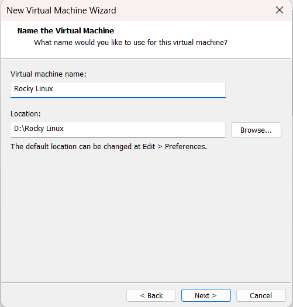

# Cài đặt hệ điều hành Rocky Linux trên VMWare
## Bước 1: Tải iso image
- Truy cập vào đường dẫn sau để tiến hành tải file Rocky iso image: https://rockylinux.org/vi-VN/download. Phiên bản mới nhất hiện tại là 10.0.

## Bước 2: Thiết lập cài đặt máy ảo trong VMWare
- Vào `File` chọn `New Virtual Machine`:

- Chọn file iso đã tải xuống để tiến hành cài đặt:

- Đặt tên cho máy ảo và chọn nơi lưu trữ cho máy ảo trên máy tính thật:

- Cấu hình CPU, bộ nhớ và ổ cứng cho máy ảo và hoàn tất thiết lập cài đặt:

## Bước 3: Cài đặt Rocky Linux
- Chọn ngôn ngữ cho hệ điều hành:

- Installation Menu:

- Tùy chọn `Keyboard` để thêm bố cục bàn phím. Bố cục bàn phím mặc định sẽ trùng với ngôn ngữ được lựa chọn. Nhấp vào nút + để thêm bố cục bàn phím khác ngoài bố cục mặc định. Có thể kiểm tra bàn phím trong hộp văn bản bên phải để đảm bảo đó là bố cục chính xác.

- Tùy chọn `Language Support` để cài đặt thêm các ngôn ngữ cho giao diện người dùng:

- Tùy chọn `Time and Date` để chọn thời gian, ngày cho máy ảo. Có thể chọn automatic sau khi chọn múi giờ hoặc có thể chỉnh bằng tay:

- Tùy chọn `Software Selection` để chọn base environment và một số service bổ sung muốn cài đặt:

- Tùy chọn `Installation Destination` chọn phân vùng ổ cứng cho việc cài đặt. Trong mục `Storage Configuration` chọn vào `Custom`, nhập vào `Done` và cửa sổ `Manual Partitioning` sẽ xuất hiện:

- Chọn `Standard Partition` làm phương thức phân vùng và ấn dấu + để chọn phân vùng:

- Tiến hành phân vùng như sau `/home : 12GiB`, `/boot : 1GiB`, `swap : 2GiB`, `/ : 3GiB`, `BIOS Boot: 1MiB`. Chọn lần lượt từng partition và ấn add mount point, sau đó ấn tiếp tục dấu + và thực hiện lại bước trên:

- Ấn `Done` để thoát khỏi partition manager, lúc này một cửa sổ sẽ xuất hiện xác nhận những thay đổi vừa thực hiện. Chọn `Accept Changes` để hoàn tất quá trình chọn phân vùng ổ đĩa:

- Chọn `Root Account` để cài đặt mật khẩu root cho máy ảo:

- Cài đặt thêm người dùng, chọn vào `User Creation`:

## Bước 4: Hoàn tất cài đặt máy ảo
- Chọn `Begin Installation` để hoàn tất cài đặt máy ảo:

- Chọn `Reboot System` để hoàn tất thiết lập:

- Hoàn tất cài đặt.

