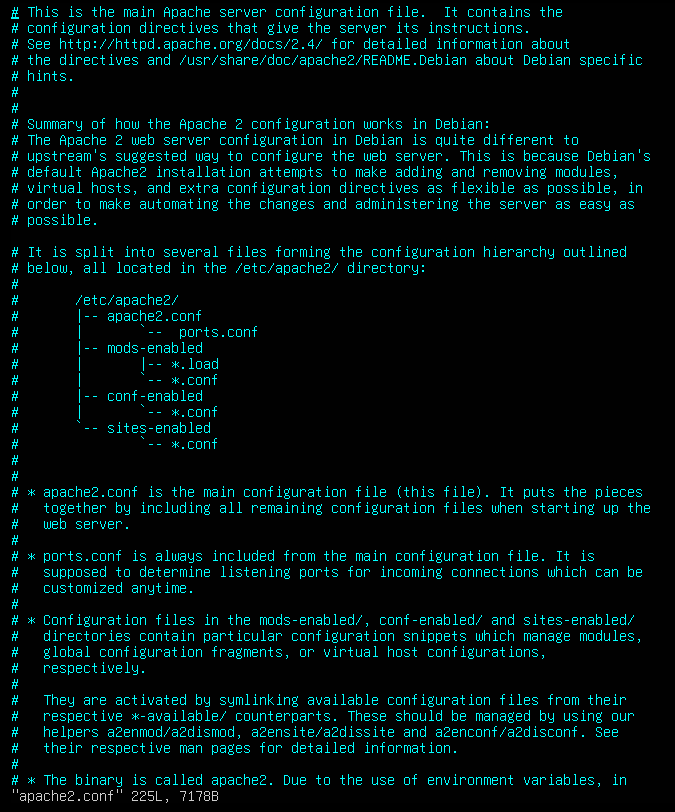
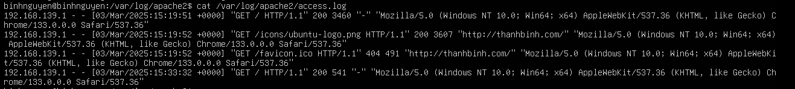
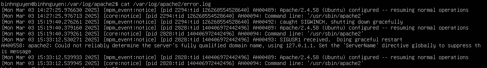
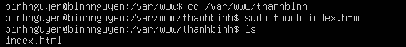

# APACHE
# 1. Apache là gì?

Apache là một phần mềm mã nguồn mở được phát triển bởi Apache Software Foundation. Phần mềm này hoạt động như một máy chủ web, chịu trách nhiệm tiếp nhận và phản hồi các yêu cầu từ trình duyệt web của người dùng. Apache sử dụng giao thức HTTP và HTTPS để phục vụ nội dung web từ các tệp tin trên máy chủ đến các trình duyệt của người dùng. Apache đã được phát hành lần đầu vào năm 1995 và từ đó đến nay đã trở thành một trong những giải pháp máy chủ web phổ biến nhất thế giới.


# 2. Cách thức hoạt động của Apache
Apache hoạt động dựa trên mô hình Request-Response. Khi người dùng gửi một yêu cầu thông qua trình duyệt web của họ, yêu cầu này sẽ được gửi đến máy chủ nơi Apache đang chạy. Apache sau đó sẽ phân tích yêu cầu này và tìm kiếm tài nguyên thích hợp trên máy chủ (như một tệp HTML, hình ảnh, hoặc dữ liệu) để trả về cho trình duyệt. Quá trình này diễn ra nhanh chóng, cho phép người dùng truy cập trang web một cách mượt mà và hiệu quả.


# 3. Apache có tính năng gì
- **Tính năng URL Write:** Apache hỗ trợ viết lại URL thông qua module mod_rewrite, giúp tối ưu hóa SEO và tạo ra các URL thân thiện với người dùng. Đây là một tính năng quan trọng đối với các trang web muốn cải thiện thứ hạng trên các công cụ tìm kiếm.
- **Hỗ trợ Virtual Hosts:** Apache cho phép chạy nhiều trang web trên cùng một máy chủ thông qua tính năng Virtual Hosts. Điều này rất hữu ích cho các nhà phát triển và quản trị viên hệ thống muốn tiết kiệm tài nguyên và quản lý nhiều trang web trên cùng một hạ tầng.
- **Khả năng tương thích cao:** Apache hoạt động tốt trên nhiều hệ điều hành khác nhau, bao gồm Linux, Windows, macOS, và các hệ điều hành Unix-like khác. Apache cũng tương thích với nhiều ngôn ngữ lập trình và công nghệ web, giúp nó trở thành một giải pháp linh hoạt cho các nhà phát triển.
- **Hỗ trợ nhiều giao thức:** Bên cạnh giao thức HTTP và HTTPS, Apache còn hỗ trợ nhiều giao thức khác như FTP, SMTP, và WebDAV, giúp nó trở thành một giải pháp máy chủ toàn diện cho nhiều loại dịch vụ mạng.

# 4. Cài đặt Apache
## 4.1 Trên Ubuntu

- Thực hiện chạy câu lệnh: *sudo apt install apache2* để tiến hành cài đặt apache.

- Sau khi cài đặt xong, cần chạy lệnh *sudo systemctl start apache2* và *sudo systemctl enable apache2* để khởi động và kích hoạt apache.


- Kiểm tra cài đặt apache bằng việc vào trình duyệt web và thực hiện gõ http://192.168.139.134. Nếu thấy trang "It works" xuất hiện thì việc cài đặt apache thành công.


## 4.2 Trên CentOS

- Trên CentOS9, apache được gọi là httpd, thực hiện chạy câu lệnh *sudo dnf install httpd -y* để tiến hành cài đặt apache.

- Sau khi cài đặt xong, cần chạy lệnh *sudo systemctl start httpd* và *sudo systemctl enable httpd* để apache tự động khởi động cùng hệ thống.

- Kiểm tra cài đặt apache trên CentOS bằng cách gõ lệnh *sudo systemctl status httpd*, nếu xuất hiện active (running) thì việc cài đặt hoàn tất.


- Thực hiện kiểm tra lại bằng cách vào trình duyệt web và gõ http://192.168.139.132. Nếu thấy trang như hình dưới xuất hiện thì việc cài đặt apache thành công.


# 5. File cấu hình Apache
- Mở tệp cấu hình Apache:
```
$ vi /etc/apache2/apache2.conf
```

# 6. File log Apache
- Vị trí file access log trên Ubuntu:/var/log/apache2/access.log. Sử dụng lệnh cat /var/log/apache2/access.log để truy cập file



- Vị trí file error log trên Ubuntu:/var/log/apache2/error.log. Sử dụng lệnh cat /var/log/apache2/error.log để truy cập file


# 7. Sử dụng virtual cấu hình nhiều website trên một máy ảo chạy webserver
- **Tạo và cấu hình trang web**
  - Tạo một thư mục trong thư mục /var/www bằng lệnh mkdir. 
  
  

  - Gán quyền truy cập thư mục bằng biến môi trường $USER.
  
  ```
  sudo chown -R $USER:$USER /var/www/thanhbinh
  ```

  - Đồng thời cho quyền đọc và thực thi đối với group và những user khác.
  
  ```
  sudo chmod -R 755 /var/www/thanhbinh
  ```

  - Tạo tập html trong thư mục bằng lệnh touch.
  
   

  - Mở tệp index.html bằng lệnh vi và chèn đoạn code sau vào file index.html
  
   ```
   <!doctype html>
  <html>
  <head>
  <meta charset="utf-8">
  <title>Nginx: Web & Reverse proxy server</title>
  </head>
   <body>
   <h1>Welcome to ThanhBinh</h1>
   <p>I've just configured a virtual host using Nginx web server on Linux</p>
  </body>
  </html>
    ```

- **Định cấu hình webserver**
   - Để định cấu hình virtual host, trước tiên, hãy tạo tệp cấu hình virtual host cho trang web trong thư mục /etc/apache2/sites-available
   
   - Tạo tệp thanhbinh.conf để làm file cấu hình.
   
   - Mở tệp vừa tạo bằng lệnh vi và chèn dòng mã như sau:
   
   ```
   <VirtualHost *:80>
    ServerAdmin webmaster@localhost
    ServerName thanhbinh.com
    ServerAlias www.thanhbinh.com
    DocumentRoot /var/www/thanhbinh
    ErrorLog ${APACHE_LOG_DIR}/error.log
    CustomLog ${APACHE_LOG_DIR}/access.log combined
   </VirtualHost>
   ```
- **Kích hoạt file Virtual Host**
   - Bây giờ có thể enable file bằng công cụ a2ensite:
   ```
   sudo a2ensite thanhbinh.conf
   ```
   - Disable trang mặc định được định nghĩa trong 000-default.conf:
   ```
   sudo a2dissite 000-default.conf
   ```
   - Sau đó kiểm tra lỗi cấu hình nếu có:
   ```
   sudo apache2ctl configtest
   ```
   - Nếu output là Syntax OK thì không có lỗi gì xảy ra:
   
   

- **Định cấu hình DNS**
    - Mở file trong thư mục /etc/hosts và thêm tên miền thanhbinh.com tương ứng với địa chỉ ip của máy chủ

    

- **Khởi động lại máy chủ Nginx**
   - Khởi động lại máy chủ Nginx để lưu các thay đổi đã thực hiện bằng câu lệnh *sudo systemctl restart apache2*.

- **Thử kết nối đến trang web bằng điều hướng đến URL http://thanhbinh.com**

   

# 8. So sánh Apache với Nginx
- **Hiệu năng:** 
  - Static content (Nội dung tĩnh là những dữ liệu không thay đổi hoặc chỉ thay đổi khi được chỉnh sửa thủ công bởi người quản trị web: trang giới thiệu, hình ảnh,...): Apache và Nginx có cơ chế xử lý kết nối khác nhau. Apache sử dụng phân luồng hoặc keep-alive, trong khi Nginx sử dụng vòng lặp sự kiện không bị ngăn chặn và tiến trình công việc. Điều này giúp Nginx tránh sự cố về CPU và RAM khi có nhiều truy cập cùng lúc. Ngoài ra, NGINX còn có tốc độ xử lý nhanh hơn, hiệu suất sử dụng bộ nhớ tốt hơn và tiêu thụ ít tài nguyên RAM và CPU. Điều này làm cho NGINX trở thành lựa chọn hàng đầu cho việc xử lý lượng truy cập lớn và đáng tin cậy.
  
  - Dynamic content (Nội dung động là dữ liệu thay đổi tùy vào tương tác của người dùng, thời gian hoặc các yếu tố khác: trang đăng nhập, đăng ký, giỏ hàng,...): Apache có thể xử lí nội dung động trong webserver mà không cần tới một yếu tố bên ngoài. Nginx không thể xử lí chúng với Webserver như cách mà Apache làm, nó sẽ đưa sang một proccess bên ngoài (Như PHP-FPM) để thực thi. Nginx chờ cho nội dung được xử lí xong quay trở lại và gửi lại cho client.
- **Hệ điều hành hỗ trợ:** 
  - Apache: Hỗ trợ tất cả những hệ thống dựa trên Unix như Linux hoặc BSD. Hỗ trợ đầy đủ MS-Windows
  - Nginx: Hỗ trợ phần lớn những hệ thống dựa trên Unix. Hỗ trợ một phần MS-Windows

|             Apache              |           Nginx                  |
|:--------------------------------|:---------------------------------|
| Được thiết kế làm webserver     | Có thể làm webserver hoặc một reverse proxy server|
| Khó khăn khi xử lý nhiều request liên tục khi lưu lượng web tăng cao | Có thể xử lý nhiều request với tài nguyên hệ thống hạn hẹp |
| Có cách tiếp cận đa luồng khi xử lý request | Có cách tiếp cận theo sự kiện khi xử lý request |
| Có thể xử lý nội dung động | Không thể xử lý nội dung động, phải đưa cho bên thứ 3 (PHP-FPM) |

Tài liệu tham khảo

[1]()