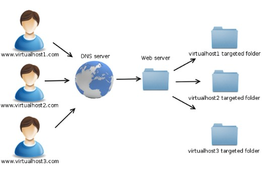

# TÌM HIỂU VỀ VIRTUAL HOST
# 1. Virtual Host là gì?

Virtual Host là một kỹ thuật trong việc quản lý các trang web trên một webserver duy nhất. Điều này cho phép chạy nhiều trang web khác nhau trên cùng một máy chủ vật lý, mỗi trang web với tên miền riêng, nhưng chúng chia sẻ cùng một địa chỉ IP.

Khi một yêu cầu truy cập đến máy chủ web, máy chủ sẽ kiểm tra địa chỉ IP và tên miền của yêu cầu đó để xác định trang web cụ thể mà yêu cầu đó đang điều hướng đến. Điều này giúp phân chia lưu lượng truy cập và cung cấp khả năng chạy nhiều trang web độc lập trên cùng một máy chủ.

Virtual Host có thể được cấu hình bằng cách chỉ định các tập tin cấu hình riêng cho mỗi trang web, trong đó bạn xác định tên miền, thư mục gốc, các thiết lập bảo mật và các cài đặt khác cho trang web đó.

Virtual Host là một phần quan trọng của việc triển khai và quản lý các ứng dụng web phức tạp, đặc biệt là khi bạn muốn chạy nhiều trang web hoặc dịch vụ trên cùng một máy chủ vật lý.

# 2. Cách thức vận hành Virtual Host
- Cấu hình DNS: Đầu tiên, cần cấu hình DNS (Domain Name System) để định tuyến các tên miền cụ thể đến địa chỉ IP của máy chủ web. Có thể thêm các bản ghi DNS A hoặc CNAME cho từng tên miền mà bạn muốn định tuyến đến máy chủ.

- Cấu hình máy chủ web: Tiếp theo, cần cấu hình máy chủ web của mình để nhận và phản hồi đúng với các yêu cầu từ các tên miền khác nhau. Tùy thuộc vào máy chủ web đang sử dụng, cấu hình này có thể được thực hiện trong các tập tin cấu hình như Apache's httpd.conf hoặc Nginx's nginx.conf.

- Xác định Virtual Hosts: Trong tập tin cấu hình của máy chủ web, xác định các Virtual Hosts bằng cách định nghĩa các khối cấu hình cho mỗi tên miền. Mỗi Virtual Host bao gồm thông tin như tên miền, địa chỉ IP, thư mục gốc của trang web và các thiết lập bảo mật.

- Khai báo các thiết lập: Trong mỗi khối cấu hình Virtual Host, có thể thực hiện các thiết lập cụ thể cho trang web đó. Điều này có thể bao gồm cấu hình SSL/TLS, thiết lập bảo mật, xác thực người dùng, quản lý phiên, và nhiều thiết lập khác tùy thuộc vào yêu cầu của ứng dụng web.

- Khởi động lại máy chủ web: Sau khi đã hoàn tất cấu hình Virtual Hosts, cần khởi động lại webserver để áp dụng các thay đổi. Các yêu cầu truy cập đến tên miền đã cấu hình sẽ được định tuyến đúng Virtual Host tương ứng và trả về nội dung của trang web đó.

# 3. Ưu, nhược điểm của Virtual Host
## 3.1 Ưu điểm
- **Tiết kiệm tài nguyên:** Virtual Host cho phép chạy nhiều trang web trên cùng một máy chủ vật lý, giúp tận dụng tối đa tài nguyên máy chủ.
- **Tính linh hoạt:** Có thể chạy nhiều trang web với tên miền khác nhau trên cùng một địa chỉ IP, mở rộng khả năng quản lý và triển khai ứng dụng web phức tạp.
- **Phân chia lưu lượng truy cập:** Virtual Host cho phép phân chia lưu lượng truy cập giữa các trang web khác nhau, giúp cải thiện hiệu suất và độ tin cậy của máy chủ.
- **Quản lý dễ dàng:** có thể quản lý và cấu hình mỗi trang web riêng biệt thông qua tập tin cấu hình của từng Virtual Host, giúp dễ dàng thực hiện các thiết lập và điều chỉnh cụ thể cho từng trang web.
## 3.2 Nhược điểm
- **Tính bảo mật:** Nếu không được cấu hình đúng, có thể xảy ra lỗi cấu hình Virtual Hosts và gây ra rủi ro bảo mật, ví dụ như xuyên tạc dữ liệu giữa các trang web hoặc truy cập trái phép vào các tài nguyên của trang web khác.
- **Hiệu suất:** Khi chạy nhiều Virtual Hosts trên cùng một máy chủ, hiệu suất có thể bị ảnh hưởng, đặc biệt là khi các trang web đồng thời nhận lưu lượng truy cập lớn. Quản lý tài nguyên và tối ưu hóa cấu hình là cần thiết để đảm bảo hiệu suất tốt.
- **Quản lý phức tạp:** Với nhiều trang web chạy trên cùng một máy chủ, việc quản lý và duy trì các Virtual Hosts có thể trở nên phức tạp hơn so với chỉ chạy một trang web duy nhất.

