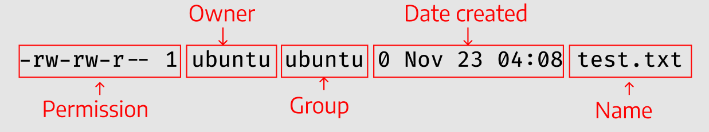
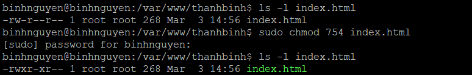

# CÁCH PHÂN QUYỀN TRONG LINUX
# 1. Ownership
Mỗi file trên Linux đều được gán bởi 3 loại chủ sở hữu là user , group và other.
- **User:** Mặc định trên Linux thì người tạo ra 1 file hay 1 thư mục sẽ là chủ sở hữu của chính nó.
- **Group:** Nhóm có thể chứa nhiều người dùng cùng 1 lúc .Tất cả người dùng của một nhóm sẽ có quyền truy cập vào một file hay thư mục nào đó.
- **Other:** Other là bất kỳ người dùng nào không thuộc hai nhóm trên.

Để phân biệt 3 loại người dùng trên , giúp cho việc người dùng A và người dùng B không ảnh hưởng đến file và thư mục của nhau , ta cần đến permissions để quản lý quyền hành vi của mỗi người.
# 2. Permission
Trong linux, tất cả các file, tài nguyên đều có 3 loại quyền chính:
- **READ (Đọc):** Quyền đọc cho phép bạn mở file và xem nội dung của nó. Trong trường hợp thư mục thì bạn có thể xem các thành phần con trong nó.
- **WRITE (Viết):** Quyền viết hay ghi cho phép bạn thay đổi nội dung của file. Trong trường hợp thư mục thì bạn có thể thay đổi vị trí, xoá, thêm các thành phần con trong nó.
- **EXECUTE (Thực thi):** Quyền thực thi cho phép bạn chạy file.

Lưu ý rằng, bạn có quyền viết thư mục nhưng không có nghĩa là bạn có thể thay đổi các nội dung file con của nó và ngược lại. Ví dụ bạn có quyền viết một file /abc/bbc/helloworld.txt nhưng chỉ có quyền đọc thư mục /abc/bbc/, lúc đó bạn chỉ có thể thay đổi nội dung file helloworld.txt nhưng không thể thay đổi vị trí, xoá hay đổi tên của nó được.
# 3. Cách phân quyền
# 3.1 Xem phân quyền
Xem thông tin phân quyền của một file hay thư mục bạn có thể sử dụng lệnh ls. Để biết thêm các thông số khác thì thêm -l ở phía sau.
```
ls -l text.txt
```
Ta sẽ thu được kết quả theo định dạng sau:
```
-rw-rw-r-- 1 ubuntu ubuntu 0 Nov 23 04:08 test.txt
```


Trong đó:
- **Permission:** Các quyền của file.
- **Owner:** Chủ sở hữu của file.
- **Group:** Nhóm mà chủ sở hữu thuộc vào.
- **Date created:** Ngày tạo file.

Ở trong Permission sẽ là chi tiết các quyền của các loại user khác nhau:


- **File Type (loại tệp):** Có ba loại là Tệp thông thường (-)/ Thư mục (d)/ Liên kết (i).
- **User:** Quyền đối với người dùng (chủ sở hữu).
- **Group:** Quyền đối với nhóm của chủ sở hữu.
- **Other:** Quyền đối với những người dùng khác.
# 3.2 Các mode chỉnh sửa phân quyền
## 3.2.1 Sử dụng Symbolic Mode
Symbolic sử dụng các ký tự để quy ước loại *user*:
- User (u)
- Group (g)
- Other (o)
- All (a)

Và các quyền hạn:
- Read (r)
- Write (w)
- Excute (x)

Ngoài ra ta còn có thêm các signs (biểu thị toán học) + - = để phục vụ cho mục đích tinh chỉnh theo ý muốn từng loại quyền với từng loại user khác nhau:
- (+): Thêm quyền lên đầu các quyền hiện có.
- (-): Xoá quyền khỏi các quyền hiện có.
- (=): Ghi đè lên các quyền hiện có.


## 3.2.2 Sử dụng Numeric Mode
Đây là bảng thể hiện các phân quyền trên Linux trong chế độ Numeric:


Hoặc đơn giản hơn bạn có thể nhớ như sau:
- Read (r) = 4
- Write (w)=2
- Execute (x)=1

Ta thử nhé Read + Wite = 6, Read + Write + Execute = 4 + 2 + 1=7,... kết quả thu được sẽ giống như trên bảng.


Việc phân quyền trên Linux cho các loại user sẽ được thể hiện dưới dạng 3 chữ số XXX thứ tự là User, Group, Other.

Ví dụ: 
- User: Read + Write + Excute = 4 + 2 + 1 = 7
- Group: Write = 2
- Other: Write + Excute = 2 + 1 =3


## 3.2.3 Thay đổi owner và group
- Để thay đổi quyền user:
```
sudo chown <username> <filename>
```
- Để thay đổi quyền group:
```
sudo chgrp <groupname> <filename>
```
- Để thay đổi quyền cả user và group:
```
sudo chown <username>:<groupname> <filename>
```

Tài liệu tham khảo

[1] (https://123host.vn/community/tutorial/gioi-thieu-ve-phan-quyen-tren-linux.html)

[2] (https://viblo.asia/p/phan-quyen-trong-linux-yMnKMbDNZ7P)