# Sử dụng các lệnh cơ bản của FTP với FTP Server đã dựng
- Sử dụng lệnh **help** hoặc **?** để hiển thị tất cả lệnh có sẵn với giao thức FTP.

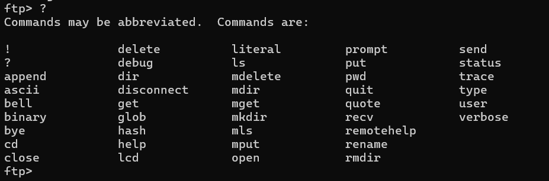

- Lệnh **!** được sử dụng để thực thi các lệnh của hệ điều hành trên máy tính cục bộ (local machine) trong khi đang sử dụng phiên FTP.

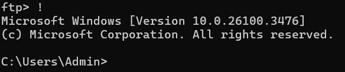

- Lệnh **pwd** cho biết thư mục hiện tại đang làm việc ở FTP Server.

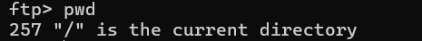

- Lệnh **status** để xem trạng thái FTP hoạt động trong khi kết nối và trao đổi dữ liệu giữa máy khách và máy chủ FTP.

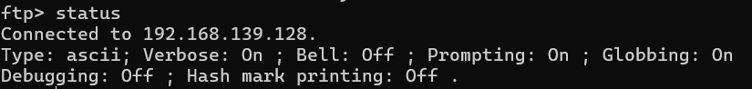

- Lệnh **cd** để chuyển thư mục làm việc ở FTP server.

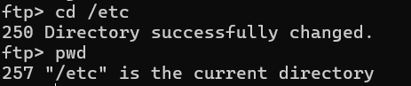

- Lệnh **mkdir** để tạo thư mục mới ở FTP server.

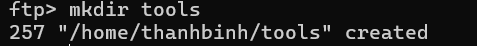

- Lệnh **lcd** để chuyển đổi thư mục hiện tại ở FTP Client.

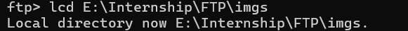

- Lệnh **binary** để chuyển đổi chế độ truyền file qua dạng nhị phân.

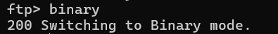

- Lệnh **put** để tiến hành truyền file từ FTP client qua FTP server.

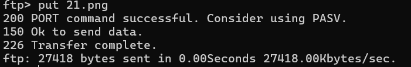

- Lệnh **mput** để tiến hành truyền nhiều file từ FTP client qua FTP server.

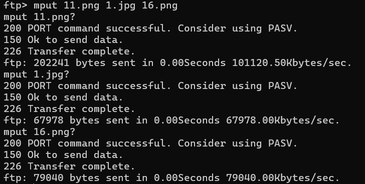

- Lệnh **ls -la** để liệt kê toàn bộ file ở trong thư mục /home/thanhbinh/tools vừa đc truyền qua.

- Lệnh **del** để xóa file đã được truyền đi.

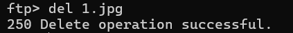

- Lệnh **ascii** để chuyển đổi chế độ truyền file qua dạng ascii.

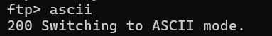

- Lệnh **get** để được sử dụng để tải tệp từ máy chủ FTP về máy tính cục bộ.

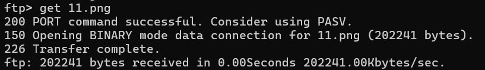

Tài liệu tham khảo:

(https://duc2008.wordpress.com/2008/09/28/lenh_ftp/)
