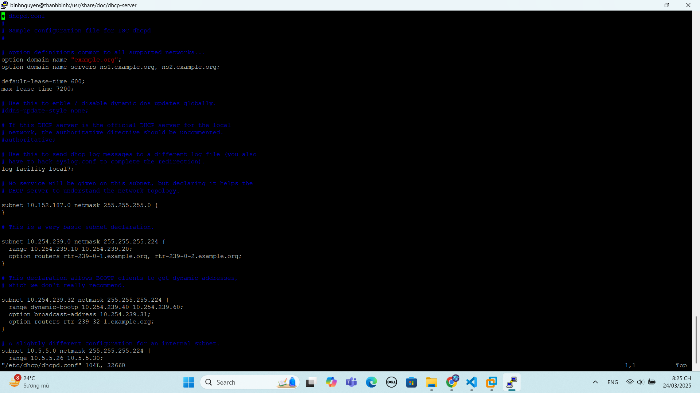
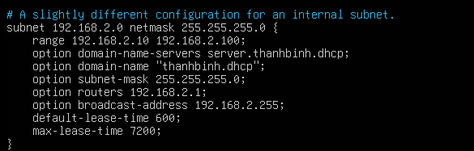
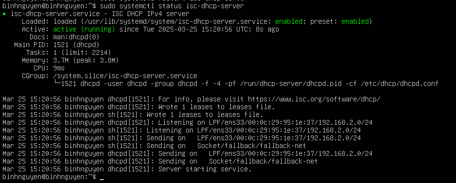
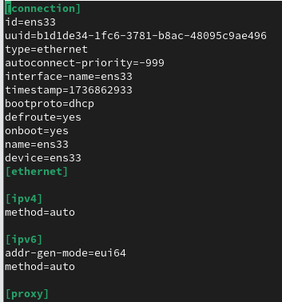
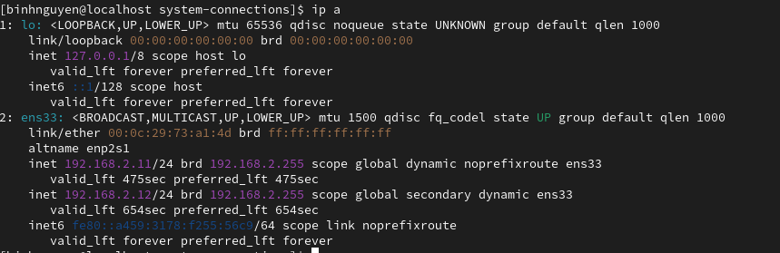
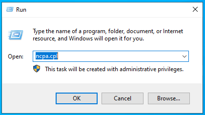
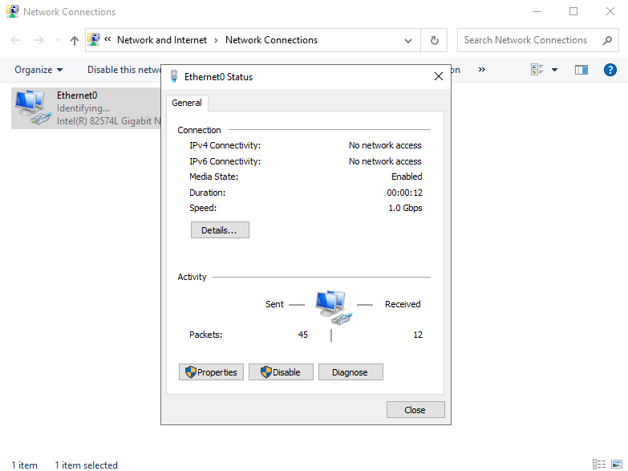
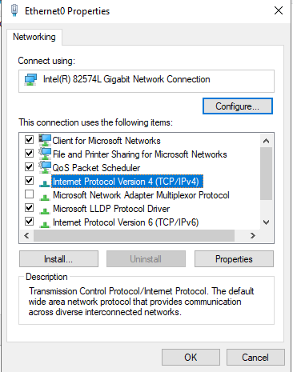
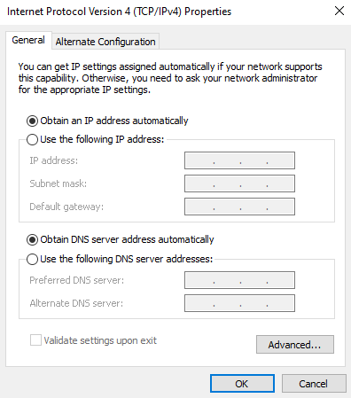
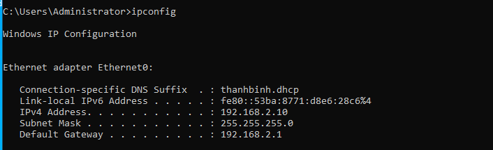

# CẤU HÌNH DHCP TRÊN UBUNTU 24.04
# 1. Cấu hình DHCP Server
## 1.1 Cài đặt DHCP
- Cài đặt DHCP:
```
sudo dnf -y install isc-dhcp-server
```

## 1.2 File cấu hình DHCP
**Thành phần file cấu hình:**
- Cấu hình toàn cục ( global ) : quy định những thông tin giá trị mặc định cho các khai báo lớp mạng ( subnet ) cấp phát IP động DHCP.
- Cấu hình lớp mạng cấp phát IP động ( scope ) : quy định những giá trị thông tin cho việc cấp phát IP động thông qua DHCP.

**File cấu hình dhcp nằm tại:**
```
/etc/dhcp/dhcpd.conf
```
**Chỉnh sửa file cấu hình DHCP:**
```
vi /etc/dhcp/dhcpd.conf
```



## 1.3 Cấu hình global
- Cấu hình `domain-name` và `domain name-server`:


- Cấu hình thiết lập thời gian thuê địa chỉ IP cho các máy khách được cấp phát địa chỉ từ DHCP server (đơn vị s):
 


- Log của DHCP tại `/var/log/syslog`:


- Bỏ dấu # trước authoritative thì máy chủ DHCP sẽ được coi là chính thức trong mạng cục bộ và sẽ có quyền ưu tiên trong việc cấp phát địa chỉ IP.


## 1.4 Cấu hình scope


Trong đó:
- range: vùng địa chỉ IP được dùng để cấp phát cho Client
- option domain-name-servers: DNS Server
- option domain-name: tên Domain
- option routers : Default gateway
- option broadcast-address : Địa chỉ broadcast của dải mạng
- default-lease-time : Thời gian mặc định cấp IP cho một Client (ưu tiên hơn global) (đơn vị: giây)
- max-lease-time : Thời gian tối đa cấp IP cho một Client (ưu tiên hơn global) (đơn vị: giây)

## 1.5 Khởi động dịch vụ dhcp và kích hoạt tự khởi động
```
systemctl start isc-dhcp-server
systemctl enable isc-dhcp-server
```
## 1.6 Kiểm tra trạng thái dịch vụ
```
systemctl status isc-dhcp-server
```


# 2. Cấu hình DHCP Client
# 2.1 Trên Client CentOS 9
Vào thư mục `etc/NetworkManager/system-connections/ens33-nmconnection` thực hiện cấu hình như ảnh dưới:



Khởi động lại mạng bằng lệnh `sudo systemctl restart NetworkManager`.

Gõ lệnh `dhclient -v` để được cấp địa chỉ ip từ DHCP Server.

Địa chỉ IP sau khi được cấp phát từ DHCP server:



# 2.2 Trên Client Window
Vào Run, gõ `ncpa.cpl` để mở cửa sổ Network Connections:



Vào cài đặt để set IPv4:



Chọn IPv4, chọn Properties:



Thiết lập cấu hình như hình dưới:



Vào cmd, gõ lệnh ipconfig:



Hoàn tất việc cấp IP cho client từ DHCP server đã tạo.

Tài liệu tham khảo:

[1] (https://mhungg03.hashnode.dev/cau-hinh-dhcp-server-ubuntu-ver-2004)