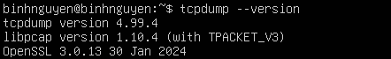
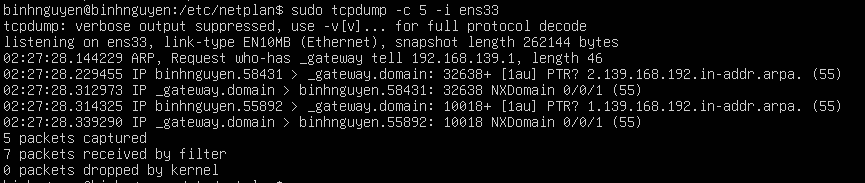
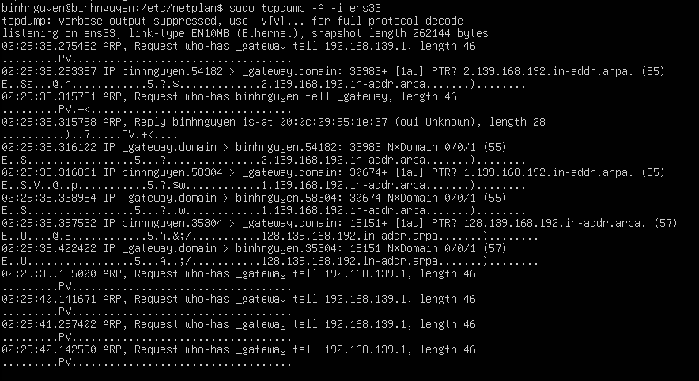
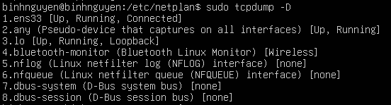
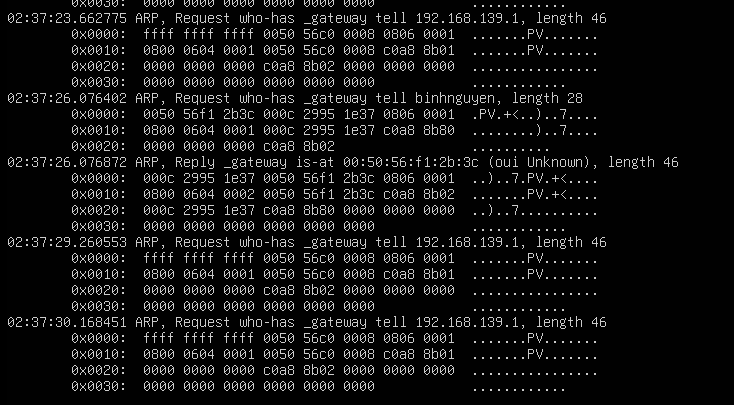
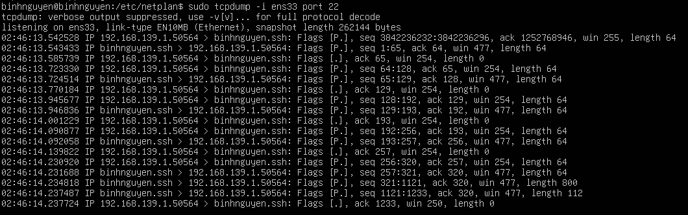
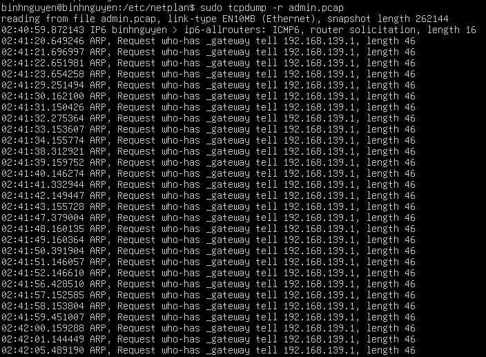
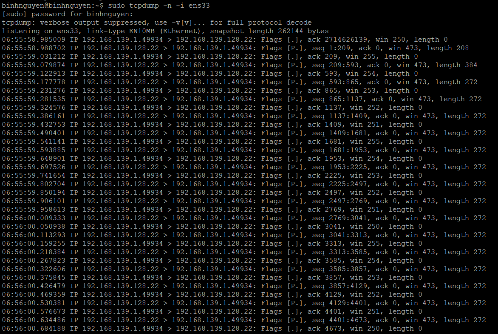
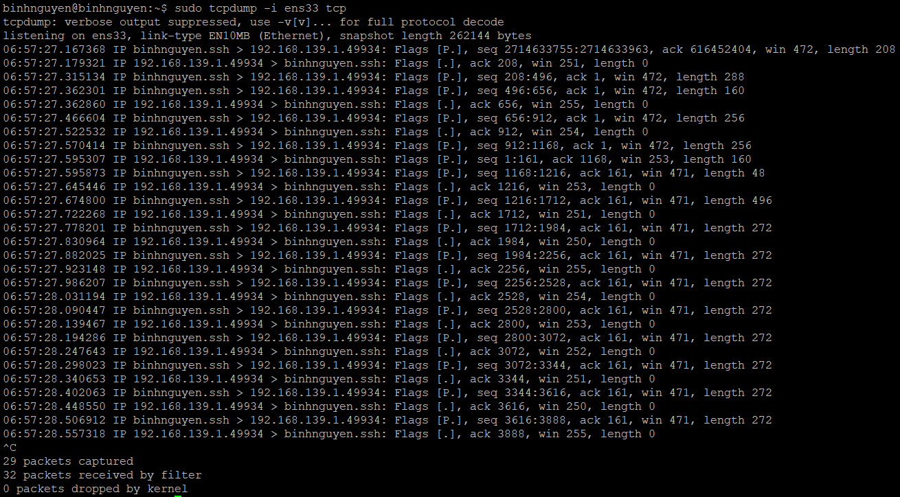
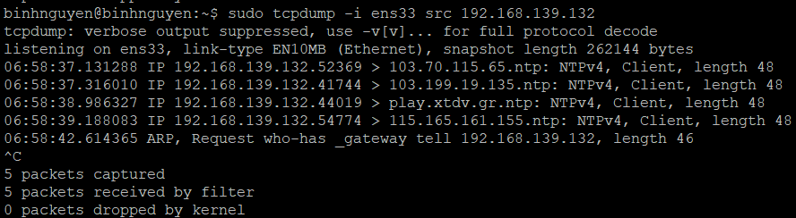

# TÌM HIỂU VỀ TCPDUMP
# 1. Tcpdump là gì?
Tcpdump là công cụ mạnh mẽ và được sử dụng rộng rãi cho việc bắt gói tin và phân tích gói tin trên mạng, nó được sử dụng để bắt hoặc có thể lọc các gói tin TCP/IP được nhận hay được gửi trên một mạng cụ thể nào đó.
# 2. Sử dụng Tcpdump trên Linux
# 2.1 Cài đặt Tcpdump trên Linux
Nhiều bản phân phối của Linux thường thì sẽ có cài đặt sẵn tcpdump, nếu trong trường hợp chưa có thì có thể sử dụng như sau để cài đặt nó trên máy tính của mình.
```
yum install tcpdump
```
Để biết máy đã được cài đặt Tcpdump hay chưa gõ lệnh `tcpdump --version`.



# 2.2 Sử dụng lệnh Tcpdump trên Linux
- **Bắt gói tin trên một interface:**

Màn hình dòng lệnh sẽ cuộn xuống cho đến khi nào bạn ngắt nó, và khi chúng ta sử dụng lệnh tcpdump thì nó sẽ bắt gói tin trên mọi interface. Tuy nhiêu với tùy chọn -i thì nó sẽ bắt cái interface mà bạn muốn.

```
tcpdump -i ens33
```


- **Bắt số gói tin nhất định:**

Khi bạn chạy lệnh tcpdump nó sẽ bắt tất cả các gói tin cho một interface nhất định, cho đến khi bạn gõ lệnh dừng (Ctrl + C). Nhưng khi bạn sử dụng option -c thì bạn có thể yêu cầu nó bắt số gói tin nhất định. Ví dụ bên dưới chúng ta sẽ chỉ bắt 6 gói tin.

```
tcpdump -c 5 -i ens33
```



- **In các gói tin bắt được trong định dạng ASCII:**

Lệnh tcpdump bên dưới với option -A sẽ hiển thị những gì mà nó bắt được dưới định dạng ASCII cho chúng ta.

```
tcpdump -A -i ens33
```


- **Hiển thị các interface có sẵn:**

Để hiện thị các interface có sẵn trên hệ thống của bạn, thì bạn có thể chạy dòng lệnh với option -D như sau.

```
tcpdump -D
```

- **Hiển thị gói tin được bắt dưới dạng hệ HEX và ASCII:**

Lệnh bên dưới với option -XX nó sẽ giúp ta bắt được các gói tin và chuyển nó về dạng HEX và ASCII.

```
tcpdump -XX -i ens33
```


- **Bắt gói tin từ một cổng cụ thể:**

```
tcpdump -i ens33 port 22
```

- **Đọc nội dung file đã bắt được:**

```
tcpdump -r admin.pcap
```


- **Bắt địa chỉ IP của gói tin:**

```
tcpdump -n -i ens33
```


- **Chỉ bắt gói tin TCP:**
```
tcpdump -i ens33 tcp
```


- **Bắt gói tin từ địa chỉ IP nguồn:**
```
tcpdump -i ens33 src 192.168.139.132
```

