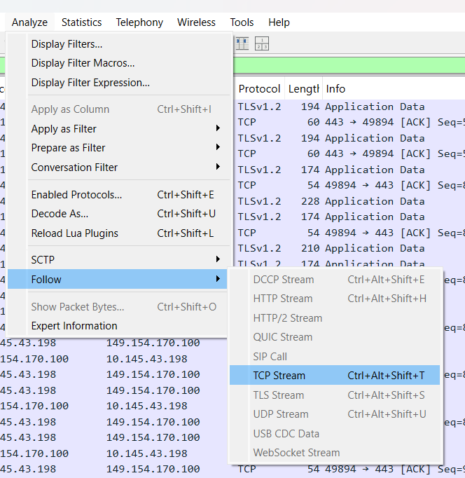
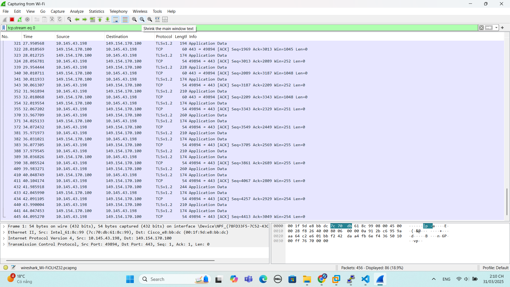
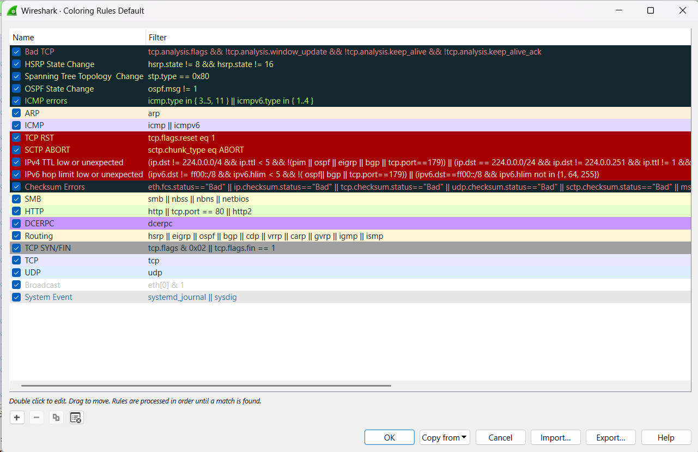

# TÌM HIỂU VỀ WIRESHARK
# 1. Phần mềm Wireshark là gì?
Wireshark là một công cụ phân tích mạng và ghi lại giao thức mạng. Nó cho phép người dùng theo dõi và phân tích các gói tin mạng trong thời gian thực. Wireshark có khả năng xem và phân tích dữ liệu trong các giao thức mạng phổ biến như TCP, UDP, IP, HTTP và nhiều giao thức khác.

Với Wireshark, người dùng có thể xem các gói tin mạng được truyền qua mạng, xác định nguồn gốc và đích của các gói tin, kiểm tra nội dung và cấu trúc của các giao thức, và phân tích lưu lượng mạng để tìm hiểu về hiệu suất và vấn đề liên quan đến mạng.

Với Wireshark, người dùng có thể xem các gói tin mạng được truyền qua mạng, xác định nguồn gốc và đích của các gói tin, kiểm tra nội dung và cấu trúc của các giao thức, và phân tích lưu lượng mạng để tìm hiểu về hiệu suất và vấn đề liên quan đến mạng.

Wireshark là một công cụ quan trọng trong việc phân tích và xử lý sự cố mạng, tìm hiểu và kiểm tra hiệu suất mạng, và nghiên cứu về các giao thức mạng.


# 2. Phần mềm Wireshark hoạt động như thế nào?
Wireshark hoạt động bằng cách sử dụng một giao diện mạng để bắt và theo dõi gói tin mạng được truyền qua mạng. Khi một gói tin mạng đi qua giao diện mạng, Wireshark sẽ bắt và lưu trữ thông tin về gói tin đó để phân tích.

Các bước hoạt động cơ bản của Wireshark như sau:

- **Bắt gói tin:** Phần mềm này cho phép bạn chọn giao diện mạng để bắt gói tin. Bạn có thể chọn giao diện Ethernet, Wi-Fi hoặc bất kỳ giao diện mạng nào khác trên hệ thống của bạn.

- **Lưu trữ và hiển thị gói tin:** Wireshark lưu trữ các gói tin mạng được bắt vào bộ nhớ và hiển thị chúng trên giao diện người dùng. Mỗi gói tin được hiển thị với các chi tiết như địa chỉ nguồn, địa chỉ đích, giao thức, thông tin dữ liệu và nhiều thông tin khác.

- **Phân tích gói tin:** Phần mềm này cung cấp các công cụ phân tích mạnh mẽ để giải thích và hiểu các gói tin mạng. Bạn có thể phân tích các trường dữ liệu trong gói tin, xác định các giao thức được sử dụng, xem thông tin về kết nối mạng và nhiều tính năng khác.

- **Lọc và tìm kiếm:** Wireshark cung cấp khả năng lọc và tìm kiếm dựa trên các tiêu chí như địa chỉ IP, cổng, giao thức, dữ liệu và nhiều tiêu chí khác. Điều này giúp bạn tìm kiếm và tập trung vào các gói tin quan trọng hoặc các sự kiện đặc biệt trong mạng.

- **Xuất và chia sẻ dữ liệu:** Phần mềm này cho phép bạn xuất dữ liệu phân tích thành các định dạng như CSV, XML hoặc JSON để tạo báo cáo hoặc chia sẻ thông tin với người khác.
# 3. Phần mềm Wireshark dùng để làm gì?

- **Phân tích và gỡ lỗi mạng:** Phần mềm này cho phép người dùng xem và phân tích các gói tin mạng để xác định nguyên nhân gây ra sự cố mạng, như kết nối chậm, lỗi giao thức, mất dữ liệu và các vấn đề khác. Điều này giúp kỹ thuật viên mạng tìm ra và giải quyết các vấn đề mạng một cách hiệu quả.

- **Kiểm tra bảo mật mạng:** Wireshark có khả năng phân tích và hiển thị dữ liệu trong các gói tin mạng, cho phép người dùng kiểm tra bảo mật mạng bằng cách phát hiện và theo dõi các hoạt động không mong muốn, tấn công mạng, hoặc các thông tin nhạy cảm đang được truyền qua mạng.

- **Phân tích hiệu suất mạng:** Phần mềm này cung cấp các công cụ phân tích mạnh mẽ để đo lường và đánh giá hiệu suất mạng, bao gồm độ trễ, tốc độ truyền dữ liệu, thời gian đáp ứng và các tham số khác. Điều này giúp người dùng xác định và cải thiện hiệu suất mạng để đảm bảo hoạt động mạng tối ưu.

- **Giảng dạy và nghiên cứu:** Wireshark là công cụ quan trọng trong việc giảng dạy và nghiên cứu về mạng máy tính. Nó cho phép người dùng tìm hiểu về các giao thức mạng, quá trình truyền thông, cấu trúc gói tin và các khía cạnh kỹ thuật khác liên quan đến mạng.
# 4. Cách cài đặt Wireshark trên một số hệ điều hành
## 4.1 Đối với Windows
Phần mềm này có hỗ trợ Windows phiên bản 32 bit và 64 bit. Bạn hãy chọn phiên bản chính xác cho hệ điều hành đang sử dụng.
## 4.2 Đối với Ubuntu
Từ terminal prompt, chạy lệnh sau:
```
sudo apt install wireshark
sudo dpkg-reconfigure Wireshark-common
sudo adduser $User wireshark
```
Các lệnh giúp tải package xuống, update package và thêm các đặc quyền cho người dùng để khởi chạy.
## 4.3 Đối với RedHat Fedora
Từ Terminal Prompt, chạy lệnh sau:
```
sudo dnf install Wireshark-qt
sudo usermod -a -G Wireshark username
```
Trong đó, dòng lệnh đầu tiên sẽ cài đặt GUI và phiên bản CLI của WireShark. Dòng lệnh thứ hai sẽ thêm quyền sử dụng cho nó, thay username thành user hiện tại bạn đang sử dụng.
## 4.4 Đối với Kali Linux
Hiện tại, Wireshark đã được cài đặt sẵn trong các bản phân phối Kali Linux. Hãy kiểm tra menu ở option “Sniffing & Spoofing” để sử dụng.

# 5. Sử dụng Wireshark
## 5.1 Sử dụng Wireshark để bắt gói tin
## 5.2 Giao diện WireShark


Giao diện chính của Wireshark được chia thành 3 phần:

- **Packet List:** Chứa danh sách toàn bộ packet của file capture hiện tại. Nó thể hiện số thứ tự của gói tin, thời gian mà mà gói tin được bắt, source và destination IP, protocol của packet, chiều dài gói tin và các thông tin tổng quan khác.

- **Packet Details:** Khi bạn chọn một gói tin ở phần Packet List, thông tin chi tiết của gói tin sẽ được thể hiện ở phần Packet Detail. Các thông tin chi tiết có thể được collapsed hoặc expanded bằng cách click vào mũi tên hình tam giác ở đầu dòng. 

- **Packet Bytes:** Thể hiện packet ở định dạng raw dưới dạng hex hoặc binary và thể hiện cách mà packet được truyền trên đường truyền. 

## 5.3 Cách lọc các gói tin trong phần mềm Wireshark
Khi muốn xem chi tiết một cuộc trò chuyện TCP giữa máy khách và máy chủ, bạn có thể chuột phải vào một tệp và chọn Follow > TCP Stream. Điều này sẽ hiển thị cuộc trò chuyện TCP đầy đủ.




## 5.4 Cách Color Coding trong Wireshark
Trên máy tính, Wireshark sử dụng màu sắc để đánh dấu các gói tin, giúp người dùng nhanh chóng xác định các loại lưu lượng khi thực hiện truy cập. Các màu sắc mặc định trong Wireshark có các ý nghĩa như sau:

- **Màu tím nhạt:** Đại diện cho lưu lượng TCP.
 
- **Màu xanh dương nhạt:** Biểu thị lưu lượng UDP.                      

- **Màu đen:** Chỉ các gói tin có lỗi.           

Để hiểu rõ hơn về ý nghĩa cụ thể của từng màu, bạn có thể truy cập mục `View > Coloring Rules` trong Wireshark. Ngoài ra, người dùng cũng có khả năng tự tùy chỉnh màu sắc theo ý muốn cá nhân thông qua cách thức Color Coding trong Wireshark.


## 5.5 Cách kiểm tra gói tin trong Wireshark
Để kiểm tra gói tin trong máy tính sử dụng Wireshark, bạn bắt đầu bằng cách nhấp chuột vào một gói tin cụ thể. Sau đó, để tạo một bộ lọc, bạn có thể nhấp chuột phải vào bất kỳ chi tiết nào trong gói tin và sử dụng menu con `Apply as Filter` để tạo bộ lọc dựa trên thông tin đó.


Tài liệu tham khảo:

[1] (https://vietnix.vn/wireshark-la-gi/)

[2] (https://vinahost.vn/wireshark-la-gi/)
