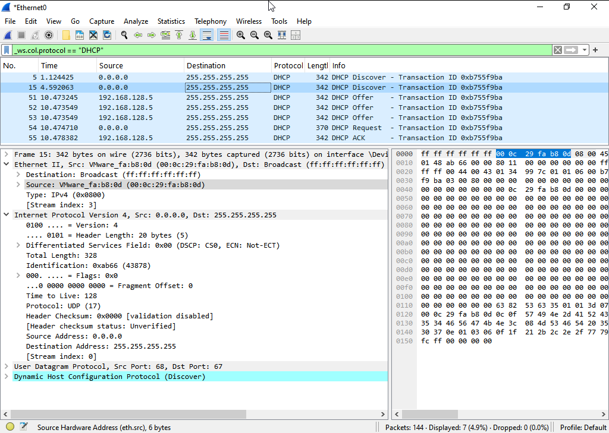
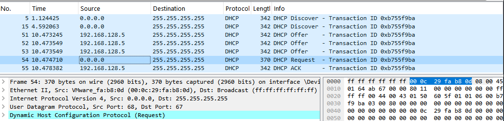
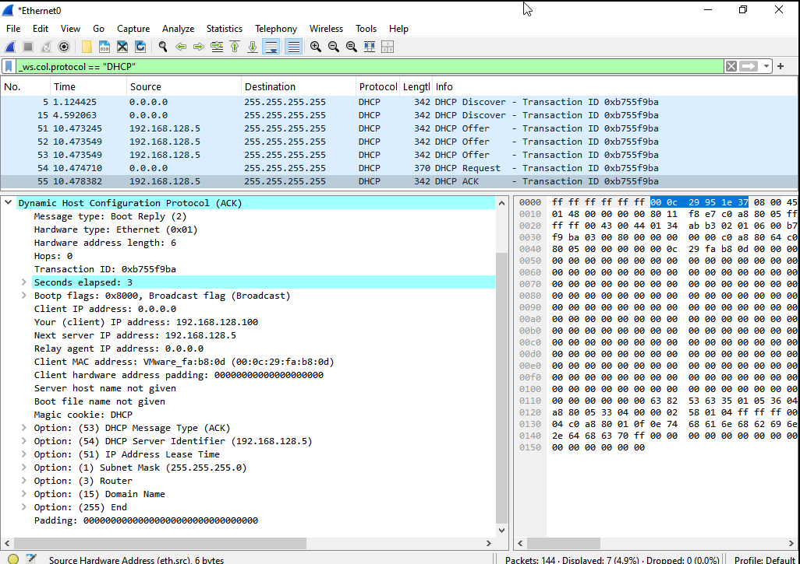
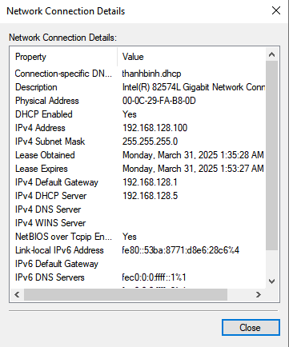

# Phân tích 4 gói tin khi Client nhận ip của DHCP Server
# 1. Client gửi bản tin DHCP Discover
- Client gửi thông điệp theo hình thức Broadcast.
- Src: `VMware_fa:b8:0d (00:0c:29:fa:b8:0d)`
- Des: `Broadcast (ff:ff:ff:ff:ff:ff)`
- IP nguồn: `0.0.0.0` (Do lúc này Client chưa có địa chỉ IP) - port 68
- IP đích: `255.255.255.255` - port 67

# 2. DHCP Server cung cấp bản tin DHCP Offer
- Server nhận được bản tin Discover sẽ gửi lại bản tin DHCP Offer theo hình thức Unicast có chứa IP `192.168.12.100` cho Client.

- Src: `VMware_95:1e:37 (00:0c:29:95:1e:37)`
- Des: `Broadcast (ff:ff:ff:ff:ff:ff)`
- IP nguồn: `192.168.128.5` - port 67
- IP đích: `255.255.255.255` - port 68
# 3. Client gửi lại bản tin DHCP Request để chấp nhận IP được Server cấp cho
- Client gửi bản tin theo dạng Broadcast.

- Tuy nhiên, bản tin đến Server sẽ chứa Request chấp nhận IP được cấp.
- Src port: 68
- Des port: 67

# 4. Server gửi bản tin DHCP ACK để xác nhận Client sử dụng địa chỉ IP cũng như thông tin cấu hình khác
- Gói tin DHCP ACK gửi dưới dạng Unicast chứa các thông tin cần thiết để cấu hình Client:

- Kiểm tra địa chỉ IP của máy tính client xem đã được cấp phát IP thành công hay chưa:

