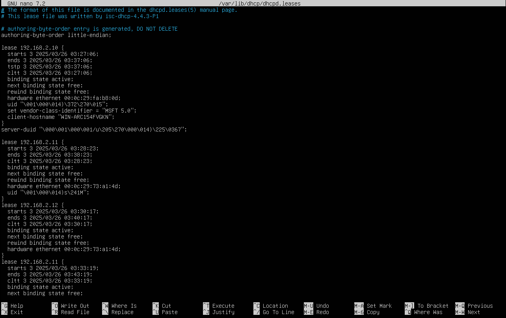
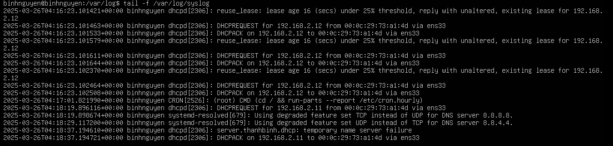
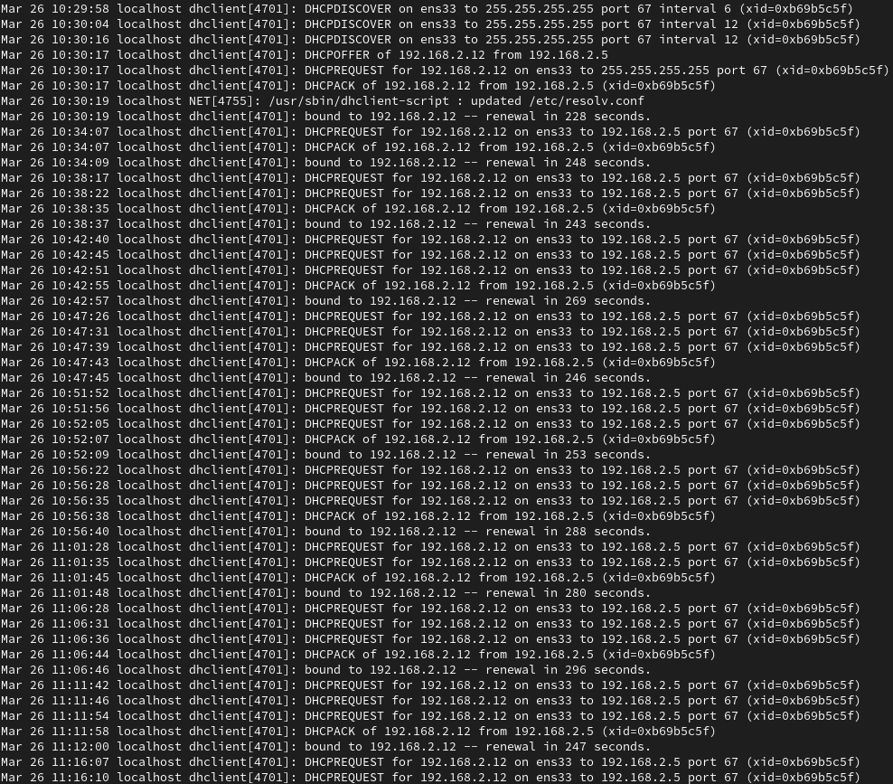

# DHCP file log
# 1. Danh sách địa chỉ IP đã cấp phát bởi DHCP
Để xem những địa chỉ IP đã được cấp phát bởi DHCP Server trên Ubuntu ta có thể xem ở file: `/var/lib/dhcpd/dhcpd.leases`



- `starts:` Thời gian bắt đầu của lease.
- `ends:` Thời gian kết thúc của lease.
- `tstp:` Thời gian tạm dừng lease. Điều này có thể dùng khi DHCP server tạm ngừng lease, nhưng thời gian này gần như luôn giống với thời gian kết thúc.
- `cltt:` Thời gian thuê của khách hàng (Client Lease Time). Đây là thời điểm khách hàng (client) yêu cầu và nhận lease, tức là cùng thời điểm với starts.
- `binding state:` Trạng thái của lease. Trong trường hợp này, lease đang ở trạng thái active, có nghĩa là địa chỉ IP hiện tại đang được sử dụng.
- `next binding state:` Trạng thái tiếp theo của lease khi lease hiện tại kết thúc. Trong trường hợp này, lease sẽ chuyển sang trạng thái free khi lease hết hạn.
- `rewind binding state:` Trạng thái quay lại sau khi lease hết hạn, lại trở thành free, sẵn sàng cho một client khác có thể yêu cầu địa chỉ IP này.
- `hardware ethernet:` Địa chỉ MAC address của máy khách yêu cầu DHCP lease. Đây là địa chỉ duy nhất của card mạng của thiết bị yêu cầu IP (trong trường hợp này là 00:0c:29:fa:b8:0d).
- `uid:` Unique Identifier (ID duy nhất) của máy khách, thường dùng để phân biệt máy khách khi máy có thể sử dụng nhiều địa chỉ IP hoặc khi DHCP server cần phân biệt giữa các máy khách.

# 2. Log của DHCP Server
Có thể xem Log của DHCP tại `/var/log/syslog`. Sử dụng lệnh tail để theo dõi sự thay đổi của file log:
```
tail -f /var/log/syslog
```



# 3. Log của DHCP Client

Để xem file log trên DHCP Client, vào file `var/log/messages`, sử dụng lệnh grep:
```
grep dhclient /var/log/messages
```


