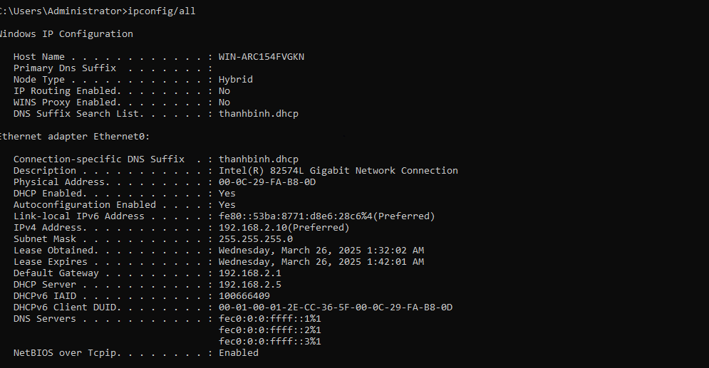
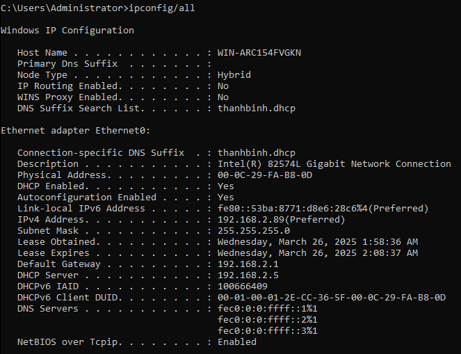
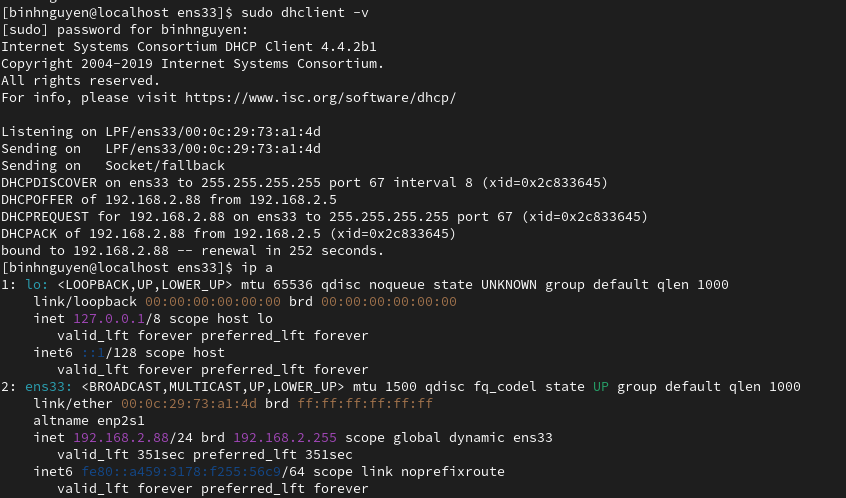

# DHCP cấp phát IP theo địa chỉ MAC(Bind IP to MAC)
# 1. Xác định địa chỉ MAC của Client
- Trên Windows, mở cmd và gõ lệnh `ipconfig/all`:



- Trên CentOS, dùng lệnh dưới đây để kiểm tra địa chỉ MAC:


# 2. Cấp IP theo địa chỉ MAC
- Trên DHCP Server, tiến hành mở file `/etc/dhcp/dhcpd.conf` để cấu hình cấp IP theo địa chỉ MAC:
```
nano /etc/dhcp/dhcpd.conf
```

- Sau đó thêm:
```
host centos9 {
    
    hardware ethernet 00:0c:29:73:a1:4d; 
    fixed-addres 192.168.2.89; 
}
```
```
host windows { 
    hardware ethernet 00:0C:29:FA:B8:0D; 
    fixed-address 192.168.2.88; 
    }
```


- Sau đó khởi động lại dịch vụ dhcp `systemctl restart isc-dhcp-server`.

# 3. Kiểm tra lại Client đã được cấp phát địa chỉ IP hay chưa
- Trên Windows, mở cmd và gõ lệnh:
```
ipconfig /release
ipconfig /renew
ipconfig
```


- Trên CentOS 9, gõ lệnh:
```
dhclient -v
```

