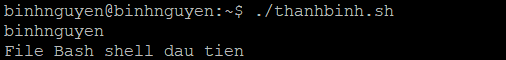
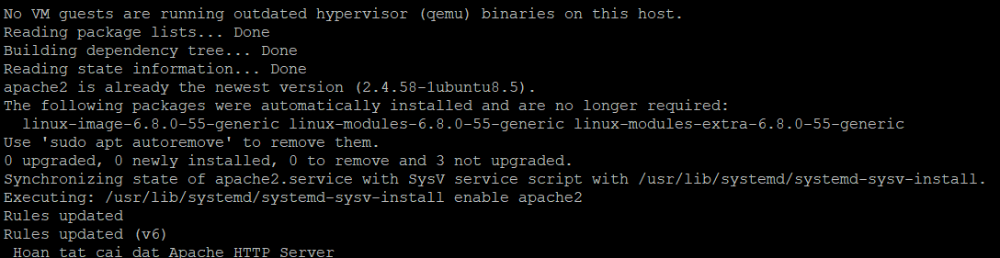

# TÌM HIỂU VỀ BASHSHELL
# 1. Bashshell là gì?
Bash (viết tắt của Bourne-Again Shell) là một chương trình dòng lệnh trong hệ điều hành Linux, cho phép người dùng giao tiếp với hệ thống Unix/Linux thông qua các lệnh đơn giản. Khi sử dụng Bash, bạn có thể nhập các lệnh để tương tác với máy tính như xem chỉnh sửa file, quản lý thư mục, hoặc cài đặt phần mềm. Bash không chỉ là một công cụ để chạy lệnh, mà còn là một ngôn ngữ lập trình hữu ích.


Bash Shell là một loại Bourne Shell (sh) với tính năng thông dịch ngôn ngữ lệnh phổ biến nhất trên hệ điều hành GNU (hoặc GNU/Linux – một tên gọi khác của Linux). Ngoài việc hỗ trợ các chức năng như biến (variables) và điều khiển luồng (flow controls), Bash có khả năng đọc và thực thi lệnh từ các file. Hoạt động như một shell (môi trường dòng lệnh), Bash có nhiệm vụ là trình thông dịch trung gian giữa người dùng và hệ thống, giúp máy tính hiểu nơi bạn thực hiện tập lệnh(Shell Script)
# 2. Cách tạo 1 file bashshell
Để tạo một file mới có phần mở rộng là `.sh`. Bạn có thể sử dụng lệnh `touch`.
```
touch thanhbinh.sh
```

Chỉnh sửa file bằng lệnh nano:
```
nano thanhbinh.sh
```

Viết một file bashshell cũng như việc thêm nội dung vào văn bản, tuy nhiên cần biết cách viết hợp lệ để lệnh shell có thể đọc được.
```
#!/bin/bash
echo $USER
echo "File Bash shell dau tien"
```
Một file bash script phải luôn bắt đầu bằng #!/bin/bash để biểu thị rằng tập lệnh sẽ chạy với bash script chứ không phải bất kỳ shell nào khác. Sau khi viết xong các lệnh , hãy lưu và thoát khỏi tệp để tiếp tục.
# 3. Cách chạy 1 file bashshell
Để chạy được tập lệnh của mình ta cần cấp quyền thực thi cho nó bằng lệnh chmod:
```
sudo chmod +x thanhbinh.sh
```
Để thực thi tập lệnh ta chạy lệnh:
```
./thanhbinh.sh
```

# 4. Viết 1 script bashshell “Hello World”
Ta tạo 1 file bash shell bằng lệnh touch và sửa nội dung bên trong:
```
#!/bin/bash
echo Hello, World!
```
Chạy lệnh cấp quyền thực thi và ta có kết quả:

# 5. Viết 1 script bashshell thực hiện cài đặt tự động HTTP trên Ubuntu 24.04
Tạo file `autoinstallhttp.sh`:
```
touch autoinstallhttp.sh
```
Thêm các thông tin sau vào file `autoinstallhttp.sh`:
```
#!/bin/bash

# Cap nhat va nang cap he thong

sudo apt update -y
sudo apt upgrade -y

# Cai dat Apache HTTP server

sudo apt install apache2 -y

# Khoi dong Apache va cau hinh tu dong  khoi dong cung he thong

sudo systemctl start apache2
sudo systemctl enable apache2

# Cau hinh tuong lua cho phep truy cap Http qua cong 80
sudo ufw allow 80/tcp

# Hien thi thong bao cai dat hoan tat

echo " Hoan tat cai dat Apache HTTP Server "
```

Cấp quyền thực thi cho file bash shell:
```
sudo chmod +x autoinstallhttp.sh
```
Chạy file bash shell:
```
./autoinstallhttp.sh
```



Tài liệu tham khảo:

[1] (https://vietnix.vn/bash-la-gi/)
