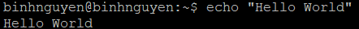
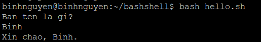
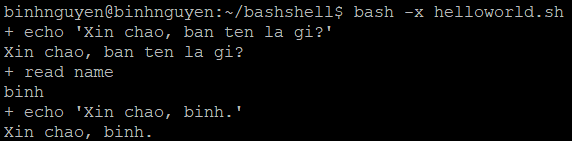
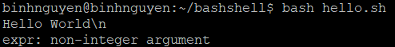
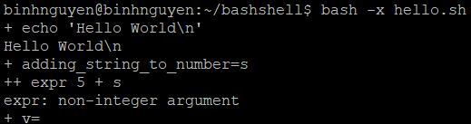
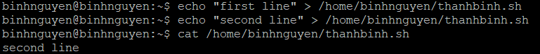
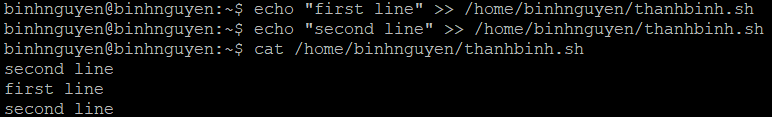

# BASHSHELL TUTORIAL
# 1. Bash Shell: Hello World
- **Chế độ Shell tương tác (Interactive Shell)**

  Chúng ta có thể hiểu đơn giản Shell interactive là dạng sử dụng câu lệnh trực tiếp trên môi trường Unix như ví dụ dưới.

  Ví dụ, sử dụng Bash để in ra output là Hello World như sau:

  

- **Chế độ Shell không tương tác (Non-Interactive Shell)**

   Thay vì thực hiện từng câu lệnh Bash một. Chúng ta có thể tổ hợp chúng vào một file script và có thể sử dụng lại nhiều lần.

   Ví dụ, tạo một script Hello World:
   - Tạo một file với tên là helloworld.sh
   ```
   touch helloworld.sh
   ```
   - Phân quyền thực thi được với câu lệnh:
   ```
   sudo chmod +x helloworld.sh
   ```
   - Thêm nội dung sau vào script:
   ```
   #!/bin/bash
   echo Hello, World!
   ```
   - Thực hiện chạy sript hello-world.sh theo 1 trong 3 cách sau:
   ```
   ./helloworld.sh
   /bin/bash helloworld.sh
   bash helloworld.sh
   ```

# 2. Sử dụng các biến trong Linux
- Tạo một file mới tên gọi `hello.sh` với nội dung bên dưới và cấp quyền thực thi `chmod +x hello.sh`.
- Nội dung script như sau:
```
#!/usr/bin/env bash
who_variable="World"
printf "Hello, %s\n" "$who_variable"
```
- Phân tích từng dòng của script sẽ như sau:
  - `Dòng 1 : #!/usr/bin/env bash`: Cú pháp shebang chỉ ra chương trình cần thực thi với Bash shell.
  - `Dòng 2 :` Gán biến `who_variable` có nội dung là `World`.
  - `Dòng 3 :`
       - printf : câu lệnh in
       - %s : format chỉ ra rằng biến phía sau phải là dạng string
       - \n : khi có thêm ký tự thì sẽ xuống dòng mới
       - $who_variable : biến được khai báo ở dòng trên
- Chú ý : Các biến cần được đặt bên trong dấu `""`.
# 3. Truyền tham số vào biến với User Input
Các biến còn có thể được truyền vào trực tiếp từ người dùng như sau:
```
#!/usr/bin/env bash
echo "Xin chao, ban ten la gi?"
read name
echo "Xin chao, $name."
```
Khi script chạy tới dòng thứ 2, câu lệnh read sẽ đọc dữ liệu truyền vào từ người dùng, sau đó gán dữ liệu đó vào biến name.

Kết quả như sau:



# 4. Tầm quan trọng của các dấu nháy (quoting) với String
Việc sử dụng dấu nháy rất quan trọng trong việc thể hiện string trong bash.

Có 2 dạng dấu nháy:
- Weak quoting: dấu nháy kép `“`
- Strong quoting: dấu nháu đơn `‘`

**TH1: Weak quoting (nháy kép)**

Sử dụng nháy kép khi bạn muốn bash thực thi các biến String được truyền vào. Ví dụ, với script như sau:
```
#!/usr/bin/env bash
world="World"
echo "Hello $world"
```

Output hiện ra sẽ là : `Hello World`

**TH2: Strong quoting (nháy đơn)**

Sử dụng nháy đơn khi bạn muốn giữ nguyên nội dung trong dấu nháy. Ví dụ:

```
#!/usr/bin/env bash
world="World"
echo 'Hello $world'
```

Output hiện ra sẽ là : `Hello $world`

# 5. Chế độ Debug trong Shell
Để có thể theo dõi quá trình thực thi script nhằm hiểu rõ hơn về cách script thực hiện, hoặc tìm lỗi trong script, chúng ta có thể dùng chế độ Debug.

Để thực hiện việc debug, cần thêm tổ hợp ký tự `-x` đằng sau các mệnh lệnh run.

**Ví dụ 1:**

Bật mode debug với script `helloworld.sh` nhằm theo dõi quá trình thực thi script.
```
bash -x helloworld.sh
```



**Ví dụ 2:**

Bật mode debug để tìm lỗi có trong script `hello.sh` sau:
```
#!/bin/bash
echo "Hello World\n"
adding_string_to_number="s"
v=$(expr 5 + $adding_string_to_number)
```

Output hiển thị sẽ là:



Tuy nhiên, nội dung output như vậy là chưa đủ để chúng ta tìm ra lỗi của script. Hãy thử bật mode debug để tìm lỗi:

```
bash -x hello.sh
```


Có thể thấy do s không phải là một chữ số vậy nên toán tử không thể thực hiện được.

# 6. Sử dụng Rediection trong Shell
Kỹ thuật redirection là kỹ thuật dùng toán tử `>`. redirect từ luồng stream này sang luồng stream khác. Thông thường giúp người dùng thêm nội dung vào trong file. Có 2 kiểu redirection:

- Kiểu `Trancate > `

Kiểu này sẽ xóa toàn bộ nội dung cũ của file và chèn nội dung được thêm. VD như sau:

Thực hiện 2 câu lệnh chèn nội dung tới file
```
$ echo "first line" > /home/binhnguyen/thanhbinh.sh
$ echo "second line" > /home/binhnguyen/thanhbinh.sh
```

Kiểm tra nội dung file:

```
cat /home/binhnguyen/thanhbinh.sh
```


- Kiểu `Append >> `

Kiểu append sẽ chèn thêm nội dung mới vào file và không tác động gì tới nội dung cũ của file.

```
$ echo "first line" >> /home/binhnguyen/thanhbinh.sh
$ echo "second line" >> /home/binhnguyen/thanhbinh.sh
```

Kiểm tra nội dung file:
```
cat /home/binhnguyen/thanhbinh.sh
```



Tài liệu tham khảo:

[1] (https://blog.cloud365.vn/shell/bash-shel-danh-cho-nguoi-moi-bat-dau-p1/)