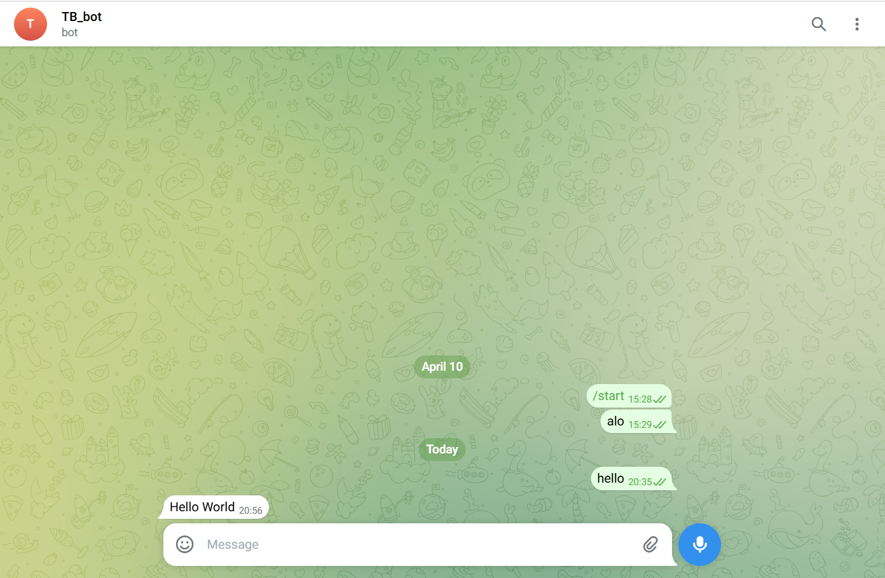

# Viết script "Hello World" để bot gửi qua telegram
Tạo 1 file script helloworld.sh
```
touch helloworld.sh
```
Bên trong file lần lượt khai báo các thông tin:
- **USERID:** ID group chat/ID chat trên telegram muốn gửi thông báo đến.
- **TOKEN:** API con bot của bạn.
- **URL:** url gửi tin nhắn của bot.
- **TEXT:** Nội dung thông báo.
```
#!/usr/bin/env bash
# ID chat Telegram
USERID="6314000780"

# API Token bot
TOKEN="8072023596:AAFIJ9qTFt7yEjfnFTXknMM3Jye0NWemVRQ"

# URL gui tin nhan cua bot
URL="https://api.telegram.org/bot$TOKEN/sendMessage"

TEXT=$(echo -e "Hello World   ")
curl -s -X POST  $URL -d "chat_id=$USERID" -d text="$TEXT" > /dev/null
```
Cấp quyền thực thi cho file:
```
sudo chmod +x helloworld.sh
```
Chạy file:
```
bash helloworld.sh
```

