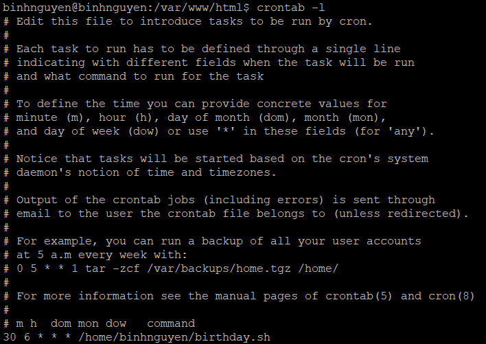

# SỬ DỤNG CRONTAB ĐỂ THỰC HIỆN FILE BIRTHDAY HÀNG NGÀY
- Gõ lệnh `crotab -e` để vào file cấu hình crontab.
- Thực hiện thêm cấu hình cho file `birthday.sh` để thực hiện hàng ngày:
```
30 6 * * * home/binhnguyen/birthday.sh
```
- Gõ lệnh `crontab -l` để xem đã cấu hình thành công hay chưa:
