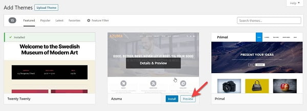

# CÁC THÀNH PHẦN CHÍNH ĐỂ XÂY DỰNG 1 WEBSITE BẰNG WORDPRESS
# 1. Chọn và đăng ký tên miền (Domain)
Mỗi Website đều cần có tên miền riêng. Ví dụ như google.com, vnexpress.net. Và các Website trên thế giới đều phải có tên miền thì mới vận hành được. 

Mỗi Website sẽ cần một tên miền, bạn sẽ trả phí theo mỗi năm sử dụng, hoặc mua với thời hạn nhiều năm hơn và được phép gia hạn hằng năm. 
# 2. Mua Hosting
Hosting là phần không gian lưu trữ Source Website của bạn, giúp Website của bạn có thể hoạt động được trên môi trường Internet. 

Cần nắm rõ các thông số cơ bản khi chọn mua Hosting chẳng hạn như: Ổ cứng HDD và SSD, Dung lượng lưu trữ (Website Space), Băng thông (Bandwidth), Uptime,… 

# 3. Cài đặt WordPress
Sau khi đã chọn và đăng ký tên miền cũng như mua được Hosting để xây dựng Website bằng WordPress, tiếp theo bạn cần tìm hiểu cách cài đặt WordPress:
- Bước 1: Tìm đến biểu tượng WordPress và nhấp chọn để tiến hành cài đặt.
- Bước 2: Điền vào các thiết lập Website muốn cài, cài đặt “User” và “Password” cho Website, đặt tên Website,…
- Bước 3: Đến đây, bạn đã tạo được Website bằng WordPress thành công.

Đường dẫn đăng nhập WordPress của bạn sẽ trông giống như thế này:

“http://websitecuaban.com/wp-admin”.

# 4. Chọn Theme WordPress
Sau khi đăng nhập vào Dashboard, bạn có thể  tùy chỉnh giao diện (Theme) trên trang Web của bạn trên.

Để thay đổi Chủ đề (Theme), bạn truy cập vào Dashboard (Trang tổng quan) và chọn “Appearance” (Giao diện) → “Themes” (Chủ đề).

Ngay đầu trang, chọn vào “Add New”.

Trên màn hình tiếp theo, có hơn 1000 Theme WordPress miễn phí có sẵn. Để xem trước một Theme, bạn đưa chuột đến một Theme bất kỳ và bạn sẽ thấy nút Preview (Xem trước). Sau đó, hãy Click vào để xem giao diện.

Chọn được Theme muốn cài đặt, bạn chỉ cần nhấn vào “Install” (Cài đặt). Và đợi vài giây để Theme được thiết lập. 

Sau đó, nút Install sẽ được thay thế bằng nút “Activate” (Kích hoạt). Việc tùy chỉnh cũng rất dễ dàng. Chọn vào “Appearance” → “Customize” là bạn có thể tùy chỉnh Theme của mình.

Lưu ý: Bạn cần tìm Theme với thiết kế, màu sắc, kiểu chữ và một vài yếu tố khác,… để có được một trang Web hoàn chỉnh.

Tài liệu tham khảo:

[1] (https://wiki.matbao.net/huong-dan-xay-dung-website-bang-wordpress-cho-nguoi-moi/)
