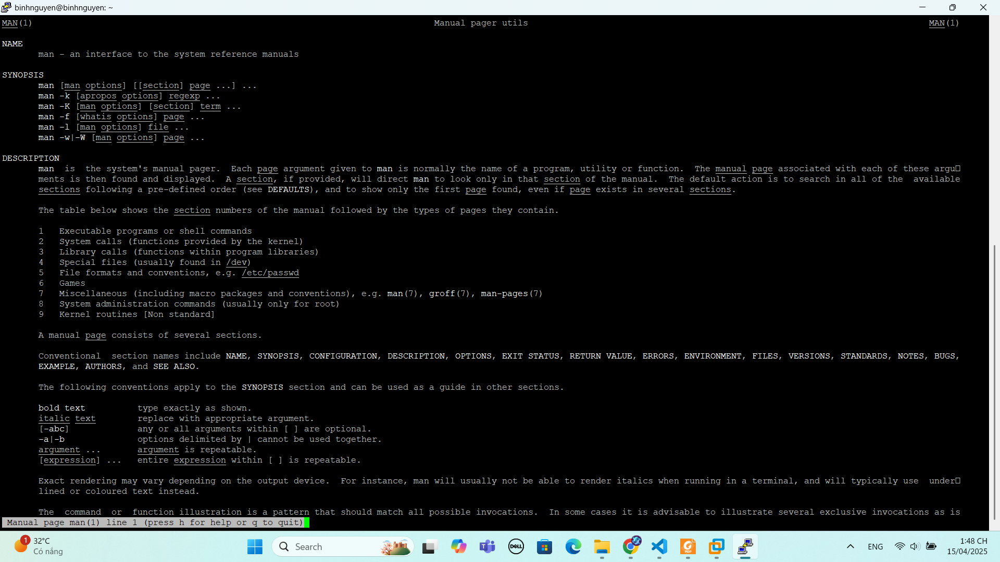
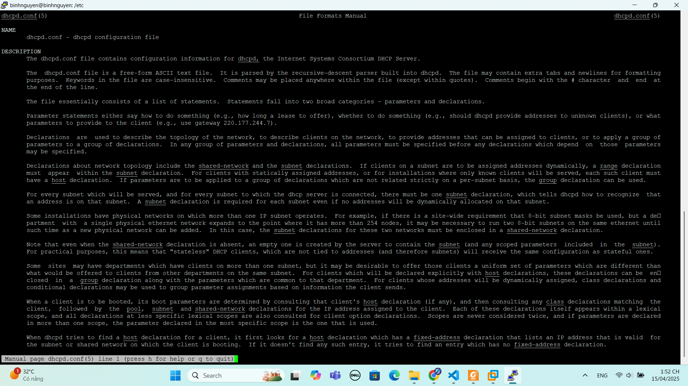
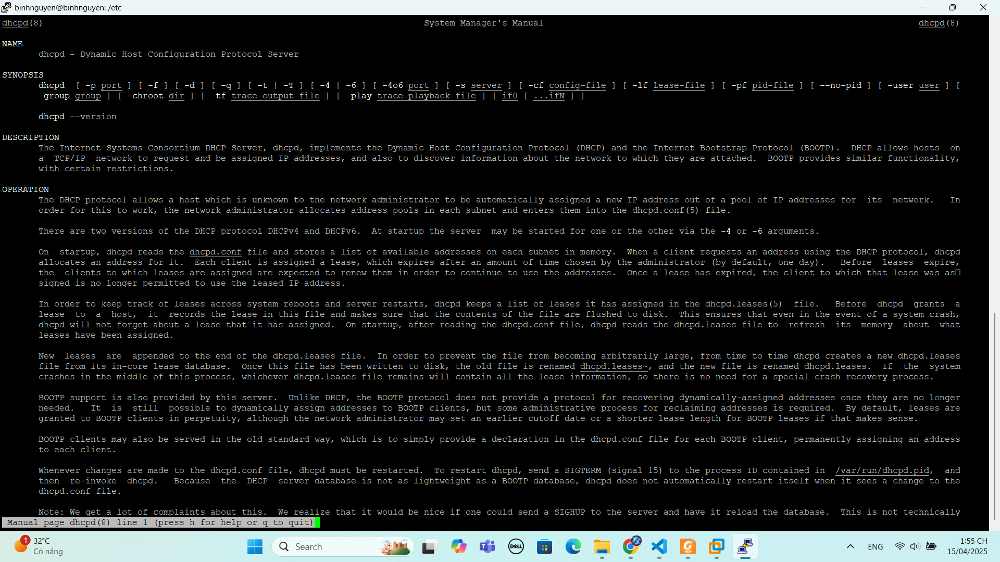
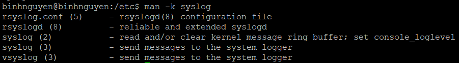
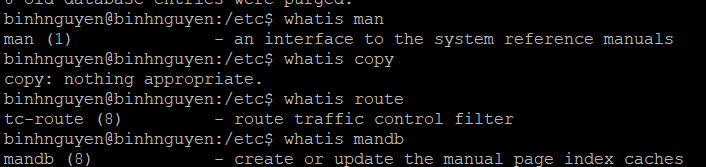
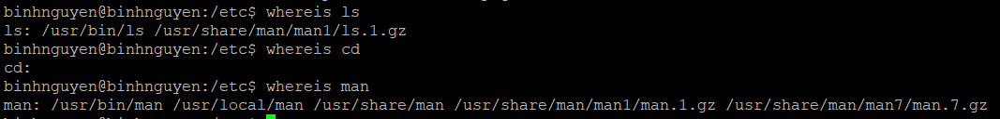
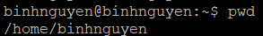
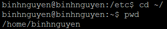

# 1. Lệnh man
## 1.1 man $command
Gõ lệnh `man` kèm theo một lệnh khác để đọc file hướng dẫn cách sử dụng lệnh đó.

Ví dụ:
```
$ man man
```


Bấm `q` để thoát khỏi trang hướng dẫn.
## 1.2 man $configfile
Gõ lệnh `man` kèm theo một file cấu hình để đọc file hướng dẫn về file cấu hình.

Ví dụ:
```
man dhcpd.conf
```


Bấm `q` để thoát khỏi trang hướng dẫn.
## 1.3 man $deamon
Gõ lệnh `man` kèm theo một deamon để đọc file hướng dẫn về deamon đó trong hệ thống.

Ví dụ:
```
man dhcpd
```



Bấm `q` để thoát khỏi trang hướng dẫn.
## 1.4 man -k (apropos)
`man -k <từ_khóa>` sẽ liệt kê tất cả các trang lệnh liên quan đến từ khóa đó, kèm mô tả ngắn.


## 1.5 whatis
Lệnh `whatis` trong Linux/Unix được dùng để hiển thị mô tả ngắn gọn về một lệnh hoặc chương trình, lấy từ trang trợ giúp (man).


## 1.6 whereis
Lệnh `whereis` trong Linux/Unix dùng để tìm vị trí của các file liên quan đến một lệnh, ví dụ như file thực thi, trang man, mã nguồn, v.v.


## 1.7 man sections
Trong Linux/Unix, khi bạn dùng lệnh man, bạn có thể thấy các con số trong ngoặc tròn sau tên lệnh, ví dụ:
```
man(1)
passwd(5)
printf(3)
```
Các con số này đại diện cho phần (section) trong tài liệu man, mỗi phần nói về một loại nội dung khác nhau:

|       |                                              |
|:------|:---------------------------------------------|
|Phần|Nội dung|
|1|Các chương trình thực thi hoặc lệnh shell|
|2|Các lời gọi hệ thống (system calls – các hàm do kernel cung cấp)|
|3|	Các lời gọi thư viện (library calls – các hàm trong thư viện lập trình)|
|4|Các tập tin đặc biệt (thường là trong /dev)|
|5|	Định dạng tập tin và quy ước (ví dụ: /etc/passwd)|
|6|	Trò chơi|
|7|	Các mục linh tinh (bao gồm các gói macro, quy ước...), ví dụ man(7)|
|8|	Các lệnh quản trị hệ thống (thường dành cho root)|
|9|Các hàm trong kernel [Không tiêu chuẩn]|
## 1.8 man $section $file
Trong Linux, một số lệnh hoặc tên tập tin có thể xuất hiện ở nhiều phần khác nhau của tài liệu man. Ví dụ:
- `passwd(1)` → Lệnh đổi mật khẩu người dùng.
- `passwd(5)` → Tài liệu về định dạng của tập tin `/etc/passwd`.

`man passwd` mặc định mở phần 1 (lệnh passwd).

`man 5 passwd` mô tả định dạng của tập tin `/etc/passwd`.

## 1.9 mandb
Lệnh `mandb` là viết tắt của manual database, được dùng để tạo hoặc cập nhật cơ sở dữ liệu tra cứu cho `man -k` hoặc `apropos`.

Khi bạn cài thêm phần mềm mới có trang man, để `man -k <từ_khóa>` hay `apropos <từ_khóa>` tìm thấy các trang mới này, bạn cần cập nhật cơ sở dữ liệu bằng cách chạy.
# 2. Lệnh làm việc với directory
## 2.1 pwd
Lệnh `pwd` hiển thị ra thư mục hiện tại mà hệ thống đang làm việc.


## 2.2 cd
Lệnh `cd` dùng để chuyển đổi thư mục hệ thống làm việc.
### 2.2.1 cd ~
Lệnh `cd ~` để chuyển tới thư mục home.


### 2.2.2 cd ..
Lệnh `cd ..` để chuyển tới thư mục mẹ của thư mục hiện tại đang làm việc.
### 2.2.3 cd -
Lệnh `cd -` để chuyển tới thư mục làm việc trước đó của hệ thống.
## 2.3 Đường dẫn tuyệt đối và tương đối
**Absolute path (Đường dẫn tuyệt đối):**
- Bắt đầu bằng dấu gạch chéo /.
- Luôn tính từ thư mục gốc (root /).
- Ví dụ: /home/paul, /etc/passwd, /usr/bin

**Relative path (Đường dẫn tương đối):**
- Không bắt đầu bằng /.
- Tính từ thư mục hiện tại.
- Ví dụ: nếu bạn đang ở /home, thì cd paul sẽ đưa bạn vào /home/paul.
## 2.4 tab
Phím `Tab` có thể giúp bạn gõ đường dẫn nhanh hơn và chính xác hơn, tránh lỗi chính tả hoặc sai thư mục.
## 2.5 ls
## 2.6 mkdir
## 2.7 rmdir
# 3. Lệnh làm việc với file
# 4. Lệnh làm việc với nội dung trong file