# Top – Linux Process Monitoring
# 1. Mục đích sử dụng
Lệnh Linux `Top` là một chương trình theo dõi hiệu suất. Lệnh `top` được sử dụng để hiển thị tất cả các quy trình thời gian thực đang chạy và đang hoạt động trong danh sách được sắp xếp và cập nhật nó thường xuyên, chẳng hạn như thông số CPU/bộ nhớ và tác vụ đang chạy, đồng thời bạn cũng có thể thể xem tất cả các process (tiến trình) đang chạy trên máy chủ của chính mình..

# 2. Thông tin hiển thị
Để hiển thị các thông tin của hệ thống, chỉ cần gõ lệnh sau vào cửa sổ dòng lệnh:
```
top
```
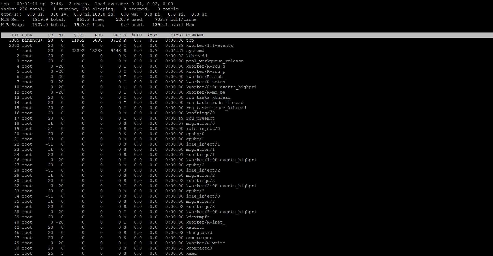

Có rất nhiều thông tin sẽ hiển thị trong lệnh top, bao gồm:

- **Dòng 1:**

   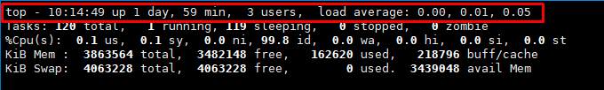

   - Thời gian hiện tại của hệ thống.
   - Hệ thống đã chạy liên tục được 1 ngày 59 phút (thời gian uptime).
   - 	Có 3 người dùng hiện đang đăng nhập vào hệ thống.
   - 	Mức tải trung bình (load average) trong 1 phút, 5 phút, 15 phút.

- **Dòng 2:**

   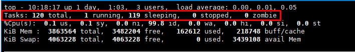

   - Tasks: Tổng số tác vụ có trên máy chủ.
   - running: Số lượng tác vụ đang chạy.
   - sleeping: Số lượng tác vụ trong trạng thái “sleep”, bạn có thể hiểu tác vụ đang tạm dừng.
   - stopped: Số lượng tác vụ đã dừng.
   - Số lượng tác vụ zombie (tiến trình không tồn tại hoặc bị hỏng).

- **Dòng 3:**

   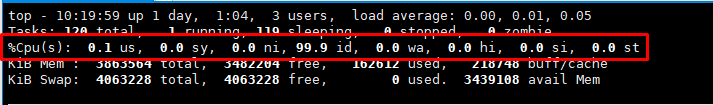

   - `%us` (user cpu time): phần trăm do tiến trình của người dùng (non root) sử dụng.
   - `%sy` (system cpu time): phần trăm do tiến trình của hệ thống (root) sử dụng.
   - `%ni` (user nice cpu time): phần trăm do các tiến trình có mức độ ưu tiên thấp sử dụng.
   - `%id` (idle cpu time): phần trăm CPU đang rảnh.
   - `%wa` (io wait cpu time): phần trăm CPU để đợi trong khi các tiến trình I/O đang xử lý.
   - `%hi` (hardware irq): phần trăm để xử lý gián đoạn phần cứng.
   - `%si` (software irq): phần trăm để xử lý gián đoạn phần mềm.
   - `%si` (software irq): phần trăm để xử lý gián đoạn phần mềm.

- **Dòng 4:**

   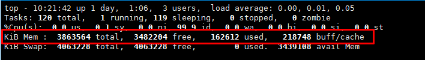

   - Tổng bộ nhớ hệ thống(đơn vị Kib).
   - Bộ nhớ trống.
   - Bộ nhớ đã sử dụng.
   - Bộ nhớ đệm buffer cache.

- **Dòng 5:** 

   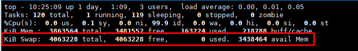

   - Tổng swap có sẵn(đơn vị Kib).
   - Tổng swap còn trống.
   - Tổng swap đã sử dụng.
   - Bộ nhớ khả dụng.
   - Swap là RAM ảo, được sử dụng khi bộ nhớ vật lý (RAM) bị đầy. Luôn luôn bật Swap để khi hệ thống đầy ram vật lý sẽ không bị treo.

- **Bảng chính:**

   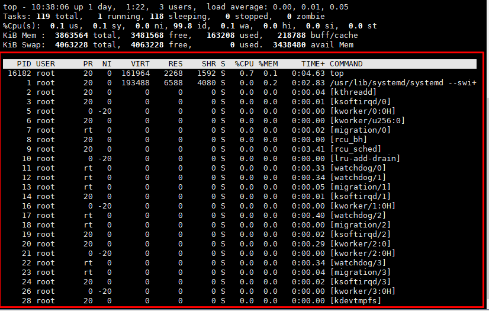

   - ID tiến trình.
   - Người dùng(Mình có ẩn bớt một số user chứ mặc định không có trống).
   - Mức độ ưu tiên.
   - Mức độ nice (gọi một tập lệnh shell với mức độ ưu tiên cụ thể).
   - Bộ nhớ ảo được sử dụng bởi tiến trình.
   - Bộ nhớ “thường trú” mà một tiến trình sử dụng (tức là tiến trình luôn ở trong bộ nhớ và không thể chuyển ra thiết bị lưu trữ khác).
   - Bộ nhớ có thể chia sẻ.
   - CPU được sử dụng bởi tiến trình theo tỷ lệ phần trăm của 1 cpu.
   - Bộ nhớ được sử dụng bởi tiến trình theo tỷ lệ phần trăm.
   - Thời gian tiến trình đã được chạy.
   - Lệnh chạy.
# 3. Các option của lệnh top
- `-h` - hiển thị các option của lệnh top
  
  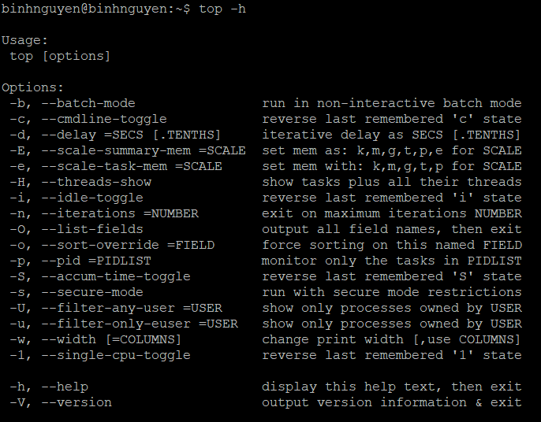

- `-V` – Hiển thị phiên bản hiện tại.

  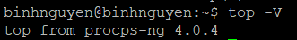

- `-b` – Chạy ở chế độ không tương tác (batch mode), kết quả sẽ được in ra chuẩn (stdout), thường dùng để ghi log hoặc phân tích tự động.

   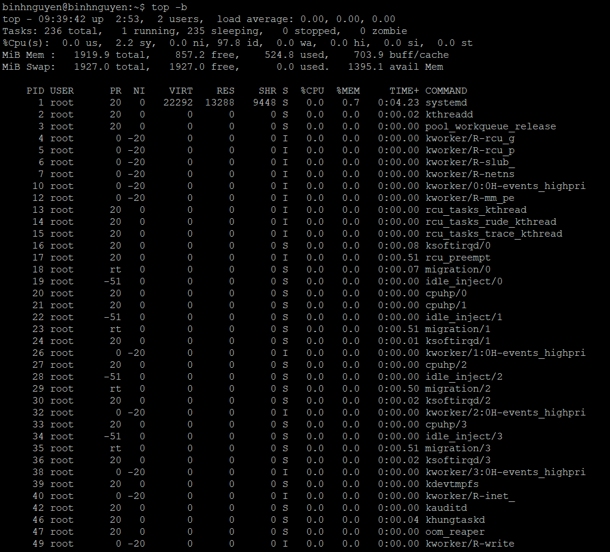
   
- `-c` – hiển thị toàn bộ dòng lệnh (full command line) mà mỗi tiến trình đang chạy, thay vì chỉ hiển thị tên chương trình (COMMAND).

   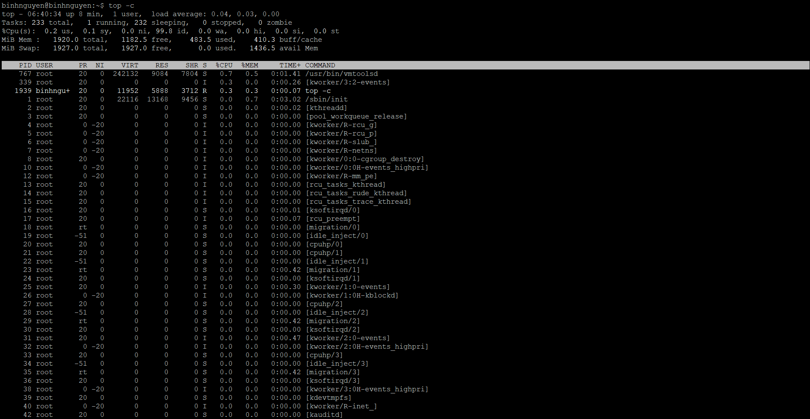

- `-d` – Chỉ định thời gian trễ khi refresh màn hình.
   
   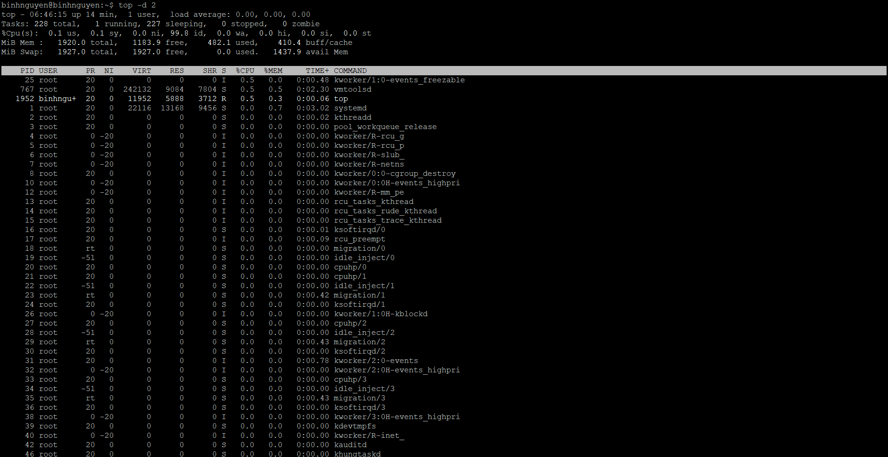

- `-o` – Sắp xếp theo trường được đặt tên
- `-p` – Chỉ hiển thị các tiến trình với ID được chỉ định.
- `-u` – Chỉ hiển thị những tiến trình của người dùng được chỉ định.
- `-i` – Không hiển thị các idle task.

# 4. Sắp xếp tiến trình
- Phím `P`: Sắp xếp theo %CPU giảm dần.
- Phím `M`: 	Sắp xếp theo %MEM giảm dần
- Phím `T`: 	Sắp xếp theo TIME+

Tài liệu tham khảo:

[1] (https://longvan.net/cong-dong/mot-so-cong-cu-de-monitor-server-linux/)
