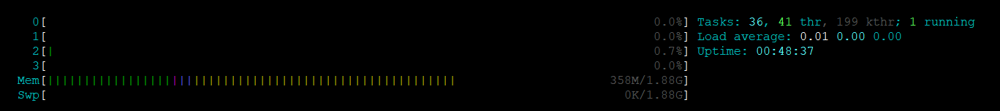
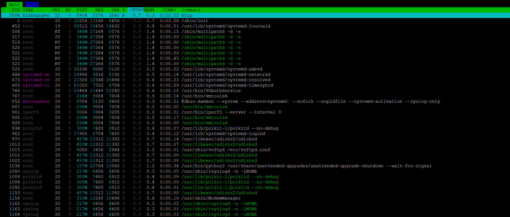
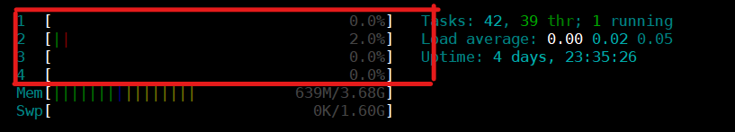
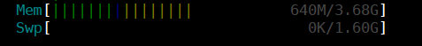
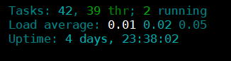
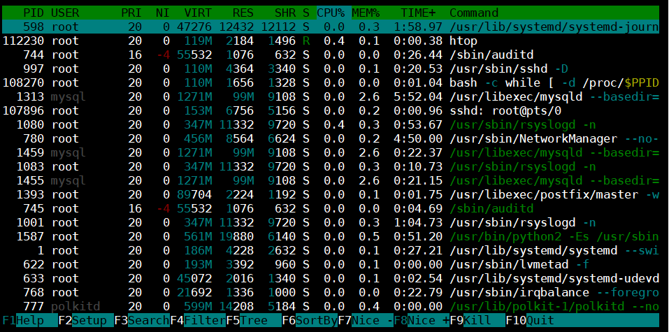

# Htop – Linux Process Monitoring
# 1. Mục đích sử dụng
Htop là một công cụ giám sát quy trình Linux tương tác và thời gian thực. Lệnh này giống với lệnh top nhưng có một số tính năng phong phú như giao diện thân thiện với người dùng để quản lý quy trình, phím tắt, chế độ xem dọc và ngang của các quy trình và hơn thế . Htop là một công cụ bên thứ 3 và không có trong các hệ thống trong Linux.
# 2. Cài đặt htop
```
# Đối với Ubuntu

sudo apt-get install htop


# Đối với centos

sudo yum -y install epel-release
sudo yum -y install htop
```
# 3. Thông tin hiển thị
## 3.1 Các phần của lệnh htop
Sau khi chạy lệnh htop chúng ta có thể thấy màn hình hiển thị htop được phân thành 3 phần:
- **Header:**



Phần header hiển thị các số liệu hệ thống bao gồm CPU, Ram, Swap, các tác vụ đang chạy, load average và thời gian hoạt động (Uptime).

- **Body:**



Phần này liệt kê tất cả các tiến trình đang chạy.

- **Footer:**


Phần này hiển thị các tùy chọn menu của htop.
## 3.2 Cách sử dụng 
### 3.2.1 Mức sử dụng CPU


- Màu xanh dương: Tiến trình với mức ưu tiên thấp
- Màu xanh lá cây: Tiến trình người dùng
- Màu đỏ: Tiến trình kernel
- Màu vàng: Thời gian IRQ (Thời gian xử lý ngắt phần cứng (hardware interrupts))
- Màu đỏ tươi: Thời gian Soft IRQ (Ngắt mềm (interrupts do phần mềm, như driver))
- Xám: Thời gian chờ IO

### 3.2.2 Mức dùng bộ nhớ ram


- Màu xanh lá cây: Bộ nhớ đã sử dụng
- Màu xanh dương: Bộ nhớ đệm
- Màu vàng: Bộ nhớ cache

### 3.2.3 Tải trung bình (Load average)



Tải trung bình (Load average) là thước đo lượng công việc mà hệ thống thực hiện. Load average cho ta thấy được trung bình khối lượng công việc hệ thống phải xử lý trong mỗi khoảng thời gian 1 phút, 5 phút và 15 phút. 

### 3.2.4 Thông tin tiến trình



- **PID:** Số ID của tiến trình.
- **USER:** Chủ sở hữu tiến trình.
- **PR:** Mức độ ưu tiên của tiến trình. Con số càng thấp, mức độ ưu tiên càng cao.
- **NI:** Giá trị nice value của tiến trình, ảnh hưởng đến mức độ ưu tiên của nó.
- **VIRT:** Tiến trình sử dụng bao nhiêu bộ nhớ ảo.
- **RES:** Tiến trình sử dụng bao nhiêu RAM vật lý, được đo bằng kilobyte.
- **SHR:** Bộ nhớ chia sẻ mà tiến trình đang sử dụng.
- **S:** Tình trạng hiện tại của tiến trình (zombied, sleeping, running, uninterruptedly sleeping, traced).
- **%CPU:** Tỷ lệ phần trăm CPU được sử dụng bởi tiến trình.
- **%MEM:** Tỷ lệ phần trăm RAM vật lý được sử dụng bởi tiến trình.
- **TIME+:** Tiến trình xử lý đã sử dụng bao nhiêu thời gian.
- **COMMAND:** Tên của lệnh bắt đầu tiến trình.

### 3.2.5 Một số phím tắt
| Phím | Tên         | Chức năng                                                                 |
|------|--------------|--------------------------------------------------------------------------|
| F1   | **Help**     | Hiển thị **trợ giúp**: mô tả các màu, phím tắt, trạng thái tiến trình,…  |
| F2   | **Setup**    | Mở menu **cấu hình** (`Setup`) để chỉnh giao diện, cột, màu,…           |
| F3   | **Search**   | **Tìm kiếm tiến trình** theo tên (gõ tên và enter để lọc nhanh).         |
| F4   | **Filter**   | **Lọc tiến trình** khớp với chuỗi bạn nhập (lọc động, khác với search). |
| F5   | **Tree**     | Bật/tắt chế độ hiển thị tiến trình theo **dạng cây (tree view)**.        |
| F6   | **SortBy**   | Chọn cột để **sắp xếp tiến trình** (CPU, MEM, TIME, PID, …).            |
| F7   | **Nice -**   | **Giảm độ ưu tiên** (tăng nice value) của tiến trình đang chọn.         |
| F8   | **Nice +**   | **Tăng độ ưu tiên** (giảm nice value). Cần quyền root nếu giảm dưới 0.  |
| F9   | **Kill**     | **Gửi tín hiệu kết thúc** tiến trình (mặc định là `SIGTERM`).           |
| F10  | **Quit**     | **Thoát khỏi htop**.                                                     |

# 4. Các option lệnh htop
| Option                              | Giải thích                                                                                      |
|-------------------------------------|--------------------------------------------------------------------------------------------------|
| `-C`, `--no-color`                  | Dùng giao diện không màu (đen trắng), tiện cho log hoặc terminal không hỗ trợ màu.              |
| `-d DELAY`, `--delay=DELAY`        | Đặt khoảng thời gian cập nhật giữa các lần refresh, đơn vị là 1/10 giây (VD: `-d 50` = 5 giây). |
| `-F FILTER`, `--filter=FILTER`     | Chỉ hiển thị tiến trình khớp với bộ lọc cụ thể (giống chức năng nhấn `F4`).                     |
| `-h`, `--help`                      | Hiển thị màn hình trợ giúp dòng lệnh (như bạn đã thấy).                                          |
| `-H`, `--highlight-changes[=DELAY]`| Tô sáng tiến trình mới hoặc thay đổi trong khoảng thời gian DELAY.                              |
| `-M`, `--no-mouse`                  | Vô hiệu hóa điều khiển chuột trong `htop`.                                                       |
| `-n NUMBER`, `--max-iterations=NUM`| Thoát sau `NUMBER` lần cập nhật — hữu ích cho việc log hoặc scripting.                          |
| `-p PID`, `--pid=PID,...`          | Chỉ hiển thị tiến trình có PID được chỉ định (có thể nhập nhiều PID).                           |
| `-r`, `--readonly`                  | Chế độ chỉ đọc — không thể thay đổi nice hay kill tiến trình.                                   |
| `-s COLUMN`, `--sort-key=COLUMN`   | Sắp xếp theo cột chỉ định (VD: `CPU`, `MEM`, `TIME`, `PID`,...) — dùng `--sort-key=help` để xem danh sách. |
| `-t`, `--tree`                      | Hiển thị tiến trình theo dạng cây (cấu trúc cha-con), giống phím `F5`.                          |
| `-u USER`, `--user=USERNAME`       | Chỉ hiển thị tiến trình của user cụ thể.                                                         |
| `-U`, `--no-unicode`               | Không dùng Unicode, chỉ dùng ký tự ASCII thường — tránh lỗi hiển thị trên terminal cũ.          |
| `-V`, `--version`                  | Hiển thị thông tin phiên bản `htop`.                                                             |

Tài liệu tham khảo:

[1] (https://tailieu.tgs.com.vn/huong-dan-su-dung-htop-theo-doi-system-processes-tren-linux/)

[2] (https://longvan.net/cong-dong/mot-so-cong-cu-de-monitor-server-linux/)