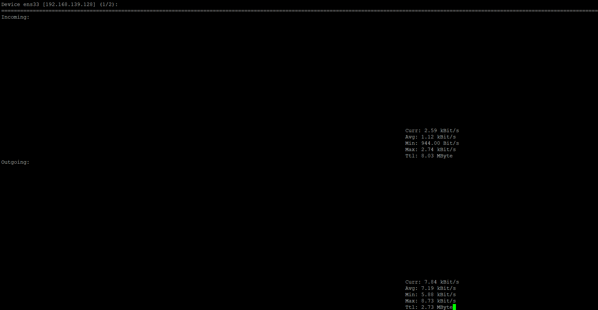
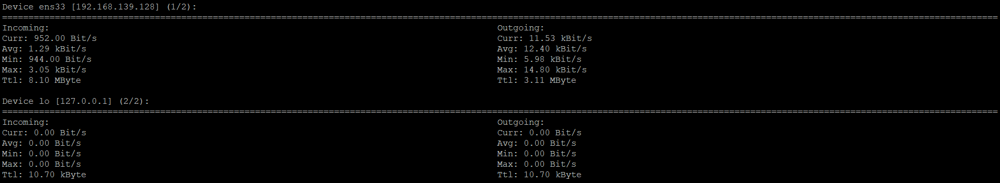
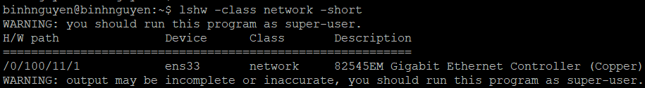

# Nload – Linux Process Monitoring
# 1. Mục đích sử dụng
nload là một công cụ trên Linux để theo dõi lưu lượng mạng và mức băng thông sử dụng thời gian thực. Nó giúp bạn theo dõi lưu lượng IN(đến) và OUT(đi) bằng cách sử dụng đồ thị và cung cấp nhiều thông tin bổ sung như tổng lượng dữ liệu được truyền tải và mức sử dụng mạng trung bình/tối thiểu/tối đa.
 
# 2. Cài đặt nload
```
-------- Trên máy chủ CentOS và RHEL -------- 
yum install epel-release -y
yum install nload -y

-------- Trên máy chủ Fedora 22+ --------
dnf install nload

-------- Trên máy chủ Ubuntu ------------
sudo apt install nload	
```

# 3. Thông tin hiển thị
Khi bạn khởi chạy `nload` với lệnh `nload`, bạn có thể chuyển đổi giữa các card mạng bằng cách nhấn các phím mũi tên trái hoặc phải.



- **Incoming:** Dữ liệu nhận vào từ mạng
  - Curr: Tốc độ hiện tại nhận vào (kBit/s).
  - Avg: Tốc độ trung bình nhận vào kể từ khi bắt đầu theo dõi.
  - Min: Tốc độ thấp nhất từng ghi nhận.
  - Max: Tốc độ cao nhất từng ghi nhận.
  - Ttl:Tổng dữ liệu đã nhận được (tính từ khi mở nload), đơn vị MB.

- **Outgoing:** Dữ liệu gửi ra từ hệ thống
   - Curr: Dữ liệu gửi ra từ hệ thống.
   - Avg: Tốc độ trung bình gửi đi.
   - Min: Tốc độ gửi thấp nhất ghi nhận.
   - Max: Tốc độ gửi cao nhất ghi nhận.
   - Ttl: Tổng dữ liệu đã gửi ra ngoài (kể từ khi theo dõi), đơn vị MB.

# 4. Các phím tắt
Sau khi khởi chạy nload, bạn có thể sử dụng các phím tắt sau:

- Sử dụng các phím mũi tên trái và phải hoặc phím Enter / Tab để chuyển màn hình sang card mạng tiếp theo hoặc sử dụng nload -m để xem nhiều card cùng một lúc.
- Sử dụng F2 để hiển thị cửa sổ tùy chọn.
- Sử dụng F5 để lưu cài đặt hiện tại vào tệp cấu hình của người dùng.
- Sử dụng F6 để tải lại cài đặt từ các tệp cấu hình.
- Sử dụng q hoặc Ctrl + C để thoát nload.

# 5. Các option lệnh nload
- `nload -m`: hiển thị nhiều card mạng đồng thời

  

- Sử dụng `nload -a` và khoảng thời gian để đặt độ dài tính bằng giây của kết quả tính trung bình (mặc định là 300), ví dụ bạn muốn tính băng thông trung bình trong 400 giây thì hãy sử dụng lệnh sau:

- Tùy chọn `-t` và khoảng thời gian refresh của màn hình được tính bằng mili giây (giá trị mặc định là 500). Lưu ý rằng việc chỉ định khoảng thời gian làm mới ngắn hơn 100 mili giây sẽ làm cho việc tính toán lưu lượng truy cập thiếu chính xác.

- Bạn có thể chỉ đích danh card mạng mà bạn cần theo dõi với lệnh sau.
```
nload devices device_name
```

- Để xem danh sách card mạng của máy chủ các bạn chỉ cần dùng lệnh:
```
lshw -class network -short
```


Tài liệu tham khảo:

[1] (https://azdigi.com/blog/linux-server/tools/nload-monitor-linux-network-bandwidth-usage/)
