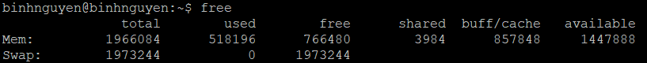
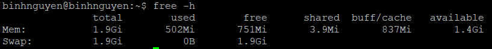
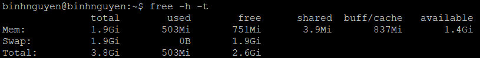
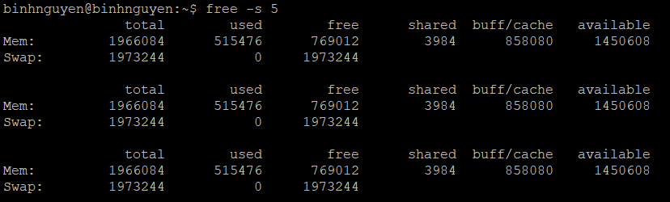

# Free – Linux Process Monitoring
# 1. Mục đích sử dụng
Trong hệ thống Linux, bạn có thể sử dụng lệnh free để nhận báo cáo chi tiết về việc sử dụng bộ nhớ của hệ thống.

Lệnh free cung cấp thông tin về tổng số tiền của vật chất và swap bộ nhớ, cũng như bộ nhớ còn trống và đã đang sử dụng.

# 2. Thông tin hiển thị
Khi được sử dụng mà không có bất kỳ tùy chọn nào, lệnh free sẽ hiển thị thông tin về bộ nhớ và hoán đổi trong kibibyte. 1 kibibyte (KiB) là 1024 byte.
```
free
```

Đầu ra sẽ bao gồm ba dòng, một tiêu đề, một dòng cho bộ nhớ và một dòng cho swap:


Đây là ý nghĩa của mỗi cột:

- **Total** – Con số này đại diện cho tổng dung lượng bộ nhớ có thể được sử dụng bởi các ứng dụng.
- **used** – Bộ nhớ đã sử dụng. Nó được tính như sau: used = total - free - buffers - cache.
- **free** – Bộ nhớ trống / không sử dụng.
- **shared** – Cột này có thể bị bỏ qua vì nó không có nghĩa. Nó ở đây chỉ để tương thích ngược.
- **buff/cache** – Bộ nhớ kết hợp được sử dụng bởi bộ đệm hạt nhân và bộ đệm trang và phiến. Bộ nhớ này có thể được lấy lại bất cứ lúc nào nếu ứng dụng cần. Nếu bạn muốn bộ đệm và bộ đệm được hiển thị trong hai cột riêng biệt, hãy sử dụng tùy chọn -w.
- **available** – Ước tính dung lượng bộ nhớ có sẵn để khởi động các ứng dụng mới mà không cần hoán đổi.

# 3. Các option lệnh free
- Theo mặc định, lệnh `free` hiển thị thông tin bộ nhớ trong kibibyte. Để xem thông tin ở định dạng có thể đọc được (thường là megabyte và gigabyte), hãy sử dụng `-h` tùy chọn:



- Lệnh `free` cũng cho phép bạn chỉ định các đơn vị, trong đó bộ nhớ được đo. Các tùy chọn hợp lệ là:

- `-b, --bytes` – Hiển thị đầu ra theo byte.
- `--kilo` – Hiển thị đầu ra theo kilobyte (1KB = 1000byte).
- `--mega` – Hiển thị đầu ra tính bằng megabyte.
- `--giga` – Hiển thị đầu ra tính bằng gigabyte.
- `--tera` – Hiển thị đầu ra tính bằng terabyte.
- `-k, --kibi` – sản lượng hiển thị ở kibibytes. (1KiB = 1024byte). Đây là đơn vị mặc định.
- `-m`, --mebi– sản lượng hiển thị ở mebibytes.
- `-g`, --gibi– sản lượng hiển thị ở gibytes.
- `--tebi` – Hiển thị đầu ra tính bằng tebibyte.
- `--peti` – Hiển thị đầu ra theo pebibyte.
- `--si` – Thay vì 1024, sử dụng lũy ​​thừa của 1000. Ví dụ --mebi --si là bằng --mega.

- Để hiển thị một dòng hiển thị tổng số cột, hãy sử dụng tùy chọn `-t`. Điều này cung cấp cho bạn tổng bộ nhớ và hoán đổi trong tổng số cột, đã sử dụng và cột còn trống.



- Để hiển thị liên tục thông tin bộ nhớ trên màn hình, hãy gọi free với tùy chọn `-s( --seconds)` theo sau là một số chỉ định độ trễ.



Tài liệu tham khảo:

[1] (https://hocdevops.com/commands/lenh-free-trong-linux/)