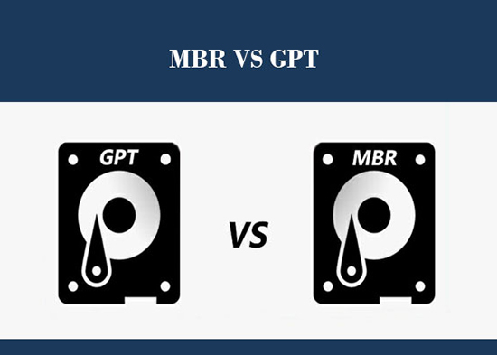
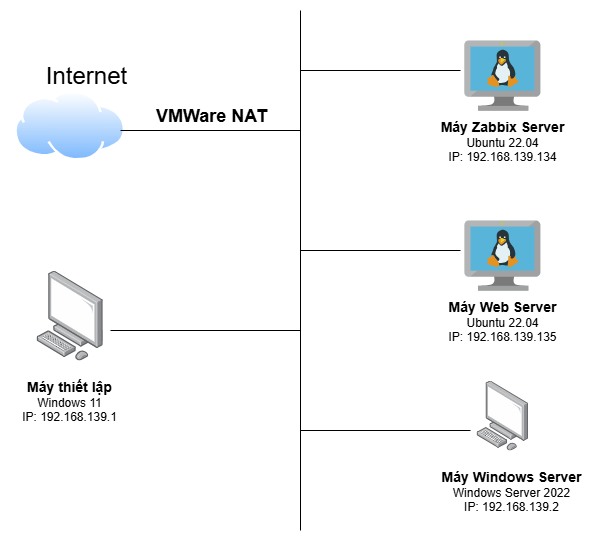
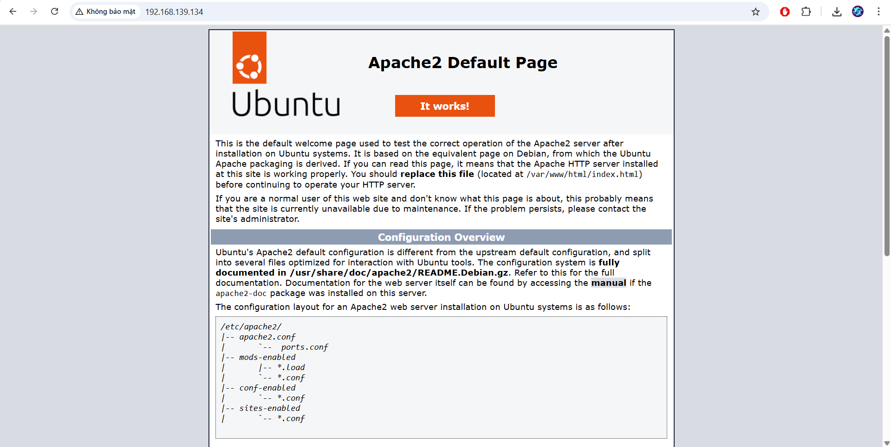

# 1. MBR và GPT là gì?
Các ổ cứng lưu trữ trên máy tính cần phải được định dạng theo một chuẩn nhất định để có thể hoạt động.

MBR là chuẩn định dạng cũ đã được sử dụng rộng rãi từ đầu những năm 1980, cho đến nay nó vẫn còn khá phổ biến. GPT là chuẩn định dạng mới hơn, được ứng dụng nhiều trên các hệ điều hành và phần cứng mới. GPT có nhiều điểm tốt hơn và cho phép những giới hạn lớn hơn nên nó đang dần thay thế MBR. Tuy nhiên vì có lịch sử ứng dụng lâu đời hơn mà MBR vẫn có độ tương thích rất tốt và cần thiết trong nhiều trường hợp, nhất là với phần cứng và hệ điều hành cũ.



# 2. Cấu trúc của MBR và GPT
- **MBR (Master Boot Record):** Đây là một tiêu chuẩn quản lý thông tin ổ cứng được hãng IBM phát minh vào năm 1983. MBR sẽ có một phân vùng nhỏ trên ổ cứng chứa đựng các thông tin để hệ điều hành boot được (Boot loader).
  
  Ổ cứng được định dạng theo chuẩn MBR, dữ liệu phân vùng và dữ liệu khởi động được lưu ở cùng một vị trí nên khi gặp sự cố thì sẽ gặp khó khăn trong phục hồi dữ liệu.

  MBR hỗ trợ dung lượng ổ cứng tối đa là 2TB và 1 ổ cứng đó phân vùng tối đa là 4. Chuẩn MBR hiện vẫn có khả năng tương thích với tất cả các phiên bản Windows hiện nay.

- GPT (GUID Partition Table): Đây là chuẩn ổ cứng được xây dựng trên GUID (Global Unique identifiers) là một phần của chuẩn giao diện máy tính mới UEFI (Unified Extensible Firmware Interface). Là chuẩn mới được thiết kế để thay thế cho MBR nên chuẩn ổ cứng này có tính năng tốt hơn. Chuẩn GPT hỗ trợ dung lượng ổ cứng tối đa là 256 TB và có thể phân vùng đến 128.

  Ổ cứng chuẩn GPT có cách phân chia dữ liệu thành nhiều bản sao khác nhau để chỗ này có bị lỗi thì lấy chỗ khác để thế vào cho nên việc phục hồi dữ liệu tốt hơn
# 3. Sự khác biệt giữa MBR và GPT
|              |                       |                         |
|:-------------|:----------------------|:------------------------|
||Ưu điểm|Nhược điểm|
|Ổ cứng MBR|Hoạt động ở mọi nền tảng hệ thống máy tính cũng như nền tảng Windows hiện nay. Tức là tương thích với nhiều dòng máy tính mới và kể cả đời cũ và mới.|Dữ liệu khởi động được lưu trữ duy nhất trên cùng một phân vùng cho nên dễ gặp lỗi và khó khôi phục. Hỗ trợ dung lượng ổ cứng không cao và chỉ hỗ trợ tối đa 4 phân vùng chính|
|Ổ cứng GPT|Dữ liệu khởi động ổ cứng nằm ở nhiều vị trí khác nhau cho nên gặp sự cố dễ dàng xử lý. Tự động khắc phục lỗi (CRC32) từ một vị trí khác. Hỗ trợ nhiều phân vùng chính, hỗ trợ ổ cứng có dung lượng lớn. Sử dụng được cho nhiều hệ điều hành khác nhau ngoài windows|Chỉ hỗ trợ trên hệ điều hành 64 bit. Các hệ thống cũ không hỗ trợ chuẩn ổ cứng này|
# 4. Hướng dẫn cách kiểm tra ổ cứng đang dùng là chuẩn GPT hay MBR
## 4.1 Trên Windows
- Gõ `Window + R` và nhập `diskpart`:


- Sau khi nhận lệnh `diskpart` gõ `list disk`:



Danh sách ổ cứng đang chạy trên máy bạn hiện ra. Nếu bạn nhìn thấy cột GPT có đánh dấu sao (*) thì ổ cứng đó đang được định dạng GPT. Còn nếu không có đánh dấu sao (*) thì ổ cứng đó đang ở định dạng 

## 4.2 Trên Ubuntu
- Gõ lệnh:
```
sudo parted -l
```



- Ở dòng `Partition Table` sẽ hiển thị chuẩn ổ cứng, ở đây là chuẩn gpt.

Tài liệu tham khảo:

[1] (https://www.phucanh.vn/o-cung-mbr-va-gpt-la-gi-convert-o-gpt-sang-mbr-va-nguoc-lai.html)