# Cài đặt Zabbix Server trên Ubuntu 22.04
## 1. Mô hình


Mô hình được sử dụng vào 2 mục đích:
- Giám sát Web Server sử dụng Zabbix Agent.
- Giám sát Windows Server sử dụng Zabbix Agent/SMNP.
## 2. Cài đặt Zabbix Server
### 2.1 Cài đặt Apache HTTP Server
- Cài đặt apache2:
```
sudo apt -y install apache2
```
- Kiểm tra các gói apache2 đã cài đặt:
```
sudo apt list --installed | grep apache2
```
- Restart và bật apache2 ngay sau khi khởi động:
```
sudo systemctl restart apache2
sudo systemctl enable apache2
```
- Kiểm tra trạng thái của apache2:
```
sudo systemctl status apache2
```
- Truy cập link http://192.168.139.134 và đã thấy hoạt động:

### 2.2 Cài đặt MariaDB
- Cài đặt MariaDB Server:
```
sudo apt -y install mariadb-server
```
- Khởi động lại và bật ngay sau khi khởi động:
```
sudo systemctl restart mariadb
sudo systemctl enable mariadb
```
- Kiểm tra trạng thái Mariadb
```
sudo systemctl status mariadb
```
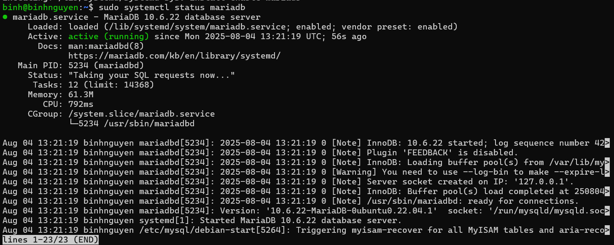
- Thiết lập secure mariadb server:

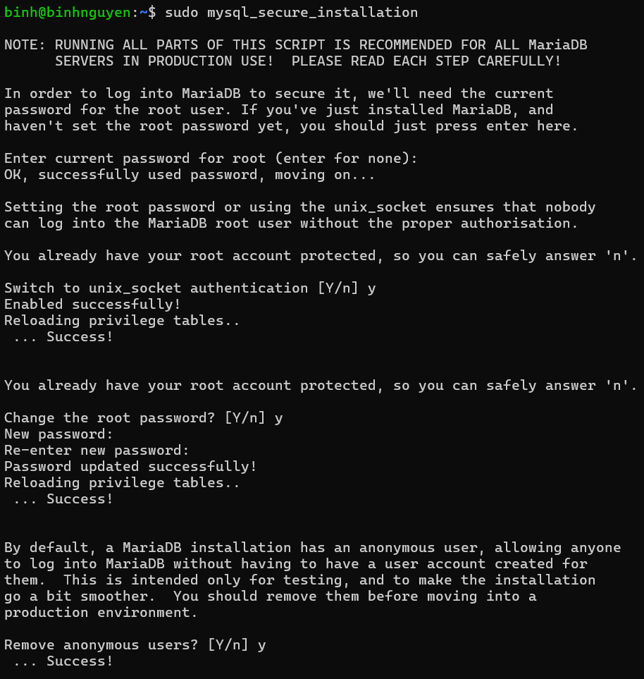

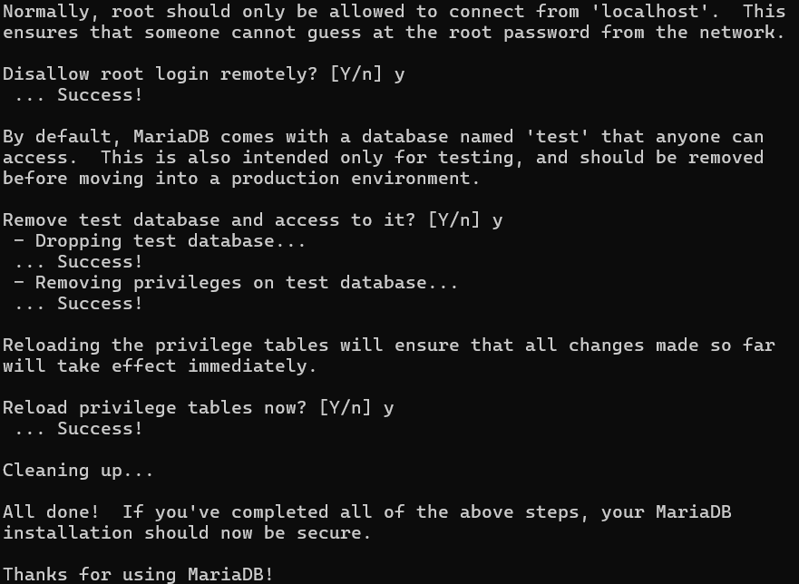
### 2.3 Cài đặt PHP-FPM
- Cài đặt PHP-FPM:
```
sudo apt -y install php-fpm
```
- Bật các mode tùy chọn:
```
sudo a2enmod proxy_fcgi setenvif
sudo a2enconf php8.1-fpm
```
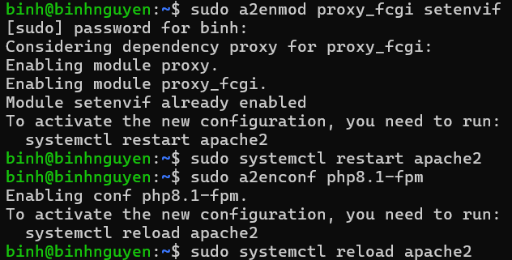
1. `proxy_fcgi`(Apache Module)
- **Chức năng chính:** Module này cung cấp khả năng proxy các yêu cầu HTTP tới một FastCGI server (như PHP-FPM). Apache sử dụng module này để "chuyển tiếp" các yêu cầu đến PHP-FPM để PHP-FPM thực thi mã PHP.
- **Vai trò trong PHP-FPM:** Khi bạn cài đặt PHP-FPM, Apache cần một cách để "gửi" các file .php đến PHP-FPM để xử lý. mod_proxy_fcgi chính là cầu nối đó. Nó cho phép Apache hoạt động như một proxy ngược, nhận yêu cầu từ client, chuyển nó đến PHP-FPM, và sau đó nhận kết quả từ PHP-FPM để gửi trả lại cho client.  
2. `setenvif` (Apache Module)
- **Chức năng chính:** Module này cho phép bạn đặt các biến môi trường dựa trên các thuộc tính của yêu cầu HTTP (ví dụ: User-Agent, Host, Request URI).

=>>> Việc kích hoạt hai module này là bước cần thiết trong quá trình cấu hình Apache để nó hoạt động hiệu quả với PHP-FPM.
- Restart lại PHP-FPM:
```
sudo systemctl restart php8.1-fpm apache2
```
- Kiểm tra trạng thái hoạt động của PHP-FPM:
```
sudo systemctl status php8.1-fpm
```
- Kiểm tra version đã cài đặt:
```
php -v
```
### 2.4 Cài đặt Zabbix
## Cài đặt Zabbix
- Cài đặt công cụ wget để tải xuống nội dụng từ máy chủ web:
```
sudo apt -y install wget
```
- Thêm repo Zabbix vào hệ thống Ubuntu 22.04:
```
wget https://repo.zabbix.com/zabbix/6.0/ubuntu/pool/main/z/zabbix-release/zabbix-release_6.0-4+ubuntu22.04_all.deb
```
- Cài đặt Zabbix:
```
sudo dpkg -i zabbix-release_6.0-4+ubuntu22.04_all.deb
```
- Cập nhật lại hệ thống:
```
sudo apt update -y
```
- Sau khi thêm repo Zabbix, có thể cài đặt Zabbix server, frontend. Để tự giám sát Zabbix server, hãy cài đặt Zabbix Agent:
```
sudo apt -y install zabbix-server-mysql zabbix-frontend-php zabbix-apache-conf zabbix-sql-scripts zabbix-agent2 php-mysql php-gd php-bcmath php-net-socket
```
## Thiết lập cơ sở dữ liệu cho Zabbix
```
mysql -u root -p
```
- Tạo database:
```
create database zabbixtb character set utf8mb4 collate utf8mb4_bin;
```
- Tạo user và password:
```
create user zabbix0@localhost identified by '1';
```
- Phân quyền:
```
grant all privileges on zabbixtb.* to zabbix@localhost;
set global log_bin_trust_function_creators = 1;
flush privileges;
quit;
```

## Import database mặc định của Zabbix:
```
sudo zcat /usr/share/zabbix-sql-scripts/mysql/server.sql.gz | mysql --default-character-set=utf8mb4 -uzabbix -p zabbixdt
```
## Chỉnh sửa tệp cấu hình máy chủ và đặt thông tin đăng nhập cơ sở dữ liệu
- Mở file cấu hình Zabbix Server:
```
sudo nano /etc/zabbix/zabbix_server.conf
```
- Kiểm tra DB name ở dòng 105 và DB user ở dòng 121:

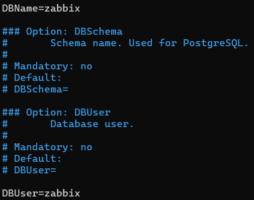
- Tại dòng 130 thêm password cho user Zabbix đã tạo ở trên:

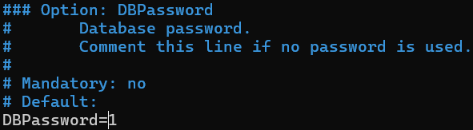

- Lưu lại và khởi động lại dịch vụ:
```
sudo systemctl restart zabbix-server
sudo systemctl enable zabbix-server
```
- Allow port 80:
```
sudo ufw allow from any to any port 80 proto tcp
```
### 2.5 Thiết lập Web Interface
- Truy cập giao diện người dùng Zabbix vừa mới tạo:
```
http://192.168.139.134/zabbix
```
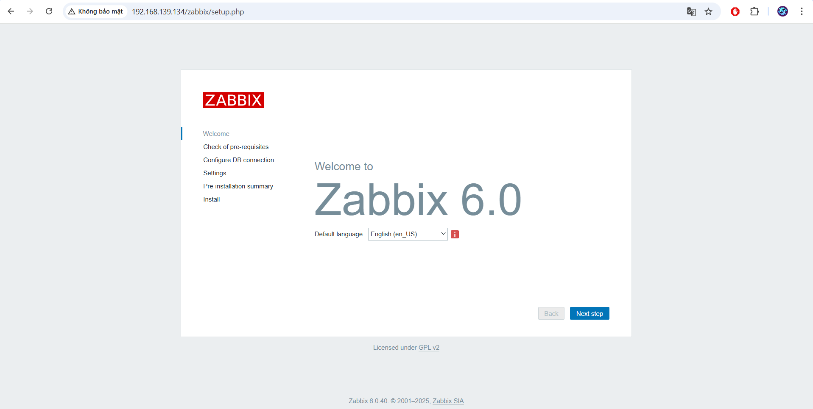

- Các thông số web chưa thỏa mãn yêu cầu cài đặt:

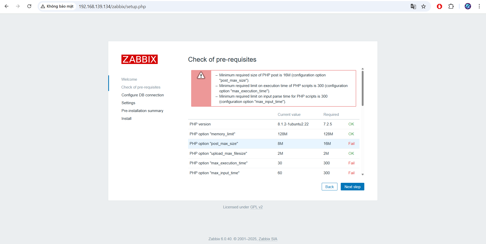

- Cấu hình giá trị PHP cho Zabbix:
```
sudo nano /etc/php/8.1/fpm/pool.d/www.conf
```
- Thêm tất cả các thông số sau phía cuối file config:
```
php_value[max_execution_time] = 300
php_value[memory_limit] = 128M
php_value[post_max_size] = 16M
php_value[upload_max_filesize] = 2M
php_value[max_input_time] = 300
php_value[max_input_vars] = 10000
php_value[always_populate_raw_post_data] = -1
php_value[date.timezone] = Asia/Ho_Chi_Minh
```
- Khởi động lại dịch vụ:
```
sudo systemctl restart php8.1-fpm
```
### 2.6 Cấu hình giao diện Web
- Mở giao diện người dùng Zabbix bằng đường dẫn URL http://192.168.139.134/zabbix và Chọn Next step để bắt đầu cài đặt Zabbix.

- Kiểm tra điều kiện: Đảm bảo tất cả các item đều [OK], Chọn Next step để sang bước tiếp theo

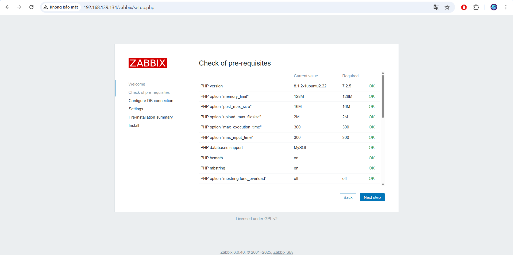

- Cấu hình kết nối với DB: *Nhập Database, user và password database zabbix* đã tạo. Chọn Next step để sang bước tiếp theo.

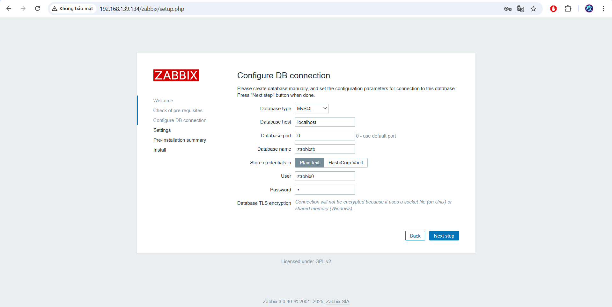

- Đặt tên Zabbix server, múi giờ và chủ đề cho giao diện người dùng.

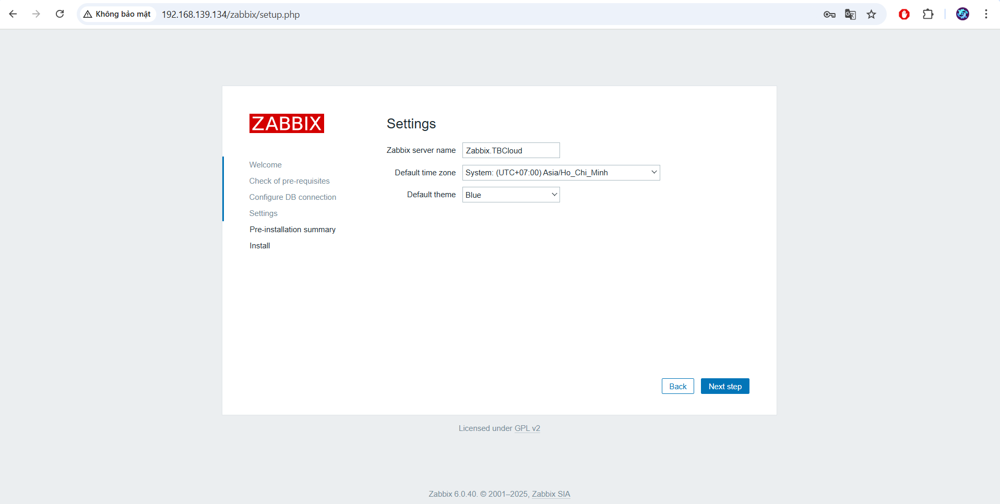

- Xác nhận các cài đặt trước đó. Chọn Next step để sang màn hình tiếp theo.

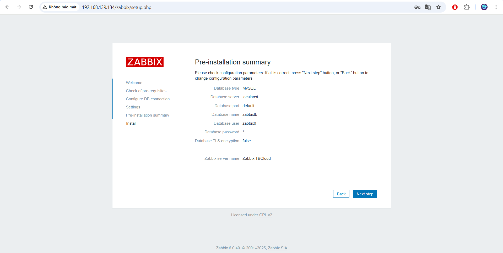

- Hoàn tất quá trình cài đặt.

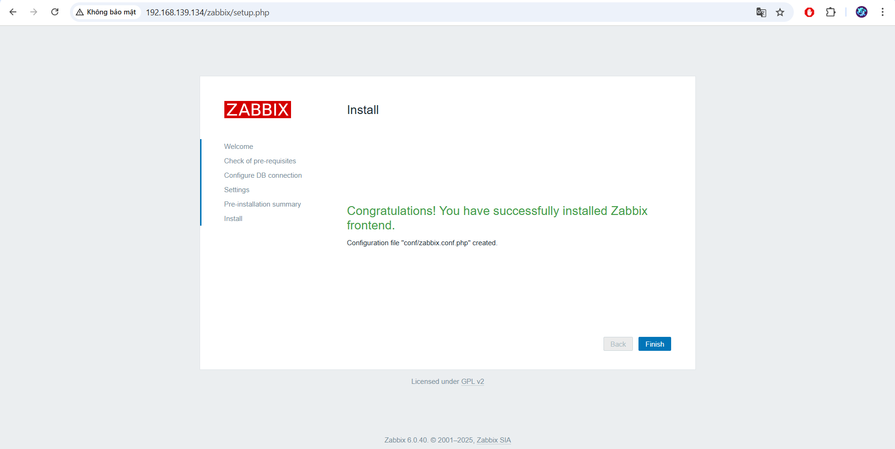

### 2.7 Đăng nhập Zabbix
- Sử dụng tên người dùng quản trị mặc định của zabbix: Admin/zabbix để đăng nhập vào giao diện người dùng

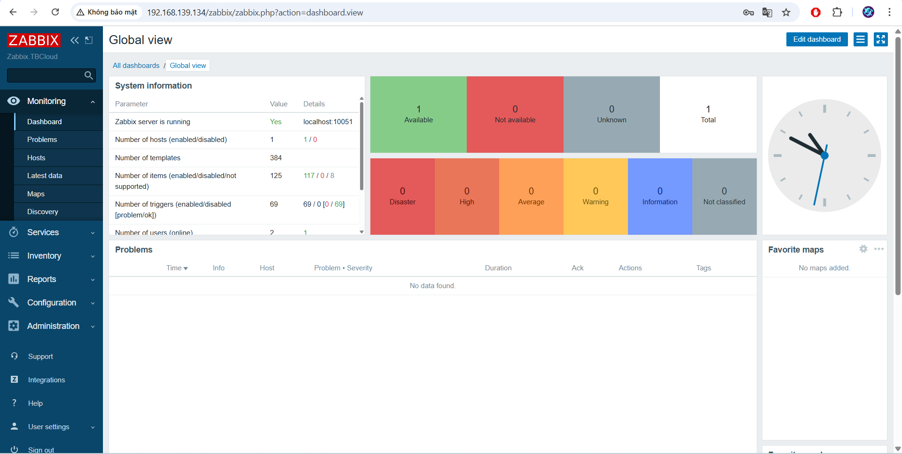

- Sau khi cài đặt zabbix thành công, để đảm bảo tính bảo mật chúng ta nên thay đổi mật khẩu tài khoản quản trị. Chọn Administrator > User. Sau đó chọn dòng Username Admin

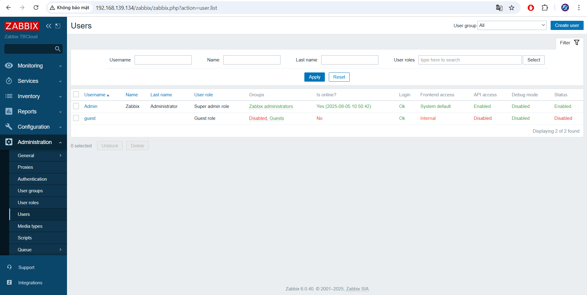

- Chọn Change password để tiến hành thay đổi mật khẩu. Nhập mật khẩu muốn thay đổi và chọn Update để xác nhận thay đổi mật khẩu.

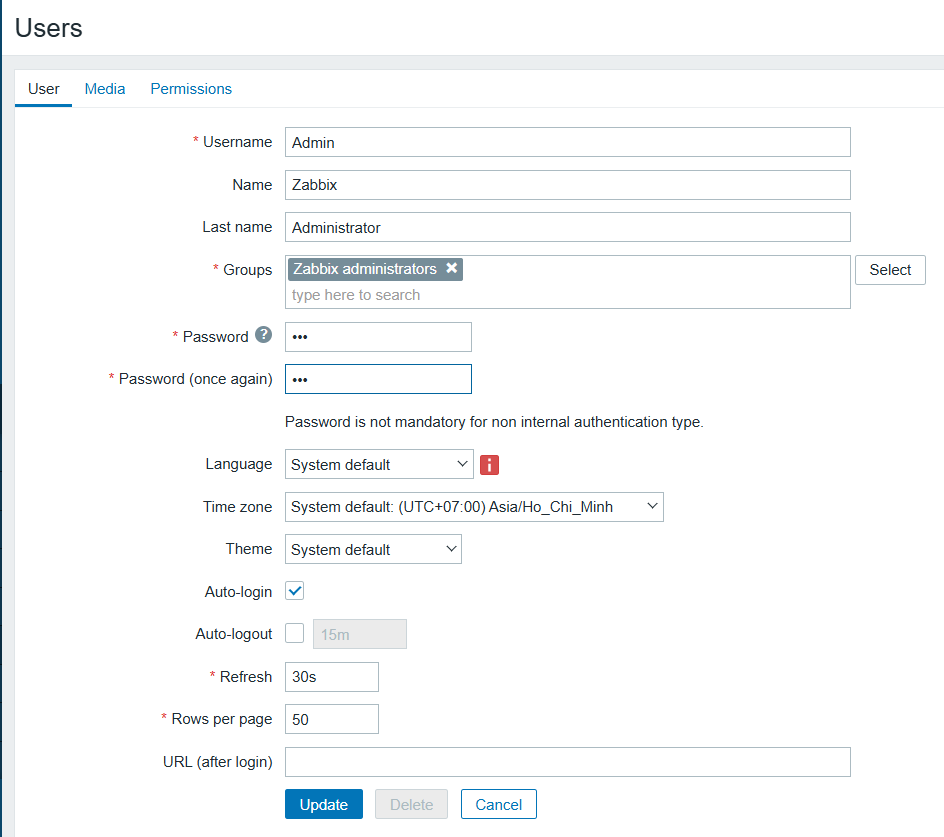

- Như vậy là đã hoàn tất quá trình cài đặt Zabbix trên máy chủ Ubuntu 22.04.

Tài liệu tham khảo:

[1] (https://suncloud.vn/huong-dan-cai-dat-zabbix-60-lts-tren-ubuntu-2204)