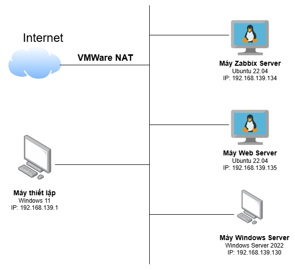
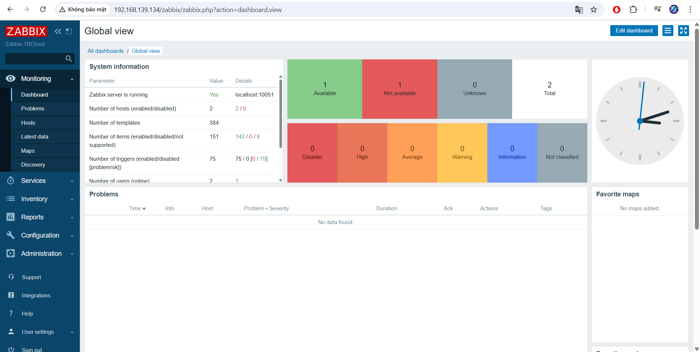
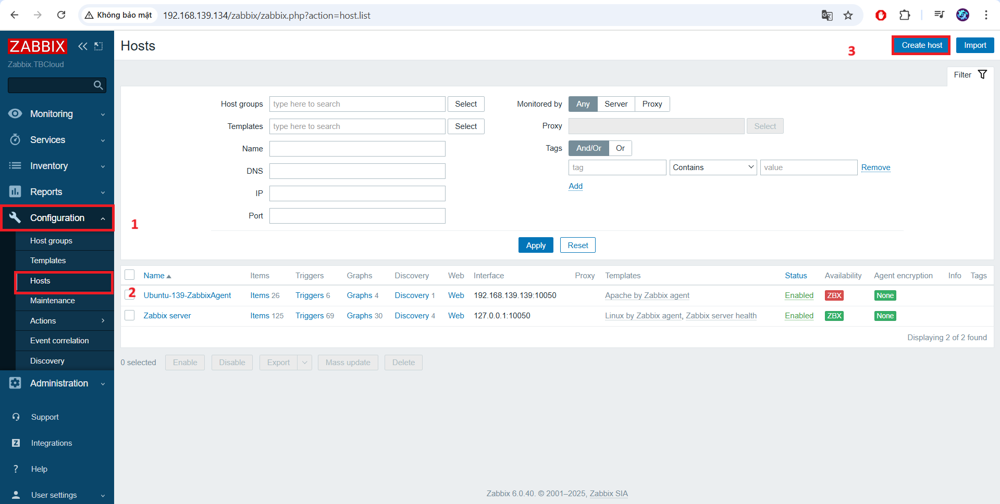
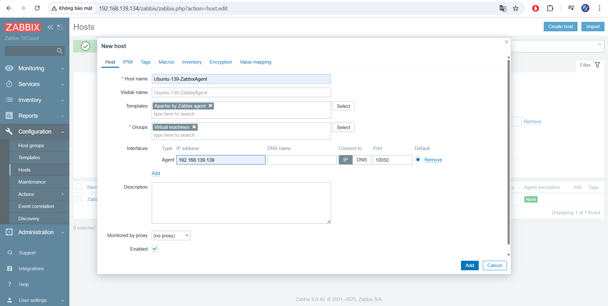
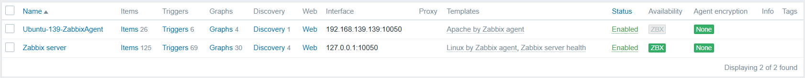
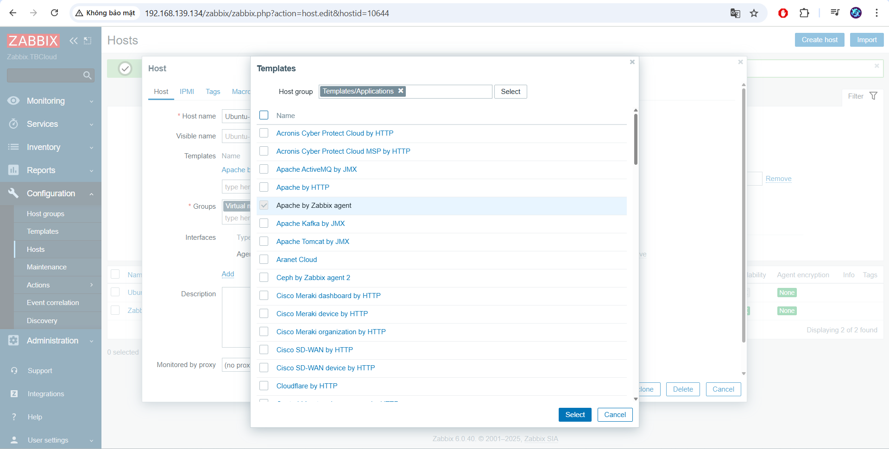

# Thiết lập giám sát thông qua Zabbix Agent
## 1. Mô hình


Máy Zabbix Server:
- Ubuntu Server 22.04
- IP: 192.168.139.134

Máy Web Server:
- Ubuntu Server 22.04
- IP: 192.168.139.135

## 2. Cài đặt zabbix-agent trên Ubuntu server
- Tải về gói cài đặt:
```
wget https://repo.zabbix.com/zabbix/6.4/ubuntu/pool/main/z/zabbix-release/zabbix-release_6.4-1+ubuntu22.04_all.deb
```
- Giải nén và cài đặt:
```
sudo dpkg -i zabbix-release_6.4-1+ubuntu22.04_all.deb
```
- Update các gói phần mềm và cài zabbix agent:
```
sudo apt-get update
sudo apt-get install zabbix-agent -y
```
- Sửa file cấu hình Zabbix agent:
```
sudo nano /etc/zabbix/zabbix_agentd.conf
```
- Các tham số cần chỉnh sửa bao gồm:
```
Server=<IP_ZABBIX_SERVER>
ServerActive=<IP_ZABBIX_SERVER>
Hostname=<ZABBIX_SERVER_HOSTNAME>
```
- Khởi động lại dịch vụ Zabbix agent:
```
systemctl start zabbix-agent
systemctl enable zabbix-agent
```
## 3. Thêm host lên Zabbix Server
- Đăng nhập vào giao diện web của Zabbix:



- Thực hiện thêm host vào để giám sát: Configuration -> Host -> Create Host



- Thiết lập thông số host tối thiểu cần 3 thông số:
    - Hostname: Là tên hiển thị trên zabbix web
    - Groups: Chỉ định các group của host muốn thêm
    - Agent interface: Địa chỉ IP của agent muốn thêm vào

Trong tab Template, ta chọn template để gán cho host cần giám sát. Ở đây Ubuntu do vậy ta sẽ chọn Linux by Zabbix Agent. Sau khi điền đầy đủ thông tin ta bấm add:



Host thêm thành công sẽ hiển thị màu xanh:



## 4. Thực hiện giám sát thông số Web Server
- Cài đặt Web Server trên thiết bị muốn giám sát:
```
sudo apt -y install apache2
sudo systemctl restart apache2
sudo systemctl enable apache2
```
- Thêm template để giám sát dịch vụ Apache:



- Xem số liệu thu được khi giám sát webserver:

