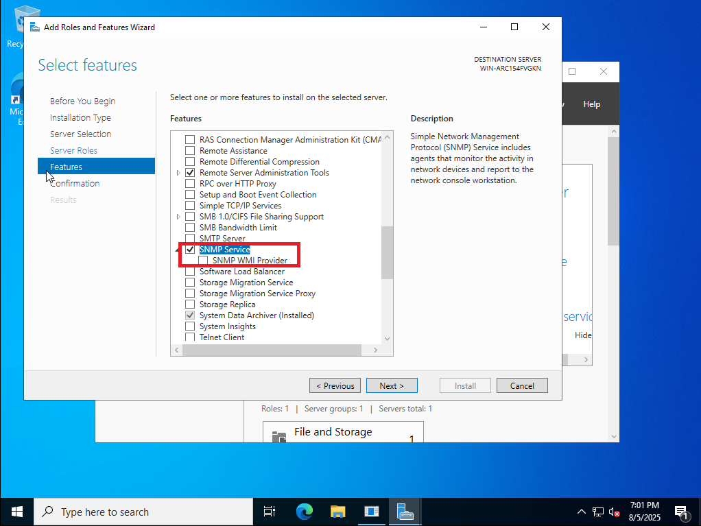
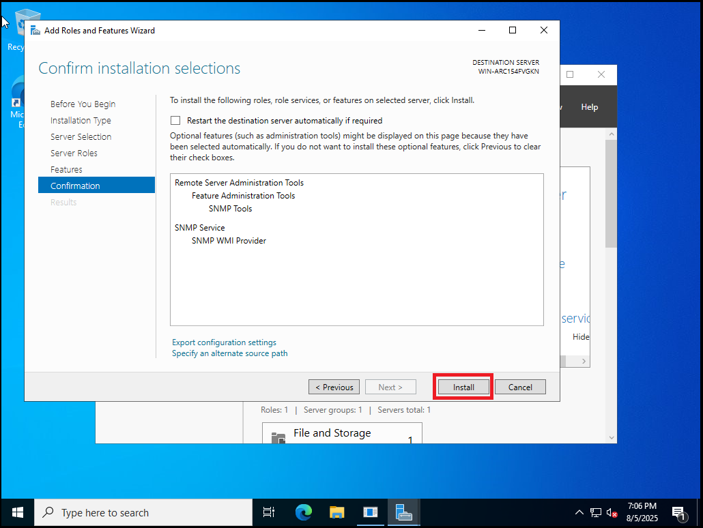
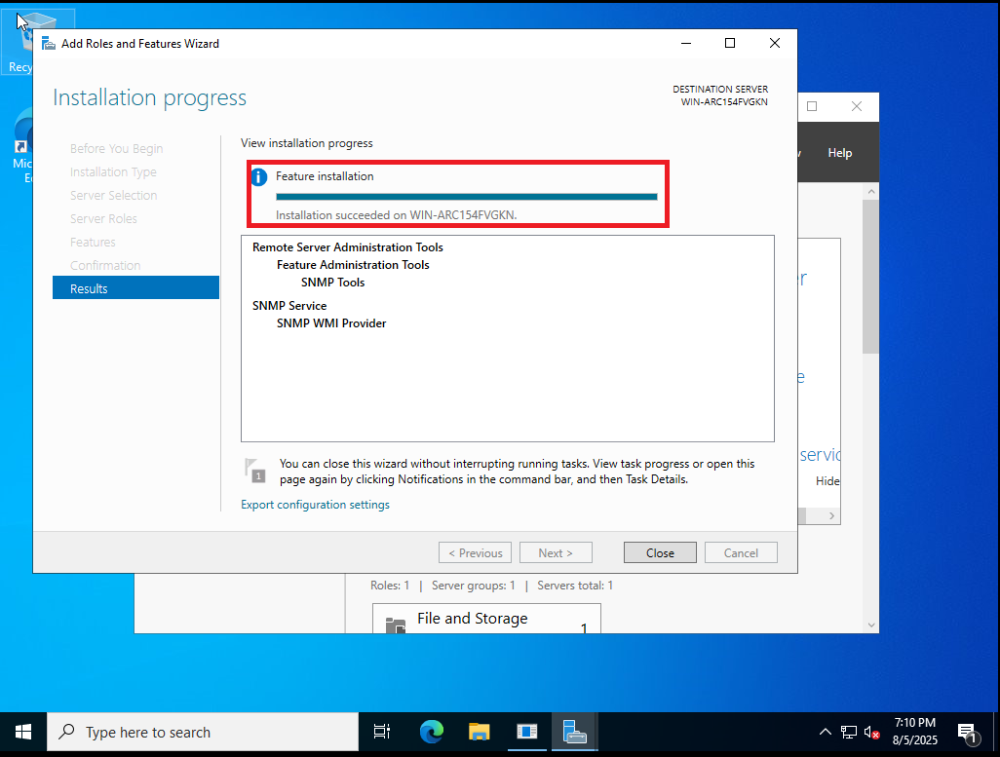
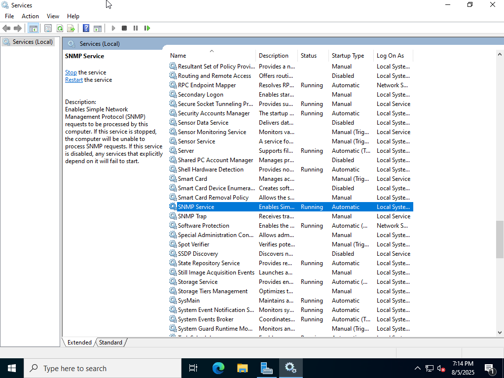
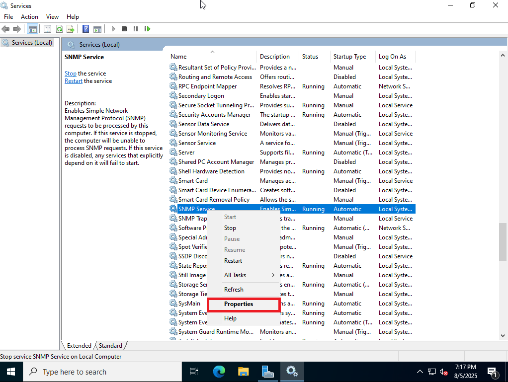
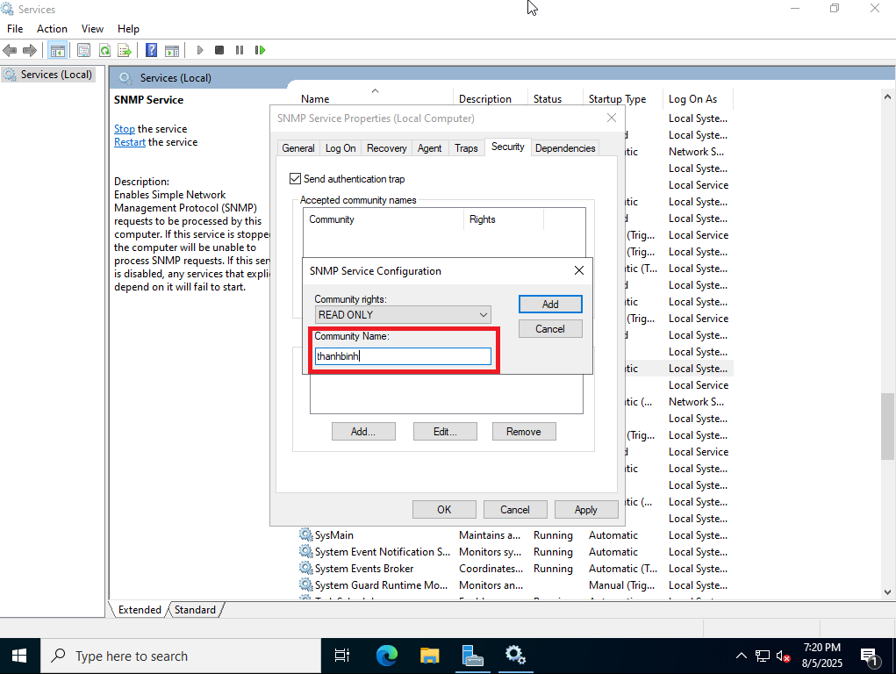
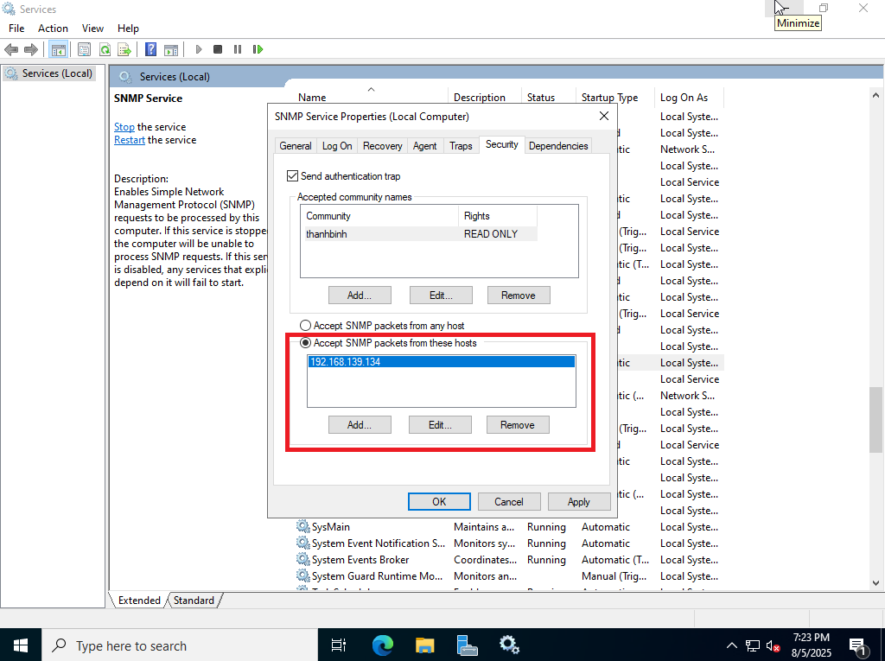
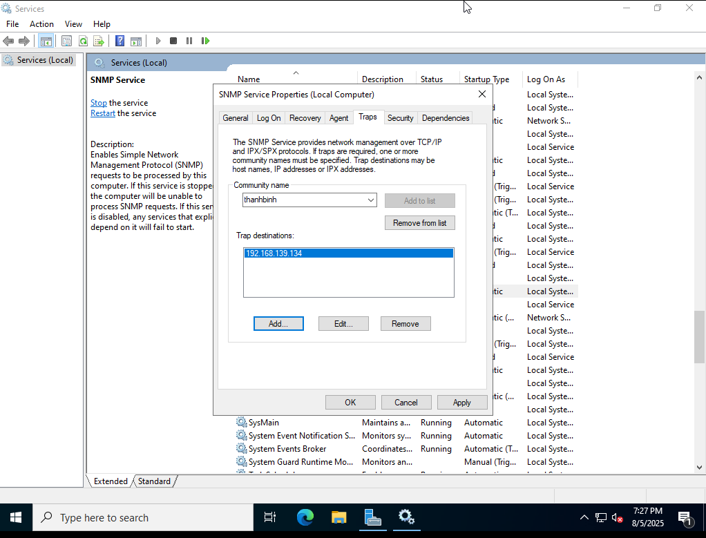
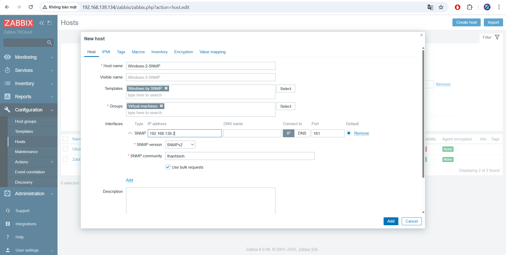
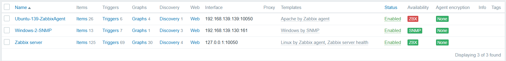

# Thiết lập giám sát thông qua SNMP
## 1. Mô hình

## 2. Cài đặt SNMP trên Windows Server 2022
**1. Trong Server Manager chọn Add Features**

Trong Server Manager chọn Manage -> Add roles and features -> Next -> Next -> Next

**2. Tìm tính năng SNMP sau đó tích vào ô SNMP Service sau đó ấn Next, sau đó chọn Add Features**

**3. Cài đặt SNMP**

Chọn SNMP WMI Provider và nhấn Install.

Thông báo hoàn tất cài đặt.

Kiểm tra trong Windows Services xem dịch vụ có đang chạy hay không.

**4. Allow thêm một số tính năng cho SNMP trên Windows**

Trong tab Security cho phép một số connection đến Windows Server thông qua SNMP.

Vẫn là tab Security chọn tiếp Accept SNMP packages from these hosts sau đó chọn Add. Thiết lập gửi dữ liệu của SNMP về 1 server cố định.

Sau khi điền IP của Zabbix server thì chọn Apply.

Trong tab Traps ta Add to list 1 Community name cùng địa chỉ IP.

Sau khi điền IP của Zabbix server thì chọn Apply.

## 3. Thêm host lên Zabbix Server
**1. Đăng nhập vào giao diện Web của Zabbix-Server**

**2. Thực hiện thêm host vào để giám sát: Configuration -> Host -> Create Host**

**3. Thiết lập thông số host tối thiểu cần 3 thông số**
- Hostname: Là tên hiển thị trên zabbix web
- Groups: Chỉ định các group của host muốn thêm
- Agent interface: Địa chỉ IP của agent muốn thêm vào

Sau khi điền đầy đủ thông tin ta bấm add:

Host thêm thành công sẽ hiển thị màu xanh.

