# Cấu hình cảnh báo trên Zabbix
## 1. Tạo mẫu cảnh báo
### 1.1 Tạo một item trên Zabbix để giám sát CPU
**Bước 1:** Đăng nhập vào trang quản trị của Zabbix

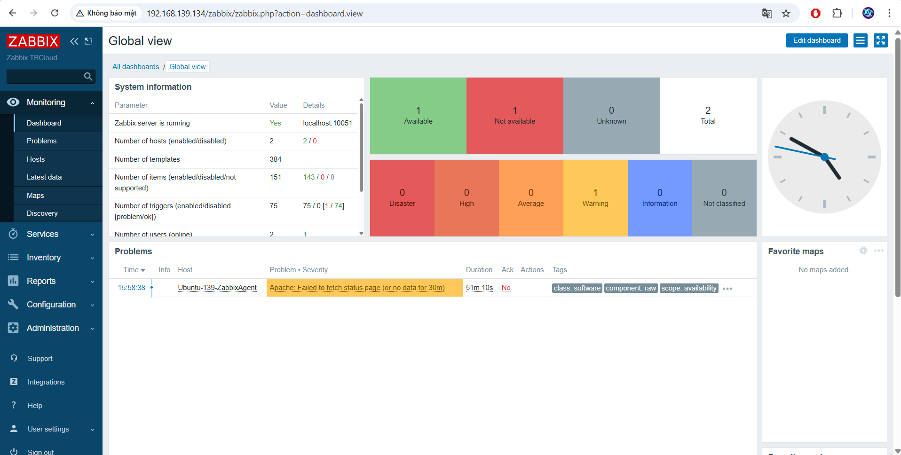

**Bước 2:** Di chuyển đến mục Configuration và chọn Hosts


**Bước 3:** Chọn host muốn giám sát (ở đây là giám sát CPU) với máy chủ Ubuntu

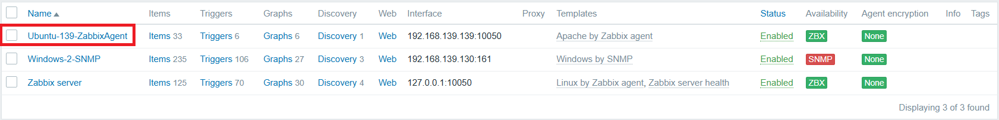

Ở đây ta sẽ chọn host `Ubuntu-139-ZabbixAgent` để giám sát.

**Bước 4:** Thêm một Item mới , Nhấp vào Item sau đó là Create Item

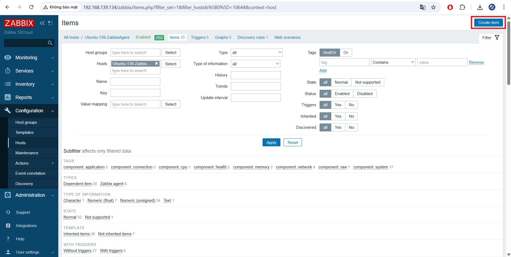

Điền các thông tin sau:

- Name: Tên của Item (ví dụ: CPU sử dụng).
- Type: Loại Item là "Zabbix agent" (nếu bạn đang sử dụng Zabbix agent để giám sát).
- Key: system.cpu.util[,idle] (hoặc sử dụng key phù hợp để lấy thông tin về tình trạng sử dụng CPU).
- Type of information: Numeric (float).
- Lưu Item.

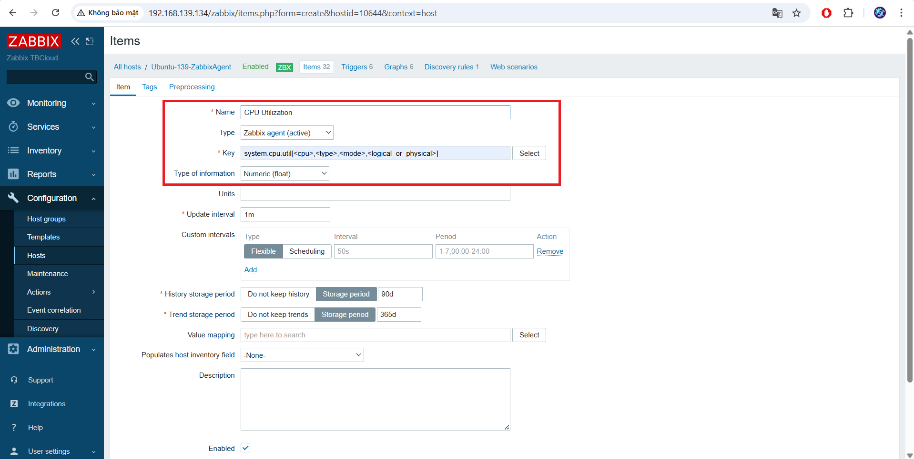
### 1.2 Tạo một trigger cho cảnh báo
Sau khi có Item để giám sát CPU, bạn cần tạo một Trigger để cảnh báo khi CPU vượt mức 80%.

Trong cùng giao diện cấu hình Hosts, di chuyển đến mục "Triggers". Thêm một Trigger mới: Nhấp vào Create Trigger.

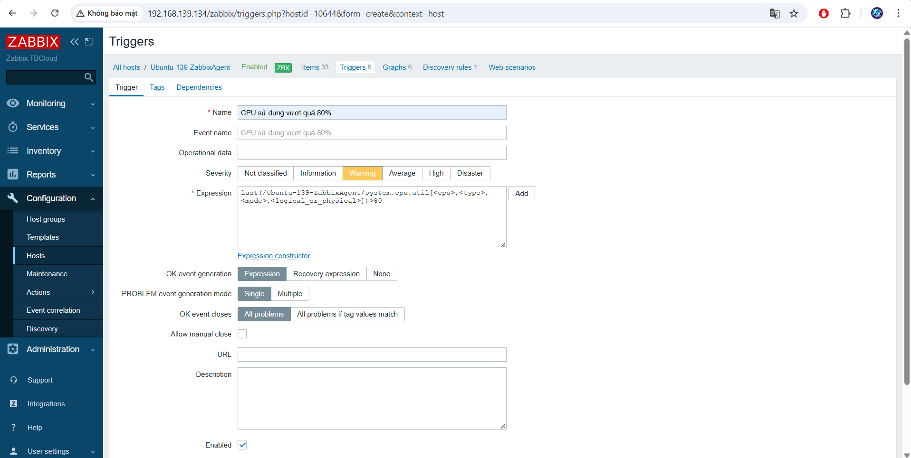

Điền các thông tin sau:

- Name: Tên của Trigger (ví dụ: CPU sử dụng mức cao).
- Severity: Mức độ nghiêm trọng của cảnh báo (ví dụ: High).
- Expression: Sử dụng biểu thức để kiểm tra giá trị của Item CPU usage. Bấm add để hiện bảng thêm giá trị

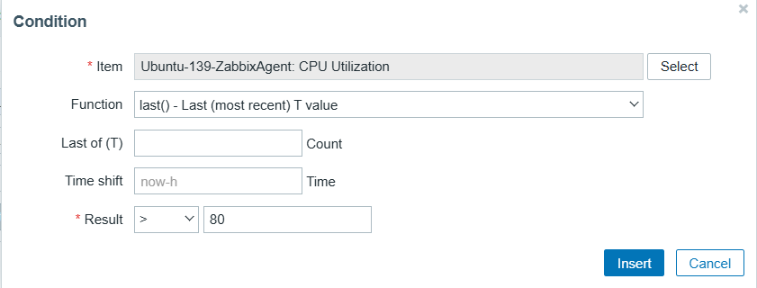
## 2. Cấu hình Zabbix gửi cảnh báo đến Telegram
### 2.1 Tạo một bot trên telegram
- Nhập Botfather tại thanh tìm kiếm trên telegram, chọn Botfather có tích xanh.

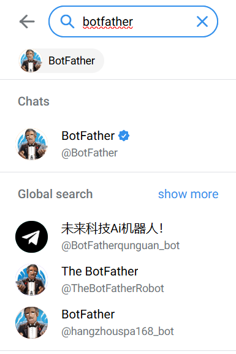

- Nhấn start.
- Hệ thống sẽ hiển thị ra đoạn chat, sau đó bạn nhấn vào mục /newbot - create a new bot.

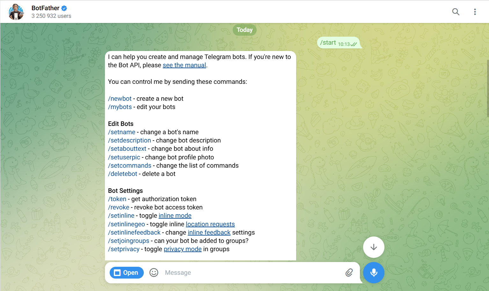

- Và bạn nhập tên cho Bot bạn mong muốn và ấn gửi.
- Nhập tên người dùng cho Bot.

Lưu ý: Tên bạn muốn tạo phải có đuôi kết thúc bằng chữ "bot", chẳng hạn như HthnBot hoặc hthn_bot.

- Lúc này hệ thống sẽ gửi thông tin xác nhận bạn tạo Bot thành công.
### 2.2 Cấu hình Media Types trong Zabbix để gửi cảnh báo đến Telegram
Đăng nhập vào giao diện quản trị Zabbix, chọn Administration > Media types > Telegram.

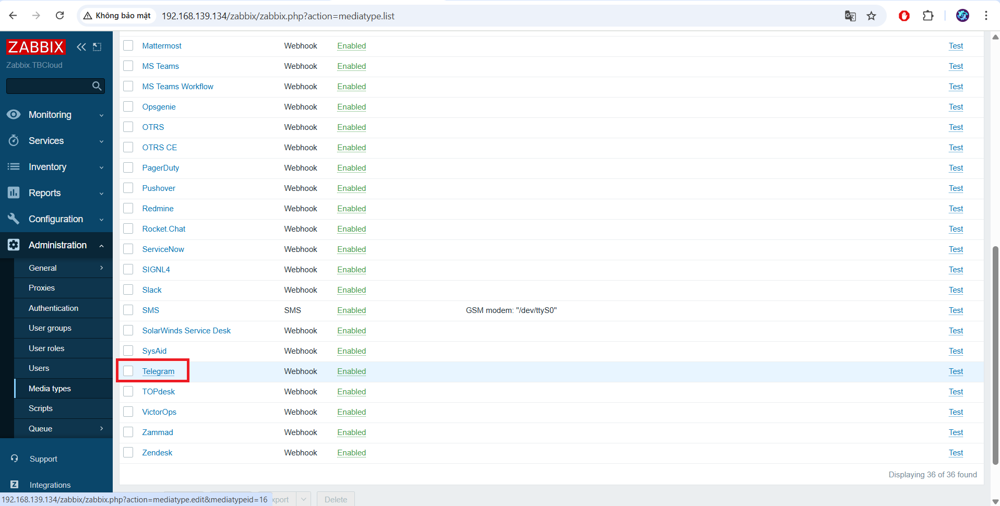

Nhập API Token của bot vào trường Token

Nhấp vào nút Update để lưu lại nội dung Mediatype.

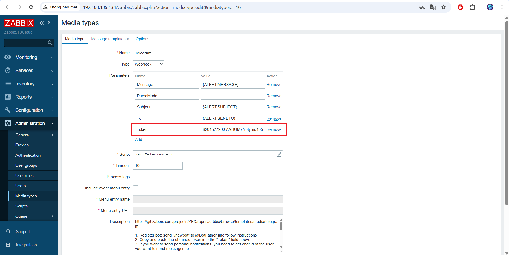
### 2.3 Cấu hình Users
Chọn mục Users và chọn người dùng bạn muốn gửi cảnh báo qua Telegram.

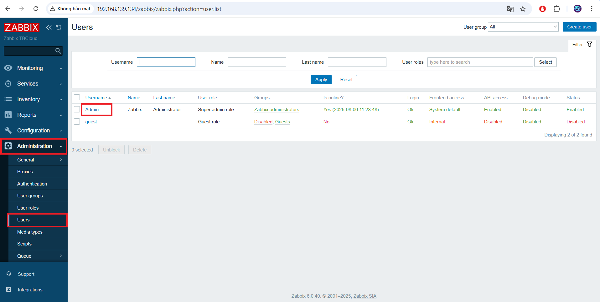

Chọn tab Media > Add để thêm Media mới.

- Trong phần "Type", chọn mediatype bạn đã tạo trước đó là Telegram.
- Điền chat ID của người dùng hoặc ID của group tại Send to.
- Tại When active nhập giới hạn khung thời gian có thể gửi cảnh báo.
- Nhấp vào nút "Update” để lưu lại thay đổi.

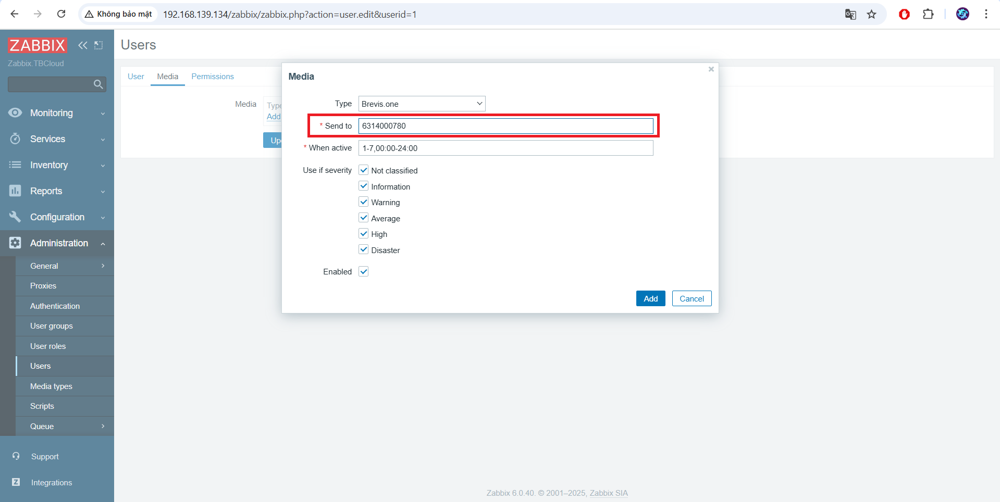

Truy cập đường dẫn sau để lấy chat ID của người dùng: `https://api.telegram.org/bot<YourBOTToken>/getUpdates`

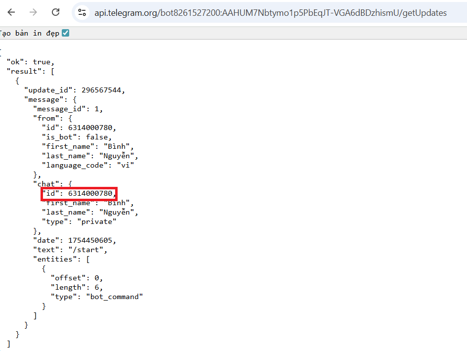
### 2.4 Cấu hình Action để nhận cảnh báo
Chọn `Configuration` > `Actions` > `Create action`.

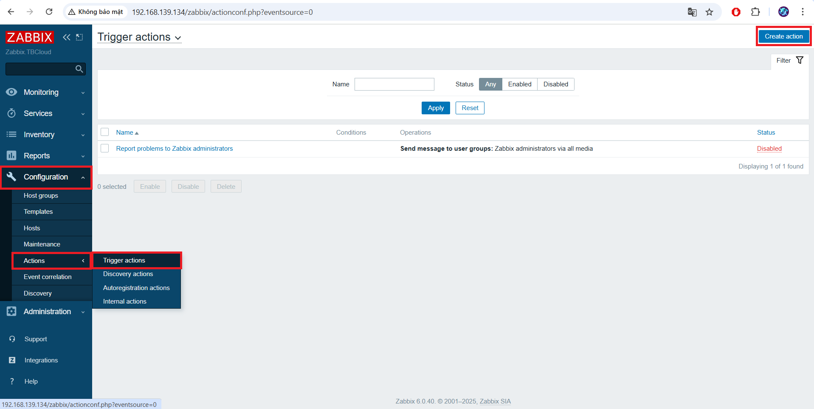

Trong bảng tạo `Action` ta điền các thông tin như phía dưới:

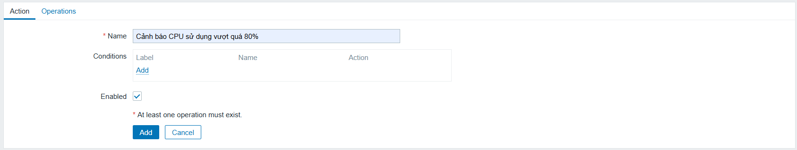

`Conditions`: Cấu hình chọn Host kích hoạt `Action`.

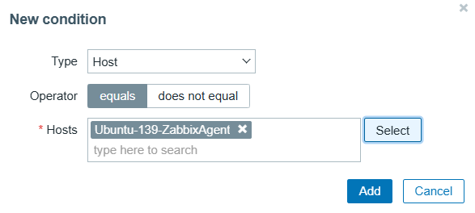

Ta bấm `Select` và chọn `Host` đã tạo mẫu trước đó ,

`Conditions`: Cấu hình điều kiện để `Trigger` kích hoạt `Action`.

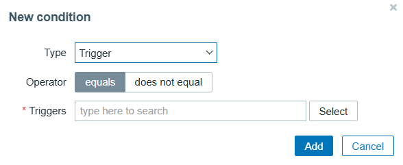

Ta bấm `Select` và chọn `Trigger` đã tạo trước đó , hoặc các `Trigger` khác tùy thuộc vào nhu cầu sử dụng:

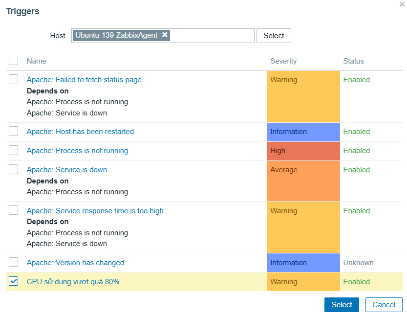

Chọn tab `Operations` > `Operations` > `Add`:

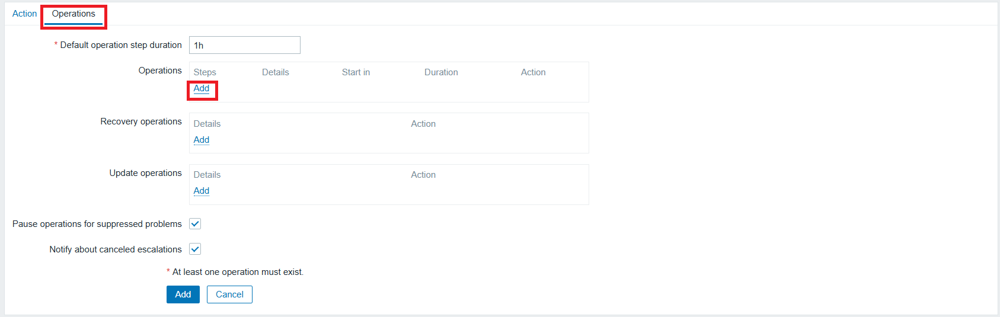

Tại `Operation details`:

- Send to users chọn User cần gửi cảnh báo đã chọn ở trên.
- Send only to chọn Telegram
- Chọn Custom message để thiết lập form cho message, có thể tham khảo mẫu bên dưới:

Subject:

```
{TRIGGER.STATUS}: {TRIGGER.NAME} on {HOSTNAME}
```

Message:
```
Host: {HOSTNAME}
Severity: {TRIGGER.SEVERITY}
Values:{ITEM.VALUE1}
Event: {EVENT.NAME}
Operational data: {EVENT.OPDATA}
Item Graphic: [{ITEM.ID1}]
```

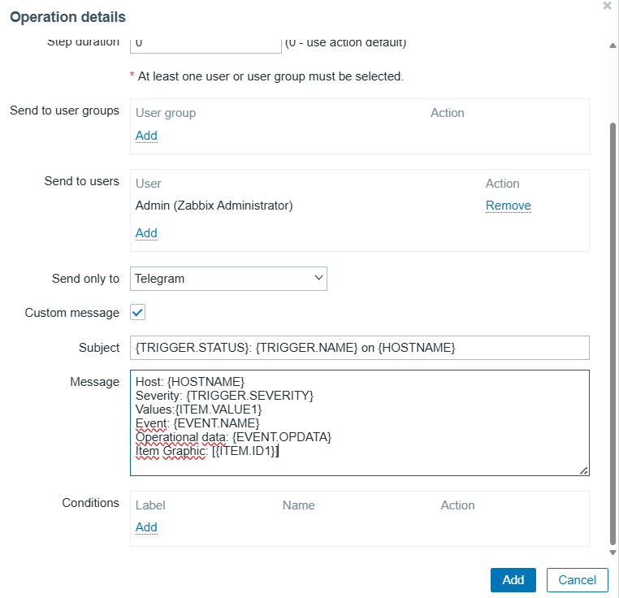

Chọn `Add` tại `Recovery operations`:

Tại `Operation details`:

- Send to users chọn User cần gửi cảnh báo đã chọn ở trên.
- Send only to chọn Telegram
- Chọn Custom message để thiết lập form cho message, có thể tham khảo mẫu bên dưới:

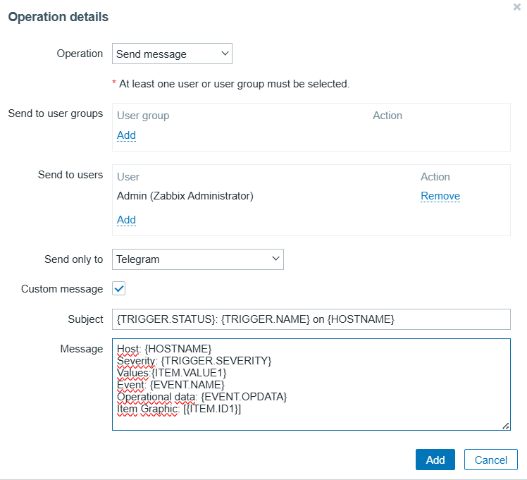

Sau khi cấu hình thành công:

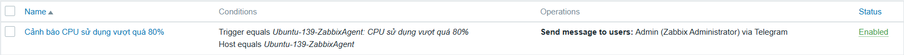