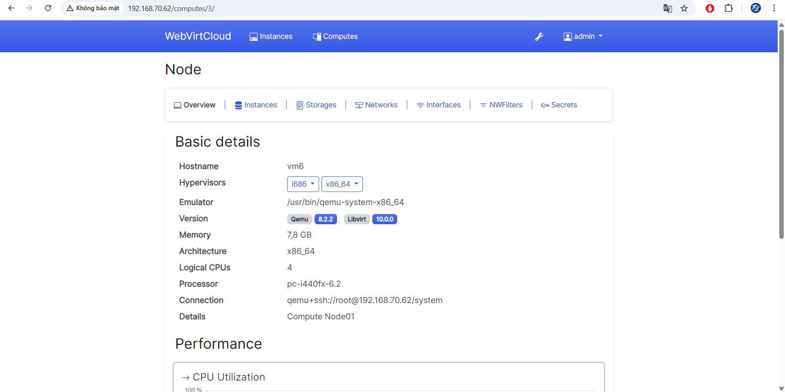

# Cài đặt WebVirtCloud trên Ubuntu 24.04
## 1. Cài đặt các gói cần thiết
- Update hệ thống trước:
```
sudo apt update && sudo apt upgrade -y
```
- Cài đặt các gói sau:
```
sudo apt install -y git libvirt-dev libxml2-dev libxslt1-dev \
libxslt1-dev zlib1g-dev libffi-dev libssl-dev supervisor gcc \
pkg-config libsasl2-dev libssl-dev libldap2-dev 
```
## 2. Cài đặt python
- Cài đặt gói python:
```
sudo apt install python3 python3-pip python3-venv
```
- Kiểm tra sau khi cài đặt:
```
python3 --version
```
## 3. Cài đặt Nginx Webserver
- Cài đặt gói nginx:
```
apt -y install nginx
```
- Kích hoạt nginx:
```
systemctl enable --now nginx
```
- Kiểm tra đã cài đặt thành công hay chưa:
```
systemctl status nginx
```
## 4. Cài đặt webvirtcloud
- Git clone về máy:
```
git clone https://github.com/retspen/webvirtcloud.git
```
- Chuyển tới thư mục webvirtcloud:
```
cd webvirtcloud
```
- Tạo file `setting.py` từ file template cho sẵn trước:
```
cp webvirtcloud/settings.py.template webvirtcloud/settings.py
```
- Chỉnh sửa secret key trong file setting.py:


- Copy file cấu hình nginx và supervisor:
```
cp ~/webvirtcloud/conf/nginx/webvirtcloud.conf /etc/nginx/conf.d
cp ~/webvirtcloud/conf/supervisor/webvirtcloud.conf /etc/supervisor/conf.d
```
- Mở file cấu hình Nginx trong đường dẫn `/etc/nginx/conf.d/webvirtcloud.conf` và tiến hành sửa đổi:


- Copy thư mục webvirtcloud tới thư mục /srv
```
mv webvirtcloud /srv
cd /srv/webvirtcloud
```
- Cài đặt môi trường ảo cho webvirtcloud:
```
python3 -m venv venv
source venv/bin/activate
pip3 install -r conf/requirements.txt
pip3 install setuptools
python3 manage.py migrate
python3 manage.py collectstatic --noinput
```
- Cấp quyền cho cho thư mục `srv/webvirtcloud`:
```
sudo chown -R www-data:www-data /srv/webvirtcloud
```
- Enable và restart lại dịch vụ nginx supervisor:
```
sudo systemctl enable nginx supervisor
sudo systemctl restart nginx supervisor
```
- Kiểm tra xem supervisor managed service đã chạy hay chưa:


## 5. Truy cập trang web
- Truy cập vào webvirtcloud bằng đường dẫn `http://192.168.70.62`:


- Tiến hành đổi mật khẩu của người dùng admin, Chọn “Profile” > “Edit Profile” > “Change Password”::


- Nhập thông tin người dùng và ấn `change password`:


## 6. Tiến hành thêm KVM host để quản lý
- Thực hiện chạy lệnh script dưới đây:
```
LINK=https://raw.githubusercontent.com/cloudspinx/linux-bash-scripts/main/webvirtcloud/debian-ubuntu-kvm-prep.sh
wget -O - $LINK| sudo sh
```
- Kiểm tra supervisor service:
```
supervisorctl status
```
- Cấu hình SSH-keys để webvirtcloud có thể quản lý KVM host:
```
sudo mkdir -p /var/www/.ssh 
sudo chown -R www-data:www-data /var/www/.ssh
sudo -u www-data ssh-keygen
```
- Sau khi tạo key thì copy đến KVM host:
```
sudo -u www-data ssh-copy-id -i /var/www/.ssh/id_ed25519.pub -o StrictHostKeyChecking=no root@192.168.70.62 
```
- Kết nối thành công:



Tài liệu tham khảo:

[1] (https://cloudspinx.com/manage-kvm-on-ubuntu-using-webvirtcloud/)