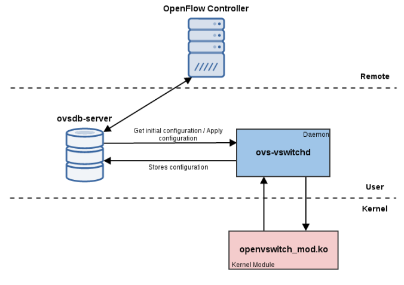

# Tìm hiểu về Open vSwitch
## 1. Open vSwitch là gì?
Open vSwitch là một switch phần mềm đa lớp, được cấp phép theo giấy phép mã nguồn mở Apache 2. Open vSwitch hoạt động như một switch ảo trong môi trường VM, nó cung ấp các giao diện điều khiển và hiển thị tiêu chuẩn cho lớp mạng ảo, nó còn được thiết kế để hỗ trợ phân phối trên nhiều máy chủ vật lý. Open vSwitch hỗ trợ nhiều công nghệ ảo hóa dựa trên Linux, bao gồm KVM và VirtualBox.


Open vSwitch hỗ trợ nhiều tính năng tương tự các thiết bị chuyển mạch (switch) thật:
- VLAN tagging
- LACP
- STP
- QOS
- Tunneling protocols (GRE, VXLAN)
- SPAN, RSPAN

## 2. Cài đặt Open vSwitch trên Ubuntu 22.04
- Cách cài đặt Open vSwitch:
```
apt install openvswitch-switch openvswitch-common -y
```
- Kiểm tra phiên bản hiện tai:
```
ovs-vsctl --version
```
- Khởi động và kích hoạt dịch vụ:
```
systemctl start openvswitch-switch
systemctl enable openvswitch-switch
```
- Kiểm tra trạng thái dịch vụ:
```
systemctl status openvswitch-switch.service
```
## 3. Kết nối máy ảo với openvswitch
- Kiến trúc kết nối như sau:


- Thêm một ovs mới bằng lệnh sau:
```
ovs-vsctl add-br my_bridge
```
- Show ovs vừa tạo bằng lệnh sau:
```
ovs-vsctl show
```


- Các thiết bị đã được tạo thành công tuy nhiên vẫn chưa kết nối với nhau:


- Kết nối card mạng sẵn có của host với ovs vừa tạo bằng lệnh sau:
```
ovs-vsctl add-port my_bridge ens33
```
- Sau khi thực hiện lệnh trên thì sẽ bị mất kết nối internet, để khôi phục kết nối mạng ngoài, chúng ta cần thực hiện hai việc:

1. Xóa địa chỉ IP của ens33, vì chúng ta không còn truy cập internet trực tiếp qua ens33 nữa.
2. Gán địa chỉ IP cho my_bridge để chúng ta có thể truy cập internet thông qua nó (luồng kết nối sẽ là: IP stack → my_bridge → ens33).

- Xóa địa chỉ IP của ens3 bằng lệnh sau:
```
ip addr del 192.168.139.134/24 dev ens33
```
- Sau đó gán lại địa chỉ ip cho card ovs:
```
dhclient my_bridge
```


- Thêm một port khác vào để kết nối với VM ảo:
```
ovs-vsctl add-port my_bridge virt_port
```
- Bây giờ, kiến trúc hiện tại:


- Thực hiện kết nối VM đến virt_port để hoàn tất thiết lập ovs:


- Xóa bridge:
```
ovs-vsctl del-br <bridge_name>
```
- Xóa port:
```
ovs-vsctl del-port <port_name>
```
## 4. Thành phần của OpenvSwitch



- **ovs-vswitchd:** Một trong những thành phần lõi. Nó là một Daemon điều khiển tất cả các switch Open vSwitch trên hệ thống. Khi được khởi động lần đầu tiên, nó nhận cấu hình ban đầu từ ovsdb-server, sử dụng giao thức quản lý OVSDB. Nó giao tiếp với module kernel bằng giao thức netlink. Để giao tiếp với hệ thống, nó sử dụng giao diện trừu tượng netdev. Nó cũng chịu trách nhiệm triển khai các tính năng switch như mirroring, bonding và VLANs.

- **ovsdb-server:** Một cơ sở dữ liệu nhẹ chứa cấu hình ở cấp độ switch. Nhờ có ovsdb-server, các thay đổi cấu hình switch được lưu trữ liên tục và sẽ được duy trì qua cả quá trình khởi động lại hệ thống. Nó giao tiếp với ovs-vswitchd bằng giao thức quản lý OVSDB.

- **OpenvSwitch Kernel Module:** Xử lý chuyển mạch và đường hầm (tunneling).


## 5. Một số tiện ích trong open vSwitch
- `ovs-vsctl`:Truy vấn và cập nhật cấu hình của ovs-vswitchd.
- `ovs-ofctl`: Truy vấn và điều khiển các OpenFlow switch và controller.
- `ovs-dpctl`:Cấu hình mô-đun kernel của switch. Cho phép bạn chỉnh sửa, tạo mới hoặc xóa các data-paths (đường dữ liệu).
- `ovs-appctl`: Gửi lệnh đến Open vSwitch daemon đang chạy. Một trong những cách sử dụng phổ biến là lệnh:
   ```
   ovs-appctl fdb/show <bridge_name>
   ```
- `ovs-pki`: Tạo và quản lý hạ tầng khóa công khai (Public-Key Infrastructure – PKI) cho các OpenFlow switch.
- `ovs-testcontroller`: Một OpenFlow controller đơn giản có thể hữu ích cho mục đích kiểm thử (không nên dùng cho môi trường sản xuất).
## 6. Open vSwitch Modes
Open vSwitch bridge có thể hoạt động ở chế độ normal (bình thường) hoặc chế độ flow (luồng) khi thực hiện việc chuyển tiếp gói tin.

- **Chế độ normal:** Ở chế độ thông thường, OpenVswitch hoạt động như một switch lớp 2.

1. Khi một frame được nhận lần đầu tiên, nó so sánh địa chỉ MAC nguồn của frame với địa chỉ trong bảng.

-  Nếu địa chỉ nguồn không xác định (= không có trong bảng địa chỉ MAC) thì nó sẽ thêm địa chỉ MAC nguồn vào bảng cùng với số cổng mà gói tin được nhận trên. 

2. Nó so sánh địa chỉ MAC đích (nơi gói tin này cần đến) với địa chỉ trong bảng địa chỉ MAC.
- Nếu có mục nhập tồn tại, switch sẽ chuyển tiếp frame ra thông qua cổng được liên kết.
- Nếu không có mục nhập nào, nó sẽ flood (tràn) gói tin ra tất cả các cổng của nó, ngoại trừ cổng mà frame được nhận vào.

- **Chế độ flow:** Ở chế độ này, OpenvSwitch sẽ chuyển gói tin dựa vào OpenFlow table entries.

  Một switch có thể có một hoặc nhiều bảng flow. Một bảng flow có thể được tạo thủ công bằng cách thêm các flow với lệnh `'ovs-ofctl add-flow'` hoặc có thể được thiết lập bởi một bộ điều khiển OpenFlow (như đã thấy trong sơ đồ các thành phần).

Tài liệu tham khảo:

[1] (https://devinpracticecom.wordpress.com/2016/10/18/open-vswitch-introduction-part-1/)

[2] (https://devinpracticecom.wordpress.com/2016/10/19/open-vswitch-introduction-part-2/)