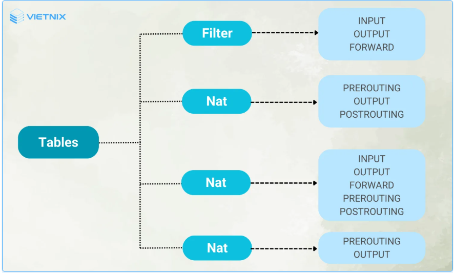
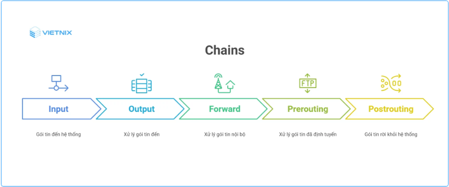
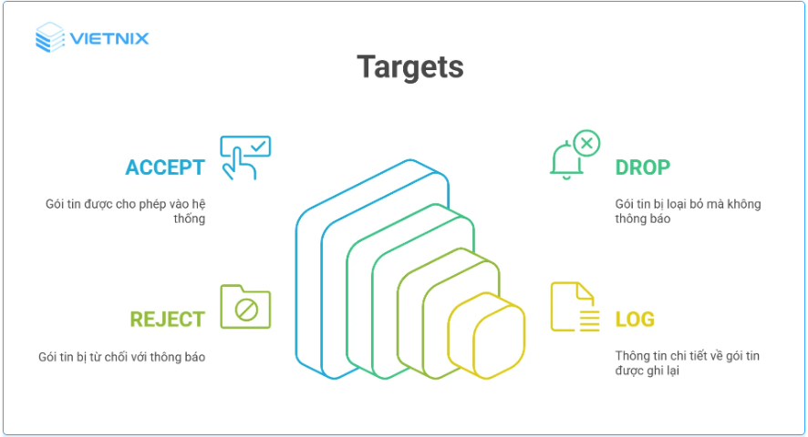

# 1. Iptables là gì?
Lệnh `iptables` là công cụ tường lửa (Firewall) miễn phí trên Linux, cho phép người dùng thiết lập và quản lý các quy tắc riêng về tường lửa để kiểm soát quyền truy cập và tăng độ bảo mật.

Khi vận hành máy chủ, tường lửa đóng vai trò quan trọng trong việc ngăn chặn các truy cập không mong muốn. Trên các bản phân phối Linux như Ubuntu, Fedora… bạn có thể sử dụng công cụ tường lửa `iptables` tích hợp sẵn để bảo vệ hệ thống.
# 2. Tổng quan về tường lửa
Tường lửa (Firewall) là một hệ thống bảo mật mạng được thiết kế để theo dõi và kiểm soát lưu lượng mạng đi vào và đi ra khỏi một mạng hoặc một thiết bị. `Iptables` hoạt động như một bức tường ngăn cách giữa một mạng nội bộ an toàn và một mạng bên ngoài không đáng tin cậy (như Internet). 

Các chức năng chính của tường lửa:
- Ghi nhật ký và báo cáo (Logging and Reporting).
- Lọc gói tin (Packet Filtering).
- Kiểm soát truy cập (Access Control).
- Ngăn chặn xâm nhập (Intrusion Prevention).

# 3. Lý do nên sử dụng iptables
Tường lửa và `iptables` là công cụ quen thuộc, nhưng nhiều người chọn firewalld hoặc ufw vì sự đơn giản. Dù dễ dùng, chúng hạn chế tính linh hoạt và không khai thác hết sức mạnh của `iptables`. Firewalld và ufw chỉ hỗ trợ chặn hoặc cho phép packet, trong khi `iptables` có thể làm nhiều hơn như NAT, ghi log, forward,…

# 4. Cấu trúc của Iptables
## 4.1 Tables
Các bảng (tables) là nơi lưu trữ các quy tắc tường lửa để quản lý và xử lý các package tin.



- **Filter table:** Thường được dùng để lọc và quyết định một package tin có được chấp nhận (Accept), bị từ chối (Reject) hoặc bị loại bỏ (Drop) hay không. Filter table bao gồm các chuỗi chính: input (xử lý các package tin đi vào hệ thống), output (xử lý các package tin được tạo ra và gửi đi từ hệ thống) và forward (xử lý các package tin được định tuyến qua hệ thống).

- **NAT table:** Được dùng để thực hiện các hoạt động liên quan đến NAT (Network Address Translation), bao gồm thay đổi địa chỉ IP nguồn hoặc đích của package tin khi đi qua hệ thống. NAT table bao gồm các chuỗi chính: prerouting (dùng để thay đổi địa chỉ IP đích), postrouting (dùng để thay đổi địa chỉ IP nguồn) và output.

- **Mangle Table:** Được sử dụng để sửa đổi manipulate trong tiêu đề (header) của package tin như thay đổi giá trị TTL (Time to Live), MTU, Type of Service. Mangle table bao gồm các chuỗi chính: prerouting, input, forward, output và postrouting.

- **Raw table:** Thường được dùng để đánh dấu các package tin cho mục đích theo dõi (tracking) và có thể bỏ qua các thao tác NAT hoặc kiểm tra trạng thái kết nối. Raw table bao gồm các chuỗi chính: prerouting, input.
## 4.2 Chains
Các chuỗi (chains) là tập hợp các quy tắc được áp dụng tuần tự cho các package tin khi đi qua tường lửa. Iptables thường được chia thành hai loại chuỗi mặc định và chuỗi người dùng tự tạo.

Dưới đây là các chuỗi mặc định thường gặp trong các bảng:

- **Input:** Được dùng để xử lý các package tin đi vào hệ thống (nghĩa là các package tin có đích đến là chính hệ thống đó). Thường được áp dụng trong các bảng: filter, mangle, security.

- **Output:** Được sử dụng để xử lý các package tin được tạo ra từ hệ thống và chuẩn bị để gửi đi. Thường được áp dụng trong các bảng: filter, nat, mangle, raw, security.

- **Forward:** Dùng để xử lý các package tin định tuyến qua hệ thống từ một giao diện mạng này sang một giao diện mạng khác. Chuỗi này thường được sử dụng trên các router hoặc gateway và áp dụng trong các bảng: filter, mangle, security.

- **Prerouting:** Thường được dùng để Xử lý các package tin ngay khi vừa đến hệ thống và trước khi được định tuyến. Prerouting thường được sử dụng để thay đổi địa chỉ IP đích (Destination NAT – DNAT) và được áp dụng trong các bảng: nat, mangle, raw.

- **Postrouting:** Sử dụng để xử lý các package tin ngay trước khi rời khỏi hệ thống, sau khi đã được định tuyến. Postrouting thường được sử dụng để thay đổi địa chỉ IP nguồn (Source NAT – SNAT) và áp dụng cho các bảng: nat, mangle.


## 4.3 Targets
Targets (mục tiêu) xác định các hành động sẽ được thực hiện khi một package tin khớp với một quy tắc cụ thể trong chuỗi (chain).

- **Accept:** Cho phép packe tin đi vào hệ thống mà không có bất kỳ sự can thiệp nào khác.

- **Drop:** Loại bỏ các package tin mà không thông báo cho nguồn gửi và sẽ không tiếp tục xử lý trong các chuỗi tiếp theo.

- **Reject:** Từ chối package tin và sẽ phản hồi lại nguồn gửi về việc package tin đã bị từ chối.

- **Log:** Ghi lại thông tin chi tiết về package tin trong nhật ký hệ thống (syslog) trước khi tiếp tục xử lý package tin trong chuỗi.



# 5. Cách thiết lập iptables
```
sudo iptables -A  -i <interface> -p <protocol (tcp/udp)> -s <source> --dport <port no.>  -j <target>
```

Trong đó:

- A: Thêm chain rules.
- i: Là giao diện mạng cần thực hiện lọc các package tin.
- p: Là giao thức mạng thực hiện lọc (tcp/udp).
- dport: Là cổng muốn đặt bộ lọc.