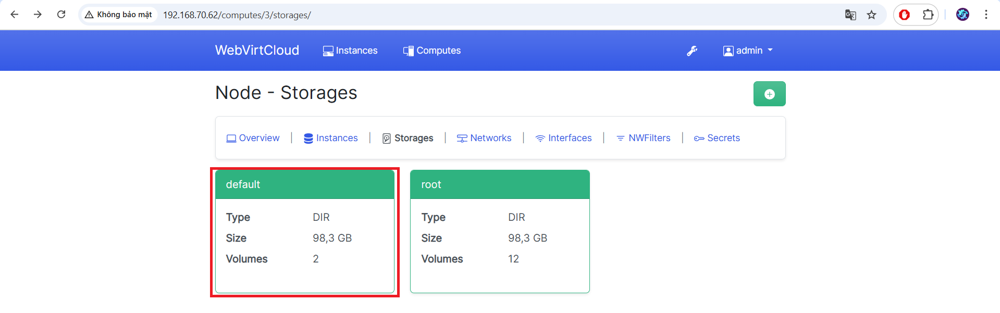

# Các thao tác với VM trên Webvirtcloud

## 1. Thêm VM
- Ta sẽ tạo 1 storage để chạy VM đó. Ta chọn Computes:

- Giao diện Computes hiện ra. Ta sẽ chọn 1 máy để tạo storage. Ở đây, ta chọn Node.

- Trên giao diện của Node, ta chọn Storages:

- Trên giao diện Storage, ta sẽ chọn 1 mục để tạo phân vùng cài VM. Ở đây, ta chọn default:

- Click chọn biểu tượng + để thêm Volume:

- Ta điền tên, định dạng và kích thước cho VM. Sau đó, click Create:

- Khi thành công, ta sẽ thấy có thông báo thành công:

- Ta chọn Instances, rồi click biểu tượng + để thêm VM:

- Ta có thể sử dụng những mẫu có sẵn hoặc custom. Ở đây, ta sẽ chọn Custom:

## 2. Sửa VM
- Thay đổi thông số `CPU`, `RAM`, `Disk`. Ta sẽ chọn mục `Resize`:

- Tại đây, ta có thể thay đổi thông số của CPU, RAM, Disk. Sau khi thay đổi xong, ta click Resize.

**Lưu ý:** Cần tắt VM trước khi Resize
## 3. Clone VM
- Ta chọn `Setting` -> `Clone`:

**Lưu ý:** Đặt tên không chứa các kí tự đặc biệt.

## 4. Snapshot
- Cần tắt VM trước khi `Snapshot`.

- Ta chọn `Snapshot` -> `Take Snapshot`. Ta đặt tên cho bản `Snapshot` rồi click `Take Snapshot`:

- Sau khi Snapshot thành công, ta sẽ thấy bản Snapshot bên mục `Manager Snapshots`. Tại đây, ta cũng có thể thấy các bản Snapshot khác của VM:

- Quay lại bản snapshot nào đó, ta chọn bản snapshot rồi click biểu tượng như hình:

- Xóa bản Snapshot, ta chọn bản snapshot rồi click biểu tượng xóa như hình:

- Bấm chọn oke:

## 5. Xóa VM
- Để xóa VM, ta chọn mục `Destroy` -> Click `Destroy` để xóa:

