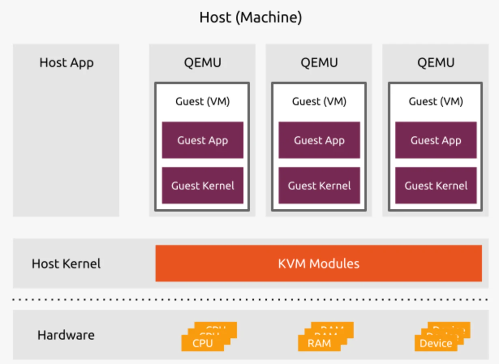

# TÌM HIỂU KVM CƠ BẢN
## 1. KVM là gì và để làm gì?
KVM (Kernel-based Virtual Machine) là một công nghệ ảo hóa mã nguồn mở dành cho hệ điều hành Linux®. Với KVM, Linux có thể hoạt động như một hypervisor cho phép chạy nhiều máy ảo (VM) độc lập và cách ly với nhau.

KVM (KVM hypervisor) cho phép khả năng ảo hóa hoàn toàn. Nó cung cấp cho mỗi máy ảo (VM) đầy đủ các dịch vụ điển hình của một hệ thống vật lý, bao gồm BIOS ảo (hệ thống nhập/xuất cơ bản) và phần cứng ảo như bộ xử lý, bộ nhớ, lưu trữ, card mạng, v.v. Nhờ đó, mỗi máy ảo mô phỏng hoàn toàn một máy vật lý.

KVM có sẵn dưới dạng một mô-đun của nhân Linux. Nó được tích hợp trực tiếp vào mã của nhân, cho phép nhân hoạt động như một hypervisor. Mỗi máy ảo (VM) chạy như một tiến trình Linux riêng biệt dưới hệ thống systemd, với các tài nguyên phần cứng ảo chuyên dụng được gán kèm.

KVM chỉ có thể được sử dụng trên bộ vi xử lý có hỗ trợ phần mở rộng ảo hóa phần cứng, chẳng hạn như Intel-VT hoặc AMD-V.


## 2. KVM thuộc loại ảo hóa nào?
KVM là một công nghệ Linux virtualization, cung cấp khả năng ảo hóa toàn phần (full virtualization) dựa trên CPU virtualization.
## 3. So sánh KVM với các loại hypervisor còn lại
Hypervisor cung cấp nền tảng cho hệ thống ảo hóa của bạn bằng cách gom các tài nguyên tính toán và phân bổ lại chúng cho các máy ảo (VM). Có nhiều lựa chọn khác nhau khi chọn hypervisor — từ các nhà cung cấp truyền thống đến các giải pháp mã nguồn mở. VMware cung cấp ESXi hypervisor và nền tảng ảo hóa vSphere, đây là một hypervisor loại bare-metal độc quyền. Kernel-based Virtual Machine (KVM) là một hypervisor mã nguồn mở và chạy trên các máy chủ Linux®.

```
Bare-metal dùng để chỉ phần cứng vật lý thuần túy, chưa có hệ điều hành hay lớp phần mềm trung gian nào chạy bên trên.
Trong ngữ cảnh ảo hóa, bare-metal hypervisor là loại hypervisor được cài đặt trực tiếp lên phần cứng máy chủ, thay vì cài trên một hệ điều hành có sẵn.
```
Các nền tảng ảo hóa khác bao gồm:

- **Hyper-V:** Nền tảng ảo hóa của Microsoft được tối ưu cho môi trường Windows. Nó yêu cầu giấy phép Windows Server để chạy và có thể không tương thích tốt với các hệ điều hành khác.
- **Nutanix:** Cung cấp giải pháp ảo hóa chuyên biệt với các tính năng hỗ trợ khả năng mở rộng và phát triển theo hướng cloud-native. Tuy nhiên, tính chuyên biệt này có thể khiến một số người dùng gặp khó khăn ban đầu do độ phức tạp.
- **Proxmox VE:** Nền tảng quản lý máy chủ mã nguồn mở, được hưởng lợi từ cộng đồng người dùng và nhà phát triển lớn, nhưng hỗ trợ ở cấp độ doanh nghiệp chỉ có dưới dạng dịch vụ thương mại bổ sung.
- **Oracle Virtualization:** Phần mềm ảo hóa cấp doanh nghiệp dựa trên KVM. Oracle cũng cung cấp Oracle VirtualBox, một hypervisor phổ biến.

Hypervisor gồm các loại sau:

- **Bare-metal Hypervisor:** Chạy trực tiếp trên phần cứng và hoạt động như một hệ điều hành (Ví dụ: `ESXi`).
- **Hosted Hypervisor:** Chạy trên một hệ điều hành có sẵn (Ví dụ: `VirtualBox`, `VMware Workstation`).
- **KVM:** Là một mô-đun ảo hóa được tích hợp trong nhân Linux, cung cấp các tính năng của cả Hypervisor loại 1 và loại 2.
- **Xen:** Ban đầu được thiết kế như một Hypervisor loại 1, nhưng theo thời gian đã bổ sung khả năng ảo hóa bán phần (paravirtualization) và ảo hóa hỗ trợ phần cứng.
- **ESXi:** Là Hypervisor loại 1 do VMware phát triển, cung cấp các giải pháp ảo hóa ở cấp độ doanh nghiệp.

Sự khác biệt chính giữa các hypervisor này nằm ở kiến trúc và cách tiếp cận quản lý tài nguyên. Ví dụ, KVM được tích hợp chặt chẽ với nhân Linux, tận dụng các tính năng mạnh mẽ và khả năng hỗ trợ phần cứng rộng rãi của Linux. Trong khi đó, Xen nổi tiếng với kỹ thuật ảo hóa bán phần (paravirtualization), cho phép các máy ảo giao tiếp với hypervisor một cách hiệu quả hơn. ESXi, là một phần của hệ sinh thái ảo hóa toàn diện của VMware, cung cấp các tính năng nâng cao và các công cụ quản lý mạnh mẽ.

|Hypervisor|Kiến trúc|Những chức năng chính|Mục đích|
|---|---|---|---|
|KVM|Linux Kernel Module|Ảo hóa tăng tốc phần cứng, tích hợp với Linux, mã nguồn mở|Lý tưởng cho những ai tìm kiếm giải pháp mã nguồn mở và tích hợp với hạ tầng Linux|
|Xen|Bare-metal|Ảo hóa bán phần, khả năng mở rộng, tập trung vào bảo mật|Phù hợp cho các ứng dụng có yêu cầu cao về hiệu năng và bảo mật.|
|ESXi|Bare-metal|Tích hợp vSphere, quản lý tài nguyên nâng cao, giải pháp doanh nghiệp|Lựa chọn mạnh mẽ cho những ai cần giải pháp ảo hóa cấp doanh nghiệp cùng các công cụ quản lý nâng cao.|
|Hyper-V|Hybrid|Tích hợp với Windows Server, khả năng mở rộng, hệ sinh thái Microsoft|
## 4. Các thành phần trong KVM
KVM bao gồm các thành phần sau:
1. **Kernel Modules:**
- `kvm.ko`: Mô-đun chung của KVM, cung cấp hạ tầng ảo hóa cơ bản.
- `kvm-intel.ko` hoặc `kvm-amd.ko`: Mô-đun dành riêng cho CPU Intel hoặc AMD, cho phép tận dụng các tập lệnh ảo hóa phần cứng (Intel VT-x, AMD-V).
2. **QEMU (Quick Emulator):**
- Trình giả lập phần cứng và quản lý máy ảo.
- Hoạt động cùng với KVM để cung cấp ảo hóa tăng tốc phần cứng.
- QEMU xử lý emulation của thiết bị ảo (card mạng, ổ đĩa, USB, GPU ảo...).
3. **Libvirt:**
- Lớp API và công cụ quản lý máy ảo.
- Cung cấp lệnh `virsh` và giao diện đồ họa virt-manager.
- Cho phép tạo, cấu hình, giám sát và điều khiển VM dễ dàng.
4. **Virtio Drivers**
- Bộ driver ảo hóa hiệu năng cao cho thiết bị I/O như: `virtio-net` (card mạng ảo), `virtio-blk` (ổ đĩa ảo), `virtio-scsi` (ổ SCSI ảo), `virtio-gpu`(GPU ảo).
- Giúp giảm overhead và tăng tốc độ truyền dữ liệu giữa máy chủ và VM.
## 5. Cách hoạt động của KVM
KVM yêu cầu cài đặt nhân Linux trên máy tính chạy trên nền CPU hỗ trợ các phần mở rộng ảo hóa. Cụ thể, KVM hỗ trợ tất cả CPU x86, một dòng chip máy tính có khả năng xử lý ngôn ngữ lệnh x86 của Intel. Các bước hoạt động của KVM bao gồm:

**Bước 1 Tải mô-đun KVM:** Để kích hoạt KVM, mô-đun nhân KVM phải được tải. Mô-đun này cung cấp hạ tầng ảo hóa cốt lõi và tương tác với phần cứng để tạo ra các môi trường ảo.

**Bước 2 Tạo máy ảo:** Khi mô-đun KVM đã được tải, người dùng có thể tạo máy ảo (VM) bằng các công cụ quản lý như libvirt, virt-manager hoặc qua giao diện dòng lệnh. Mỗi máy ảo sẽ được cấp phát các tài nguyên phần cứng ảo hóa, bao gồm CPU, bộ nhớ, lưu trữ và giao diện mạng.

**Bước 3 Chạy hệ điều hành:** Các máy ảo đã tạo sẽ chạy các hệ điều hành khách, có thể là Linux, Windows hoặc các hệ điều hành khác. Hypervisor quản lý việc thực thi các hệ điều hành khách này, đảm bảo chúng hoạt động một cách độc lập và an toàn.

**Bước 4: Quản lý tài nguyên và hiệu năng:** KVM phối hợp với nhân Linux để phân bổ và điều phối tài nguyên phần cứng như CPU, RAM, I/O và băng thông mạng cho từng máy ảo. Hệ thống lập lịch của Linux (Linux Scheduler) quản lý các vCPU như các luồng xử lý, đảm bảo phân chia công bằng hoặc theo ưu tiên cấu hình trước.

**Bước 5: Giám sát và quản trị** Người quản trị có thể giám sát trạng thái và hiệu năng của các VM thông qua công cụ virt-manager, lệnh virsh, hoặc các nền tảng quản lý ảo hóa như oVirt hay OpenStack. Quản trị viên có thể thực hiện các thao tác như di chuyển máy ảo (live migration), sao lưu, khởi động lại hoặc mở rộng tài nguyên một cách linh hoạt.

## 6. Mối quan hệ của KVM với OS là như thế nào
- Linux đóng vai trò Host OS: KVM hoạt động bên trong nhân Linux, nên Linux vừa làm hệ điều hành chủ vừa làm hypervisor.
- Host OS chịu trách nhiệm quản lý toàn bộ phần cứng vật lý: CPU, RAM, bộ nhớ, mạng… và phân bổ tài nguyên này cho KVM.
- Trên nền KVM, có thể chạy nhiều Guest OS khác nhau như Linux, Windows, BSD, Solaris…
- Mỗi Guest OS được cấp phát tài nguyên phần cứng ảo hóa (vCPU, RAM ảo, ổ đĩa ảo, card mạng ảo…).
- Guest OS hoạt động độc lập, không can thiệp trực tiếp vào phần cứng thật, mà thông qua lớp ảo hóa của KVM.


Tài liệu tham khảo:

[1] (https://ubuntu.com/blog/kvm-hyphervisor)

[2] (https://aws.amazon.com/what-is/kvm/)

[3] (https://www.redhat.com/en/topics/virtualization/what-is-KVM)

[4] (https://www.redhat.com/en/topics/virtualization/kvm-vs-vmware-comparison)

[5] (https://www.hostragons.com/en/blog/kvm-vs-xen-vs-esxi-hypervisor-technologies-comparison/)