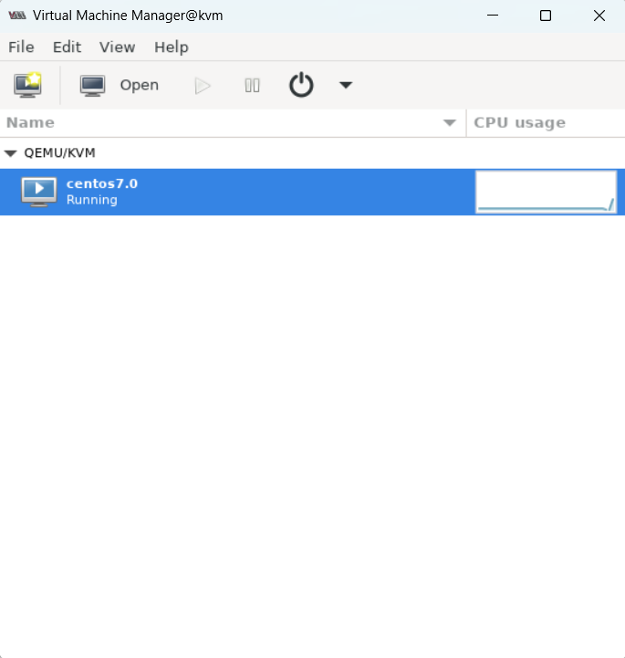
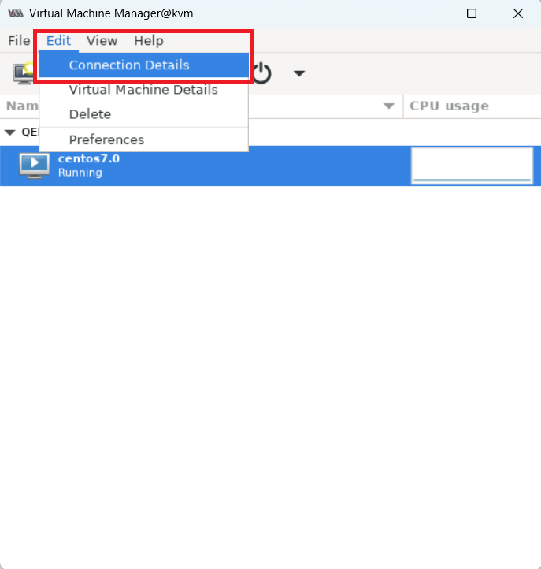
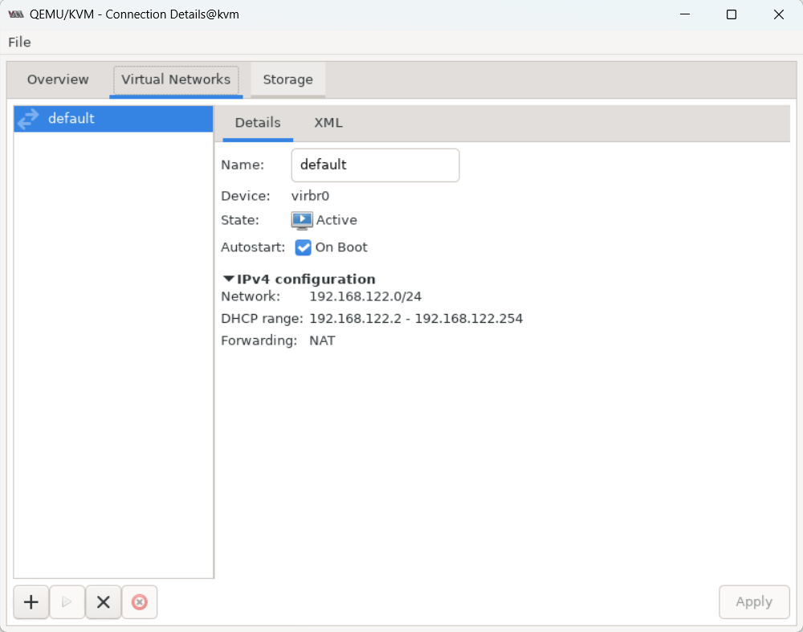
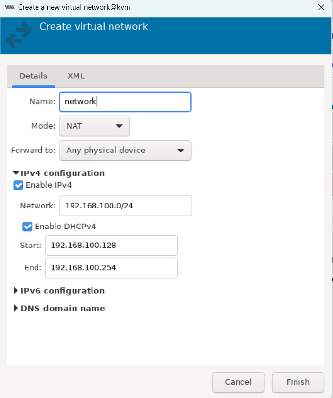
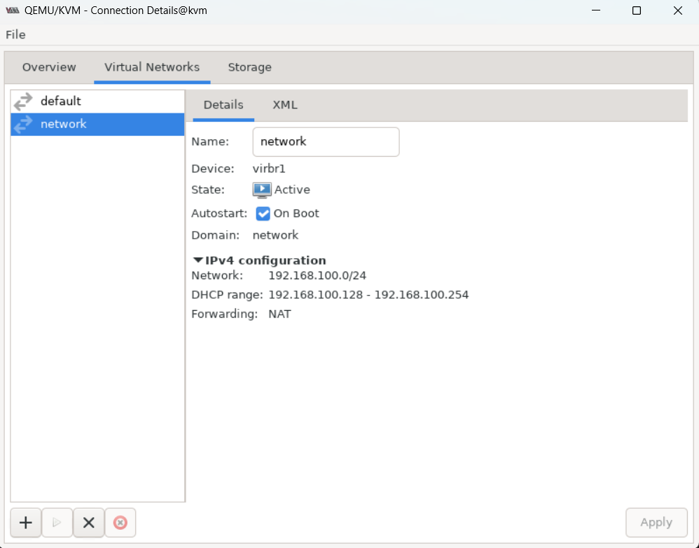
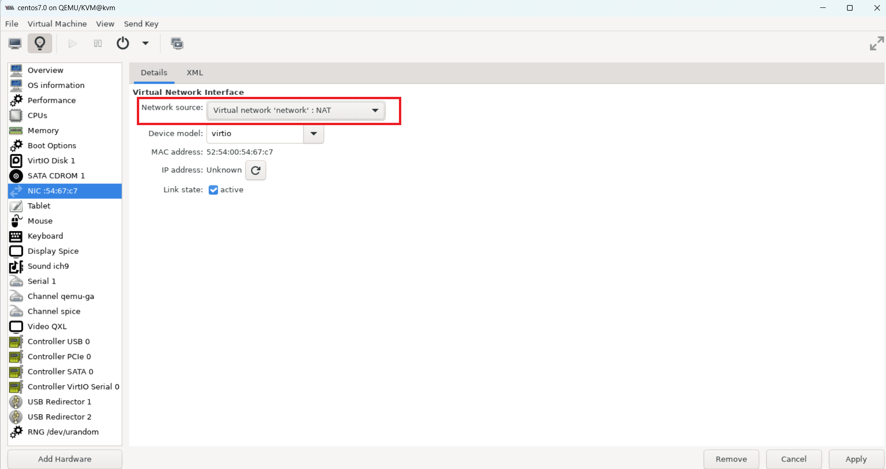
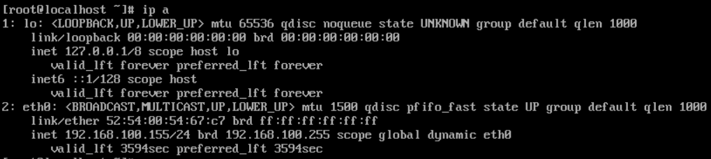
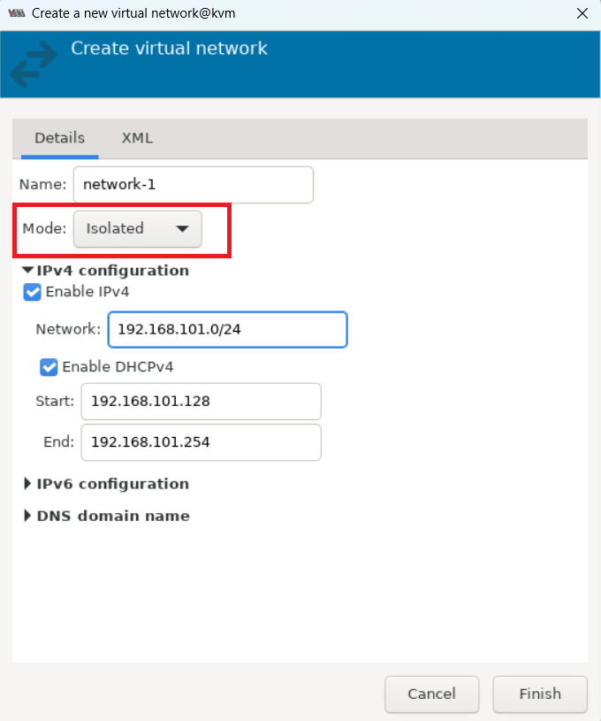
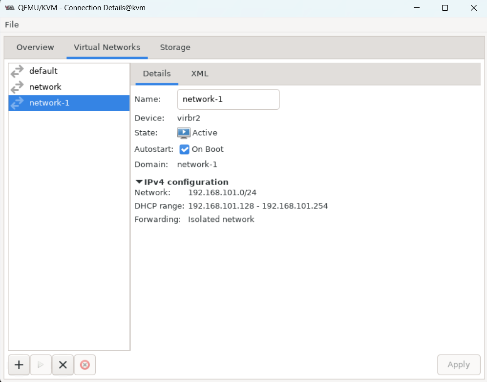

# TÌM HIỂU CÁC CHẾ ĐỘ CARD MẠNG TRONG KVM
Cũng như các công cụ ảo hóa khác thì KVM cũng cung cấp các mô hình mạng trong việc ảo hóa network. Có 3 chế độ card mạng tương ứng với 3 mô hình mạng:
- NAT
- Host-only
- Bridge

## 1. NAT
- Với mô hình này KVM thực hiện ánh xạ một dải địa chỉ để cung cấp cho máy ảo.
- Dải địa chỉ ta có thể chọn tùy ý. Với mô hình này máy ảo của ta có thể giao tiếp với internet.
- Nhưng có một chú rằng từ VM của ta có thể ping được ra ngoài internet nhưng máy bên ngoài sẽ không thấy được VM của ta chính vì vậy ta không thể ping từ bên ngoài đến VM sử dụng mô hình mạng NAT.

**Cách cấu hình:**

Mặc định, sau khi cài đặt xong KVM, ta sẽ có một mạng ảo NAT mang tên `default`.

Ta có thể add một mạng ảo với mô hình NAT khác. Ở đây, tôi sẽ dùng virt-manager để thực hiện.

Mở Virt-manager bằng câu lệnh virt-manager:

Chọn Edit -> Connection Details. Chọn tab Virtual network, ta thấy danh sách các mạng ở bên trái. Để thêm mạng, ta click biểu tưởng + :

Nhập tên cho mạng, Chọn dải mạng định tạo. Sau đó, chọn dải cấp cho máy ảo, hoặc có thể chọn đặt IP tĩnh. Chọn mô hình mạng là NAT rồi Finish.

Sau khi tạo thành công, ta sẽ thấy mạng ở trên giao diện Network của Virt-manager:

Trên VM : Ta vào phần thiết lập thông số Card mạng rồi chọn mạng NAT vừa tạo.

Reboot máy và kiểm tra IP xem đã đúng dải mạng chưa. Nếu chưa được cấp địa chỉ IP có thể gõ `su -` để vào chế độ root và gõ `dhclient -v eth0` để tiến hành cấp địa chỉ IP tự động cho VM.

## 2. Host-only
- Với mô hình mạng kiểu này cũng cho phép ta cấp phát địa chỉ tùy ý giống với mô hình NAT.
- Máy ảo không thể nói chuyện với máy tính bên ngoài.
- Nó chỉ có thể trao đổi với các máy trong cùng mạng bên trong server vật lý và trao đổi với đươc máy chủ vật lý.

**Cách cấu hình:**

Tương tự cách tạo mạng NAT. Nhưng khi đến bước chọn kiểu mạng, ta sẽ chọn mục `Isolated virtual network`:

Sau khi tạo thành công, ta sẽ thấy mạng vừa tạo:

## 3. Bridge
- Linux bridge là một phần mềm được tích hợp trong nhân linux để giải quyết vấn đề ảo hóa phần Network trong trong các máy vật lý.
- Về mặt logic Linux bridge tạo ra một con switch ảo để các VM kết nối vào và có thể nói chuyện được với nhau cũng như sử dụng để ra ngoài mạng.

Với mô hình mạng này ta có thể dùng dải mạng tương ứng với mỗi card mạng của ta. Ta cũng có thể add thêm 1 còn switch ảo và gán cho nó các card mạng tương ứng. Lúc này khi các VM kết nối vào switch đó nó sẽ nhận địa chỉ của card đã kết nối với switch.

Tài liệu tham khảo:

[1] (https://wiki.libvirt.org/VirtualNetworking.htm)