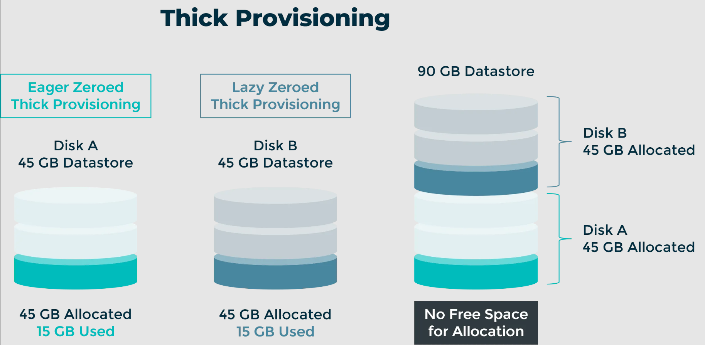
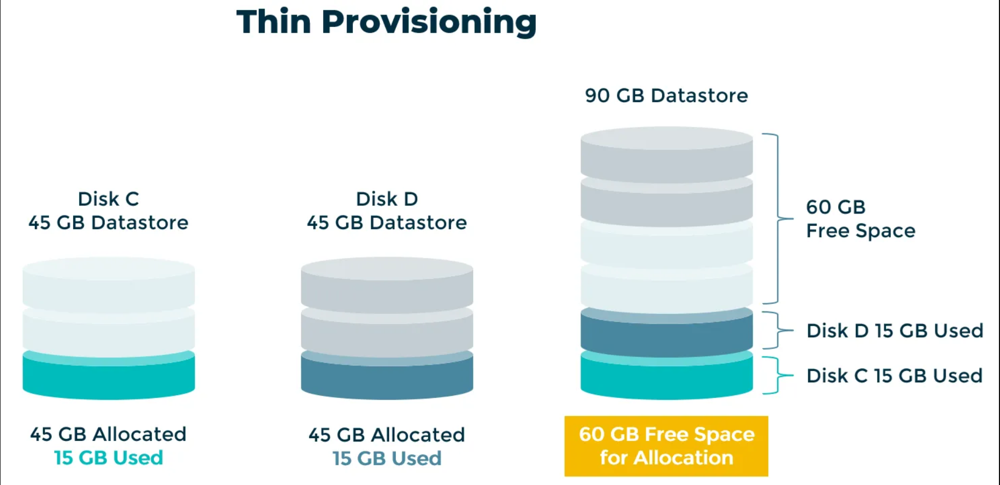
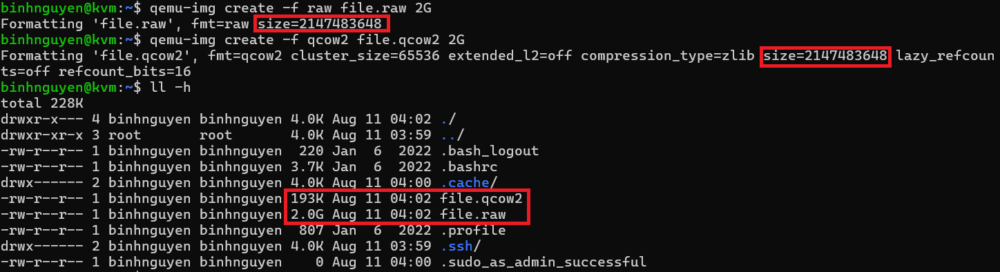
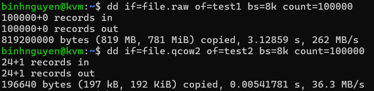
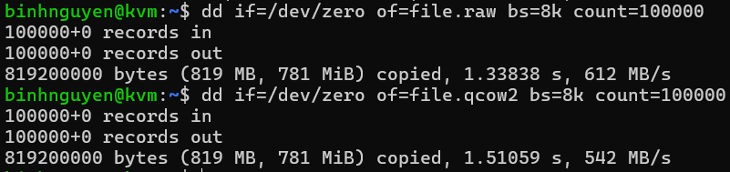
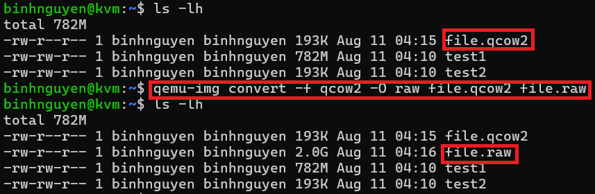
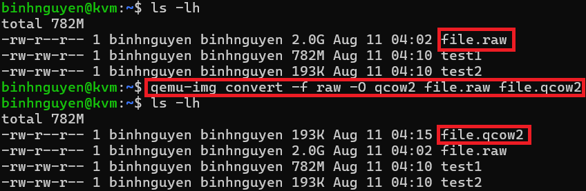

# TÌM HIỂU VỀ FILE IMAGE FORMATS TRONG KVM
## 1. Cơ chế lưu trữ thin-thick
### 1.1 Thick Provisioning
Thick Provisioning là một phương pháp quản lý dung lượng lưu trữ, trong đó một lượng không gian đĩa cố định được phân bổ trước cho một ổ đĩa ảo hoặc tập dữ liệu ngay từ đầu. Dung lượng này được dành riêng cho ổ đĩa hoặc tập dữ liệu đó, không phụ thuộc vào lượng dữ liệu thực tế đang được lưu trữ. 
```
Phân bổ trước (pre-allocate) toàn bộ dung lượng đã khai báo cho ổ đĩa ảo/nghiệp vụ (VD: tạo disk 100 GB thì hệ thống lập tức chiếm đủ 100 GB trên storage).
Dung lượng này không co giãn theo dữ liệu thực tế: lưu 1 GB hay 99 GB thì vẫn chiếm 100 GB trên host/storage.
```
Thick Provisioning có 2 loại biến thể:
- **Eager Zeroed Thick Provisioning:** Kỹ thuật này không chỉ phân bổ dung lượng đĩa ngay từ đầu mà còn ghi giá trị 0 lên toàn bộ không gian đã phân bổ ngay lập tức. Quá trình ghi số 0 này đảm bảo mọi dữ liệu dư thừa trước đó đều bị xóa, cung cấp một “trang trắng” cho dữ liệu mới. Điều này đặc biệt quan trọng trong các môi trường ưu tiên tính toàn vẹn và bảo mật dữ liệu, vì nó loại bỏ khả năng truy cập vào các phần dữ liệu cũ còn sót lại. Việc zero hóa ngay từ đầu cũng mang lại lợi ích về hiệu năng cho các ứng dụng ghi dữ liệu nhiều, vì bộ lưu trữ đã sẵn sàng nhận dữ liệu mới mà không tốn thêm chi phí dọn dẹp trong quá trình ghi.

- **Lazy Zeroed Thick Provisioning:** Trái ngược với biến thể eager, kỹ thuật lazy zeroed phân bổ dung lượng đĩa nhưng không zero hóa ngay lập tức. Không gian này được đánh dấu là đã sẵn sàng sử dụng và sẽ được zero hóa theo nhu cầu khi quá trình ghi dữ liệu diễn ra. Cách này giúp tăng tốc quá trình cấp phát ban đầu vì bỏ qua bước zero hóa ngay từ đầu. Tuy nhiên, nó có thể gây ra giảm hiệu năng khi lần đầu ghi vào mỗi sector, do đĩa phải zero hóa trước khi ghi dữ liệu mới, dẫn đến khả năng ảnh hưởng đến tốc độ ghi trong các tình huống cần ghi nhanh ngay lập tức.


### 1.2 Thin Provisioning
Thin Provisioning là một phương pháp cấp phát lưu trữ động, trái ngược hoàn toàn với thick provisioning, bằng cách chỉ cấp phát dung lượng đĩa khi thực sự cần để lưu trữ dữ liệu, thay vì đặt trước toàn bộ dung lượng ngay từ đầu.

Cách tiếp cận này tạo ra một vùng lưu trữ ảo (virtual storage pool) mà hệ điều hành và ứng dụng nhìn thấy như thể có sẵn một ổ đĩa với dung lượng lớn, bất kể dung lượng lưu trữ vật lý thực tế hiện có là bao nhiêu.

Khi nhu cầu lưu trữ dữ liệu tăng lên, thin provisioning sẽ động cấp thêm dung lượng đĩa từ vùng lưu trữ này cho ổ đĩa ảo, cho đến khi đạt giới hạn tối đa đã định sẵn. Phương pháp này rất hiệu quả vì giảm thiểu lãng phí dung lượng và cho phép overcommit — nghĩa là tổng dung lượng khai báo cho tất cả các ổ đĩa ảo có thể vượt quá dung lượng vật lý thực tế, dựa vào khả năng rất thấp rằng tất cả các ổ sẽ sử dụng hết dung lượng tối đa của mình cùng lúc.


## 2. Phân biệt 3 định dạng file images
### 2.1 Định dạng ISO
ISO là một định dạng file ảnh đĩa (disk image) thường dùng để lưu trữ toàn bộ nội dung của một đĩa quang (CD, DVD, Blu-ray) dưới dạng một file duy nhất với phần mở rộng .iso.

**Đặc điểm:**
- Chứa bản sao y nguyên (sector-by-sector copy) của đĩa gốc, bao gồm cả cấu trúc thư mục và dữ liệu.
- Không nén dữ liệu (trừ khi dùng thêm công cụ nén bên ngoài).
- Dễ mount như một ổ đĩa ảo hoặc ghi ra đĩa vật lý.

**Ứng dụng:**
- Phát hành hệ điều hành: Ubuntu, Windows, Fedora… thường được phân phối dưới dạng file .iso để người dùng tải về và ghi ra USB/CD.
- Sao lưu đĩa quang: Lưu trữ bản sao của CD/DVD gốc để bảo quản hoặc sử dụng lại.
- Triển khai phần mềm: Dùng trong môi trường ảo hóa, máy chủ, hoặc hệ thống cài đặt tự động (PXE boot, KVM, VMware…).

**Trong ảo hóa và máy ảo:**
- ISO đóng vai trò media ảo. Bạn có thể attach ISO vào máy ảo giống như đưa một đĩa CD/DVD vào ổ thật. Hệ điều hành bên trong máy ảo có thể boot và cài đặt từ ISO.
### 2.2 Định dạng RAW
RAW trong bối cảnh máy ảo và ảo hóa là một định dạng ảnh đĩa (disk image) dạng nhị phân thuần túy (bit-for-bit) của một ổ cứng, phân vùng hoặc thiết bị lưu trữ.

**Đặc điểm:**
- Không có siêu dữ liệu (metadata): file RAW chỉ chứa dữ liệu thực tế của từng sector, không bổ sung thông tin về snapshot, nén, hoặc cấu trúc mở rộng.
- Cấu trúc đơn giản: dữ liệu trong file RAW giống hệt dữ liệu sẽ có trên ổ vật lý nếu bạn sao chép trực tiếp từng byte.
- Tương thích cao: hầu như mọi hypervisor, công cụ phục hồi dữ liệu, và phần mềm ảo hóa đều có thể đọc/ghi file RAW.
- Không nén: dung lượng file bằng đúng kích thước ổ/partition được định nghĩa (trừ khi filesystem hỗ trợ sparse file).

**Ứng dụng:**
- Máy ảo: dùng làm ổ đĩa ảo trong QEMU/KVM, VirtualBox, VMware (có thể convert sang định dạng riêng).
- Phục hồi dữ liệu: copy nguyên trạng thiết bị lưu trữ để phân tích hoặc khôi phục.
- Chuyển đổi định dạng: làm trung gian khi convert giữa các định dạng ảnh đĩa khác (VD: QCOW2 ↔ VMDK).

### 2.3 Định dạng QCOW2
QCOW2 (QEMU Copy-On-Write version 2) là định dạng ảnh đĩa ảo do QEMU/KVM sử dụng, được thiết kế để linh hoạt hơn RAW và bổ sung nhiều tính năng nâng cao cho máy ảo.

**Đặc điểm:**
- Copy-On-Write (COW): chỉ ghi dữ liệu mới khi cần, các block chưa ghi sẽ không chiếm dung lượng thật → hỗ trợ thin provisioning.
- Metadata riêng: chứa thông tin về cấu trúc file, snapshot, nén, mã hóa.
- Tăng trưởng động: dung lượng file sẽ tăng dần khi dữ liệu thực sự được ghi vào.

**Tính năng nổi bật:**
- Snapshots: Cho phép lưu lại trạng thái của ổ đĩa tại một thời điểm và quay lại khi cần.
- Nén (Compression): Hỗ trợ nén zlib để giảm dung lượng lưu trữ.
- Mã hóa (Encryption): Có thể mã hóa AES để bảo vệ dữ liệu.
- Thin provisioning: File nhỏ lúc mới tạo, chỉ phình to khi ghi dữ liệu mới.
- Backings files: Cho phép nhiều ổ đĩa ảo dùng chung dữ liệu gốc, tiết kiệm dung lượng.

## 3. So sánh raw và qcow2
### 3.1 Dung lượng
Để kiểm tra dung lượng của 2 định dạng này, ta sẽ dùng lệnh qemu-img để tạo ra một file có định dạng raw và một file có định dạng qcow2 cả 2 file nàu đều có dung lượng là 2G.

File `raw`:
```
qemu-img create -f raw file.raw 2G
```
File `qcow2`:
```
qemu-img create -f qcow2 file.qcow2 2G
```



Ta có thể thấy, khi tạo thì 2 file đều có dung lượng là 2G, nhưng sau đó, kiểm tra thực tế thì ta thấy file có định dạng qcow2 chỉ có dung lượng là 193K, còn file định dạng raw thì vẫn là 2G.
### 3.2 Hiệu năng
Để test hiệu năng giữa 2 định dạng này ta sử dụng câu lệnh dd để đọc và ghi dữ liệu từ các file trên.

Đọc dữ liệu:
```
dd if=file.raw of=test1 bs=8k count=100000
dd if=file.qcow2 of=test2 bs=8k count=100000
```


Ghi dữ liệu:
```
dd if=/dev/zero of=file.raw bs=8k count=100000
dd if=/dev/zero of=file.qcow2 bs=8k count=100000
```


### 3.3 Snapshots
Chỉ có qcow2 hỗ trợ tạo snapshot.
## 4. Cách chuyển đổi giữa raw và qcow2
Chuyển từ `qcow2` sang `raw`:
```
qemu-img convert -f qcow2 -O raw file.qcow2 file.raw
```

Chuyển từ `raw` sang `qcow2`:
```
qemu-img convert -f raw -O qcow2 file.raw file.qcow2
```
