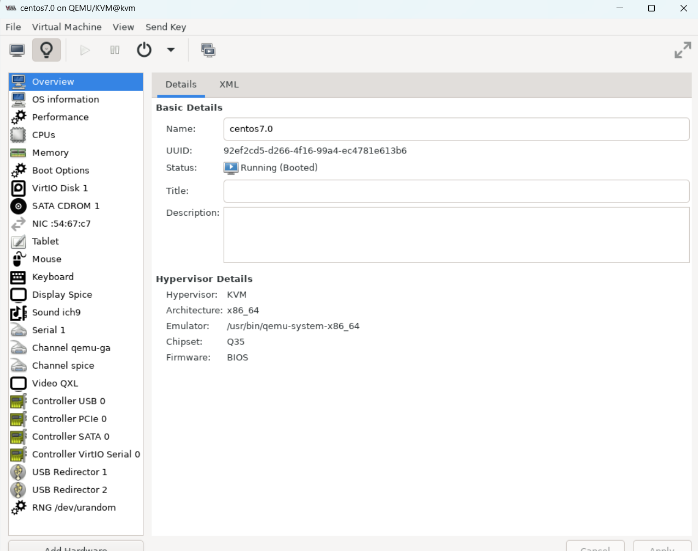
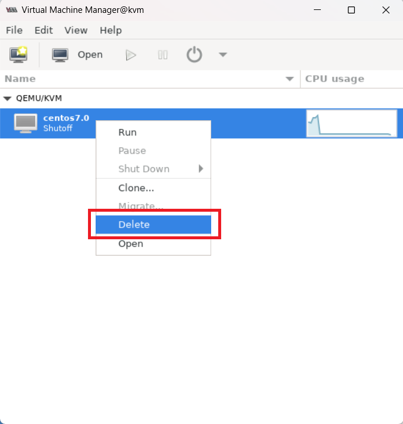
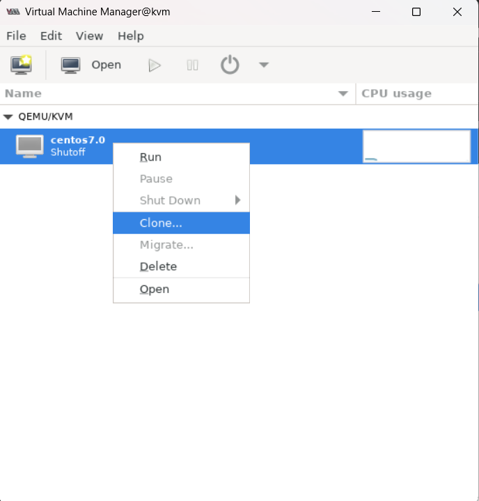
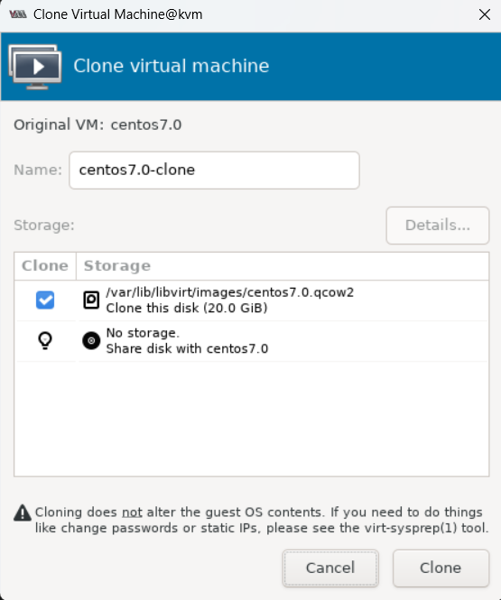
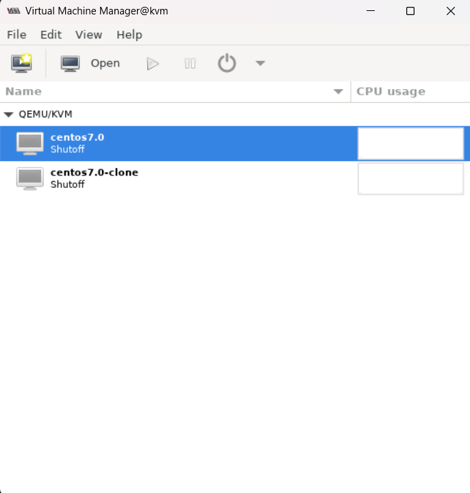

# Các tính năng của KVM đối với VM
## 1. Thêm VM
- Gõ câu lệnh `virt-manager` để hiển thị giao diện GUI cho người dùng, vào `File ->>> New Virtual Machine` để tạo VM mới.

## 2. Sửa VM
- Khi tạo thành công 1 VM nhờ KVM có thể sử dụng công cụ `virt-manager` để chỉnh sửa VM:

## 3. Xóa VM
- Có thể chọn xóa VM trong giao diện:

## 4. Clone VM
Để clone 1 VM ta thực hiện các bước sau:
- Chuột phải vào VM muốn Clone rồi click chuột Clone:

- Sau đó, cửa sổ Clone virtual machine hiện ra. Ta sẽ chỉnh sửa các thông số cơ bản của VM clone như tên, Storage. Rồi click Clone để tiến hành Clone VM đã chọn:

- Đợi quá trình Clone thực hiện xong, ta sẽ thấy 1 VM được tạo ra. Đó chính là bản clone của VM ta đã thực hiện vừa xong:

## 5. Snapshot
Để tạo Snapshot cho VM, ta làm theo các bước sau:
- Chọn vào mục Manager VM Snapshot:

- Click chọn thêm Snapshot:

- Điền tên cho Snapshot:

- Sau đó, ta sẽ thấy Snapshot được tạo:

