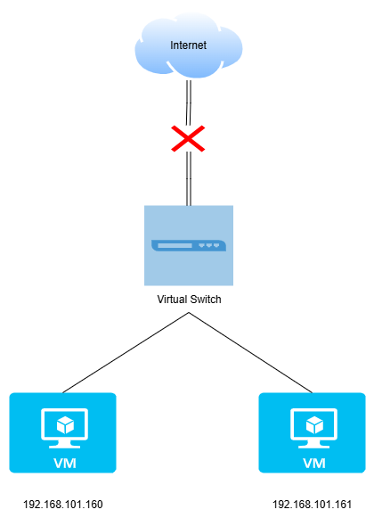
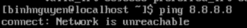
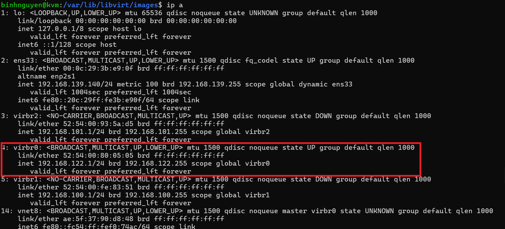
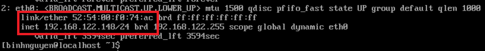
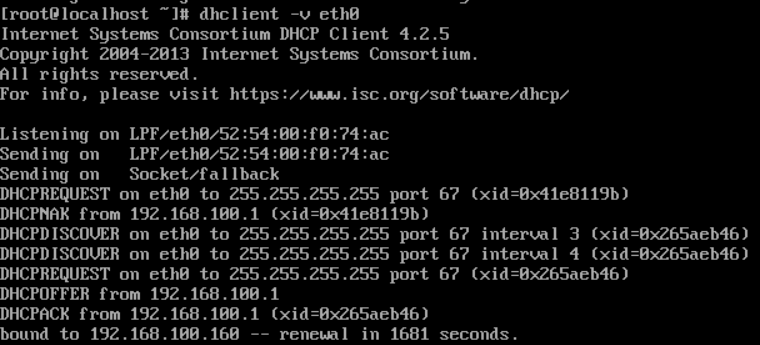
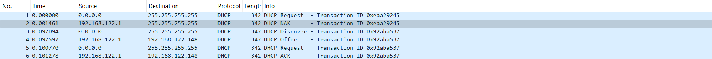
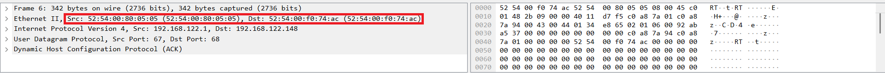

# Phân tích đường đi của gói tin với các chế độ card mạng trong KVM
## 1. Phân tích đường đi của gói tin
### 1.1 Bridge
Ta sẽ phân tích đường đi của gói tin trong mô hình mạng bridge dựa vào sơ đồ sau:

**Thành phần trong mô hình:**
- `VM1 (10.0.0.4)`: Máy ảo với card mạng ảo eth0.
- `tap interface:` Ví dụ tap fe:54:00:cf:42:75 — đây là thiết bị mạng ảo do KVM tạo ra để nối VM với host.
- `Linux bridge`: Hoạt động như một switch ảo bên trong host, kết nối tap và card mạng vật lý ens9.
- `ens9`: Card mạng vật lý trên server, kết nối tới switch vật lý ngoài.
- `Physical switch`: Switch vật lý ngoài mạng LAN, kết nối tới router và các thiết bị khác.

**Luồng gói tin từ VM ra Internet:**
1. VM1 gửi gói tin
- Ứng dụng trong VM gửi gói tin qua eth0.
- Gói tin có IP nguồn 10.0.0.4 (được cấp trực tiếp từ DHCP LAN hoặc cấu hình tay, vì dùng bridge).
2. Qua tap interface
- eth0 trong VM kết nối nội bộ với tap trên host qua KVM/QEMU.
- tap như một đầu dây cắm vào bridge, mang nguyên gói tin Layer 2.
3. Linux bridge xử lý
- Bridge nhận gói tin từ tap và xử lý như một switch ảo.
- Nếu MAC đích thuộc ens9 hoặc broadcast, nó sẽ gửi ra ens9.
- Bridge không NAT, nên IP nguồn vẫn giữ nguyên 10.0.0.4.
4. ens9 gửi ra switch vật lý
- ens9 truyền gói tin qua dây mạng tới physical switch.
- Switch vật lý thấy IP/MAC của VM như một máy độc lập trong LAN.
5. Ra router và Internet
- Switch gửi gói tin tới router gateway (cùng dải 10.0.0.x).
- Router NAT ra Internet như bình thường.
### 1.2 Host-only
Với mô hình mạng Host-Only thì các VM chỉ có thể giao tiếp với nhau qua 1 switch ảo, và không thể ra ngoài internet.

**Mô hình mạng host-only:**

Ping ra ngoài internet và ping máy trong cùng mạng Host-only:

### 1.3 NAT
Nếu như với mô hình linux bridge KVM tạo ra một virtual switch thì ta cũng có thể hình dung với mô hình mạng NAT này KVM sẽ tạo ra một thiết bị là virtual router. Khi ta tạo một dải mạng với mô hình NAT thì lúc này virtual router sẽ NAT từ dải mạng mà ta tạo ra ra địa chỉ của card mạng vật lý trên KVM host để đi ra ngoài internet.

Khi một dải mạng tạo ra ta sẽ thấy trên KVM host xuất hiện một thêm một card mạng. Card mạng này đóng vai trò là gateway cho dải mạng mà ta tạo ra.

VM có thể biết được địa chỉ ở bên ngoài internet nhưng các máy ở bên ngoài sẽ không thể thấy được VM. Như vậy địa chỉ của KVM host sẽ đại diện cho các VM khi giao tiếp với bên ngoài. 

## 2. Thành phần cấp DHCP cho VM
Mô hình hoạt động của DHCP:

Để có thể thấy được cách thức hoạt động của kiểm mạng NAT trong KVM thì ở đây tôi sẽ tạo ra một VM và dùng lệnh tcpdump để bắt gói tin trong khi yêu cầu cấp địa chỉ IP.

- **Chuẩn bị:**
  -  Host( máy pc): có địa chỉ IP 192.168.139.140
  -  Một VM có
      - IP: 192.168.122.148.
      - MAC: 52:54:00:f0:74:ac.
      - Sử dụng kiểu mạng NAT.
      - Cài lệnh tcpdump.

   

- **Thực hiện:**

   - Gõ lệnh `dhclient -v eth0` để cấp địa chỉ IP cho máy ảo.
   
   

   - Ta sử dụng lệnh tcpdump để có thể bắt được 4 gói tin mà giao thức DHCP sử dụng và ghi nó vào một file dhcp.cap và ta kiểm tra rồi đọc nó bằng wireshark.

   

   - Theo lý thuyết thì giao thức DHCP đã sử dụng 4 gói tin Discover, Request, Offer và Ack để cấp phát địa chỉ IP cho VM. Để biết được ai là người đã cấp DHCP cho VM thì hãy để ý vào gói tin ACK. Bởi vì gói tin này là gói tin cuối cùng thông báo rằng PC có thể sử dụng được IP đó do đó nó sẽ ghi đầy đủ địa chỉ của DHCP server và DHCP client.

   - Như ta thấy thì ở đây có địa chỉ MAC của server và client là Src 52:54:00:80:05:05 và Dst 52:54:00:f0:74:ac.
 
    

    - Thì cũng thấy Src 52:54:00:80:05:05 chính là địa chỉ của server và là địa chỉ của NAT default tạo ra là virbr0 để cấp IP cho client. Vậy ta có thể kết luận rằng nơi mà cung cấp DHCP cho VM chính là Virtual Router cung cấp cho VM.

    

## 3. Nếu không tạo dải bridge thì VM có đi ra ngoài internet được không?
Hầu hết các hypervisor (VirtualBox, VMware, KVM/virt-manager…) khi không tạo bridge sẽ dùng NAT (Network Address Translation) làm mặc định. VM có thể ra Internet: NAT cho phép VM truy cập mạng ngoài (web, update, tải gói…) thông qua IP của host.

**Bridge:** VM sẽ nhận IP trực tiếp từ router/modem của mạng LAN, giống như một máy thật nối vào switch. Vì vậy máy khác trong LAN có thể truy cập trực tiếp vào VM mà không cần NAT hay port forwarding.

Nếu bạn chỉ cần VM ra ngoài mạng (Internet) mà không cần máy khác truy cập vào VM, thì không cần tạo bridge — NAT là đủ. Nếu bạn muốn VM như một máy vật lý trong mạng LAN, thì phải tạo bridge.
## 4. Mối liên hệ giữa switch ảo và card thật
Khi bridge được cấu hình:

1. Bridge (switch ảo) có các port:
- Tap interface của mỗi VM.
- Card mạng thật của host.
2. Bridge nhận gói tin từ VM qua tap, chuyển đến card thật để ra mạng ngoài.
3. Bridge nhận gói tin từ mạng ngoài qua card thật, chuyển đến tap của VM tương ứng.
4. Bridge xử lý giống switch thật: học địa chỉ MAC, chỉ chuyển gói tin đến port có MAC đích.

Tài liệu tham khảo:

[1] (https://blog.cloud365.vn/ccna/dhcp_KVM/)

[2] (https://blog.cloud365.vn/linux/mo-hinh-mang-nat-kvm/)