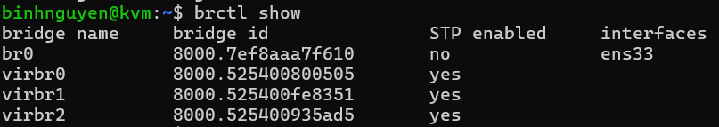
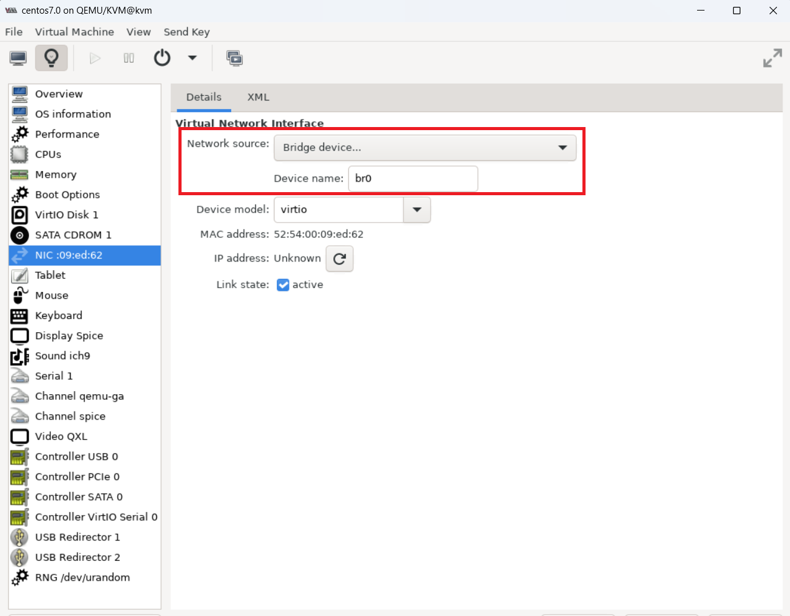
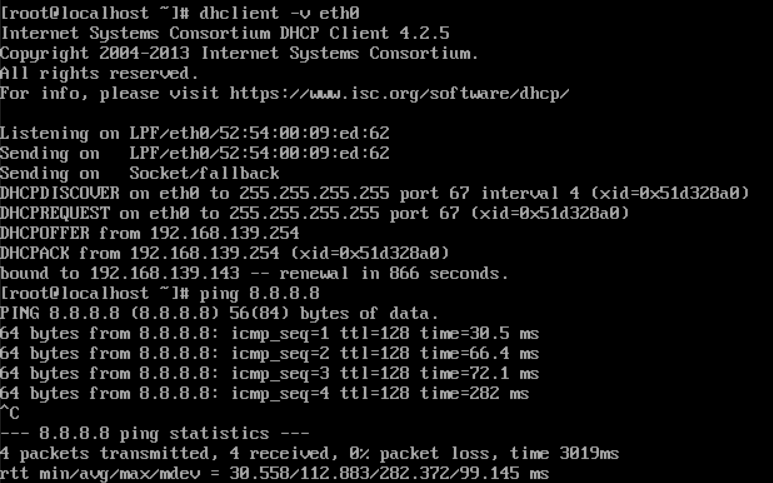

# Tìm hiểu về công nghệ Linux Bridge
## 1. Linux Bridge là gì?
Linux-bridge là một mô hình ảo hóa mạng được hỗ trợ bởi KVM. Linux bridge là một công nghệ cung cấp switch ảo để giải quyết vấn đề ảo hóa Network bên trong các máy vật lý.


Một con switch được tạo ra nằm bên trong của máy vật lý. Các VM kết nối đến đây để có thể liên lạc được với nhau. Nếu muốn liên lạc ra bên ngoài ta có thể kết nối con switch này với card mạng trên máy vật lý của ta.
## 2. Cấu trúc của Linux Bridge


Trong đó:

- Bridge ở đây là switch ảo
- Tap hay tap interface là giao diện mạng để các VM kết nối với switch do Linux bridge tạo ra(nó hoạt động ở lớp 2 của mô hình OSI)
- fd: Forward data có nhiệm vụ chuyển dữ kiệu từ VM tới switch.
## 3. Chức năng của một switch ảo do Linux bridge tạo ra
- **STP:** là tính năng chống loop gói tin trong switch
- **Vlan:** là tính năng rất quan trọng trong một switch
- **FDB:** là tính năng chuyển gói tin theo database được xây dựng giúp tăng tốc độ của switch
## 4. Tạo và quản lí Linux bridge
- Cài đặt gói sau để có thể sử dụng Linux Bridge Networking:
```
sudo apt install bridge-utils
```
- Vào file cấu hình mạng ở đường dẫn `/etc/netplan/` để tiến hành thêm card bridge:
```
sudo nano 50-cloud-init.yaml
```
- Tiến hành thêm card bridge như sau với ens33 là card mạng của máy ảo:
```
bridges:
        br0:
          interfaces: [ens33]
          dhcp4: true
```
- Gõ `sudo netplan apply` để áp dụng thay đổi cấu hình mạng và `brctl show` để xem card bridge đã được thêm thành công hay chưa:



- Sau khi tạo card bridge thành công, vào KVM Client để thêm sử dụng card này:



- Sau đó xin cấp lại địa chỉ IP trên KVM Client đó bằng lệnh `dhclient -v eth0`:



- Đã cài đặt card bridge thành công.

Tài liệu tham khảo: 

[1] (https://blog.cloud365.vn/linux/huong-dan-tao-su-dung-mo-hinh-mang-linux-bridge-KVM/)
