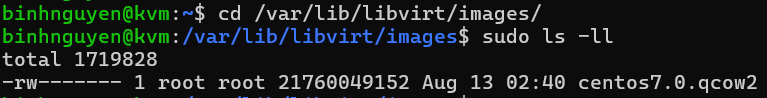
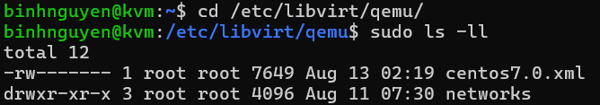
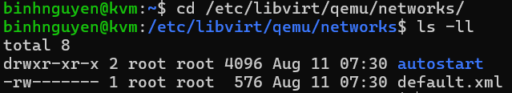
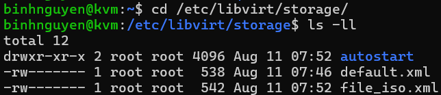
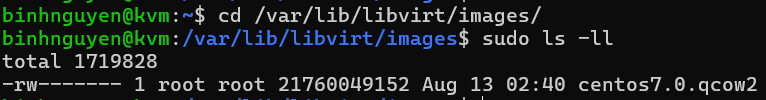
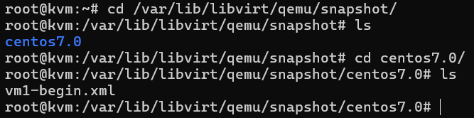

# Các file của VM trên KVM
## 1. Thư mục lưu các disk của VM
```
/var/lib/libvirt/images/
```

## 2. Thư mục chứa các file .xml thông số kĩ thuật của VM
```
/etc/libvirt/qemu/
```

## 3. Thư mục chứa các file liên quan đến network
```
/etc/libvirt/qemu/networks/
```

## 4. Thư mục lưu các storage
```
/etc/libvirt/storage/
```

## 5. Thư mục chứa các images của VM
```
/var/lib/libvirt/images/
```

## 6. Thư mục lưu các bản snapshot của các VM
```
/var/lib/libvirt/qemu/snapshot/
```
