# Tìm hiểu file XML trong KVM và tạo VM bằng file XML
## 1. Khái niệm XML
XML (eXtensible Markup Language) là một loại file có khả năng lưu trữ nhiều loại dữ liệu khác nhau. Mục đích của XML là đơn giản hóa việc chia sẻ dữ liệu giữa các hệ thống khác nhau, đặc biệt là các hệ thống được kết nối với internet.

**XML trong KVM:** Một VM trong KVM có hai thành phần chính đó là:

1. VM's definition được lưu dưới dạng file XML và nằm trong thư mục `/etc/libvirt/qemu`:


2. VM's storage lưu dưới dạng file image:


File domain XML chứa các thông tin về máy ảo như (số CPU, RAM, các thiết lập của I/O, card mạng,...).

Ngoài file domain XML còn có các file XML khác để lưu thông tin network, storage,...

## 2. Các thành phần trong file domain XML của VM
Ta có thể dùng lệnh virsh edit tên_file đẻ chỉnh sửa (chú ý tên file bỏ phần đuôi .xml) hoặc ta cũng có thể sử dụng vi hoặc vim để chỉnh sủa nó.

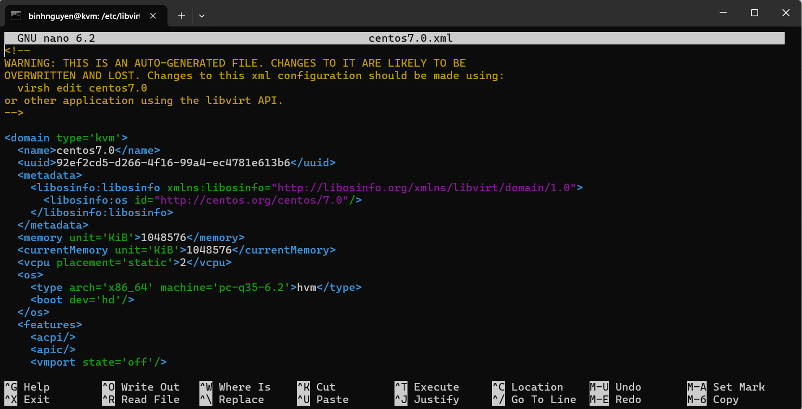

Có rất nhiều thành phần trong file xml này. Ở đây, ta sẽ tìm hiểu một số thành phần chính sau:

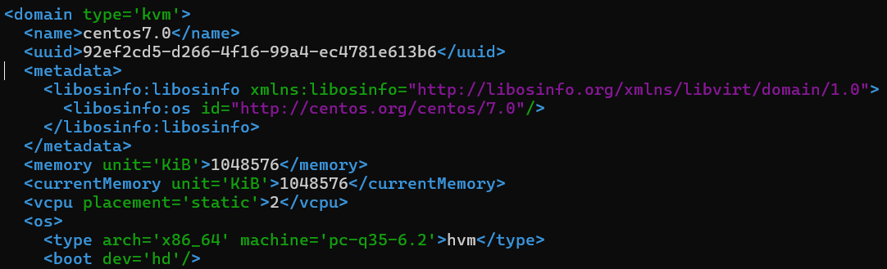

- `domain`: Xác định loại hypervisor.
- `name`: Tên của VM.
- `uuid`: Mã định danh duy nhất của VM.
- `metadata`: Chứa thông tin mô tả hệ điều hành.
- `memory`: lượng RAM tối đa cấp cho VM.
- `currentMemory`: lượng RAM VM đang dùng khi khởi động.
- `vcpu`:Số CPU ảo cấp cho VM.
- `os`: kiến trúc CPU, loại bo mạch ảo mà QEMU dùng, VM chạy ở chế độ ảo hóa phần cứng (hardware virtualization) - boot từ ổ cứng.

Phần `devices`, các thông số của các device trên VM:

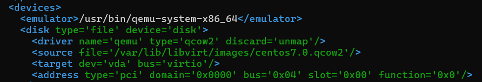

- `emulator`: Chỉ đường dẫn tới trình giả lập QEMU mà libvirt dùng để chạy VM.
- `disk`: định dạng file được lưu trên host.
- `driver`: Trình điều khiển (driver) của QEMU.
- `source`: Đường dẫn file đĩa ảo trên máy host. Đây chính là nơi lưu toàn bộ dữ liệu ổ cứng của VM.
- `target`: 
- `address`: Xác định vị trí của thiết bị này trong PCI bus của máy ảo.

Mục`interface`: phần card mạng của VM

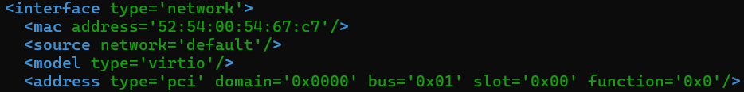

- `interface`: Xác định đây là thiết bị mạng ảo của VM.
- `mac`: Địa chỉ MAC ảo gán cho card mạng của VM.
- `source`: Mạng default thường là NAT: VM có thể ra internet qua host, nhưng từ ngoài không truy cập trực tiếp VM được (trừ khi port forward).
- `model`: Loại card mạng ảo là VirtIO — trình điều khiển mạng tối ưu cho hiệu suất cao (thay vì e1000, rtl8139...).
- `address`: Vị trí card mạng này trên PCI bus ảo của VM.

## 3. Tạo một VM bằng file domain XML
### 3.1 Chuẩn bị một file XML
Chuẩn bị 1 file XML, lưu tại thư mục `/etc/libvirt/qemu/`:
```
<domain type='kvm'>
  <name>vm3</name>
  <uuid>3fa86386-7819-11f0-9dcc-2bf442bc978b</uuid>
  <memory unit='KiB'>524288</memory>
  <currentMemory unit='KiB'>524288</currentMemory>
  <vcpu>1</vcpu>
  <os>
    <type arch='x86_64'>hvm</type>
    <boot dev='cdrom'/>
  </os>
  <features>
    <acpi/>
  </features>
  <clock offset='utc'/>
  <on_poweroff>destroy</on_poweroff>
  <on_reboot>restart</on_reboot>
  <on_crash>destroy</on_crash>
  <devices>
    <emulator>/usr/bin/qemu-system-x86_64</emulator>
    <disk type="file" device="disk">
      <driver name="qemu" type="qcow2"/>
      <source file="/var/lib/libvirt/images/vm3.qcow2"/>
      <target dev="vda" bus="virtio"/>
      <address type="pci" domain="0x0000" bus="0x00" slot="0x04" function="0x0"/>
    </disk>
    <disk type="file" device="cdrom">
      <driver name="qemu" type="raw"/>
      <source file="/var/lib/libvirt/file-iso/CentOS-7-x86_64-Minimal-1810.iso"/>
      <target dev="hdc" bus="ide"/>
      <readonly/>
      <address type="drive" controller="0" bus="1" target="0" unit="0"/>
    </disk>
    <interface type='network'>
      <source network='default'/>
      <model type='virtio'/>
    </interface>
    <controller type="ide" index="0">
      <address type="pci" domain="0x0000" bus="0x00" slot="0x01" function="0x1"/>
    </controller>
    <input type='mouse' bus='ps2'/>
    <graphics type='vnc' port='-1' autoport="yes" listen='0.0.0.0'/>
    <console type='pty'>
      <target port='0'/>
    </console>
  </devices>
</domain>
```

File domain xml này sẽ tạo ra máy ảo với những thông số sau:

- 512MB RAM, 1 vCPU
- Đường dẫn tới ổ đĩa : /var/lib/libvirt/images/vm3.qcow2
- Máy ảo được boot từ CD-ROM : /var/lib/libvirt/file-iso/CentOS-7-x86_64-Minimal-1810.iso
- Sử dụng mạng NAT default.

Mã uuid, ta có thể download package uuid rồi sử dụng lệnh uuid để sinh ra 1 mã uuid:

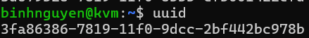

### 3.2 Tạo ổ đĩa
Dùng câu lệnh để tạo ổ đĩa dung lượng 10G với định dang qcow2:
```
qemu-img create -f qcow2 /var/lib/libvirt/images/vm3.qcow2 10G
```

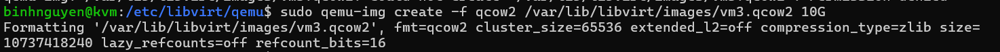
### 3.3 Khởi tạo máy ảo
Dùng câu lệnh `virsh create <ten_file_domain>.xml` để khởi tạo máy ảo: 

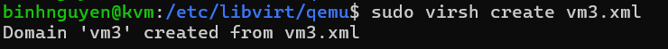

Kiểm tra xem máy ảo đã được tạo hay chưa bằng câu lệnh `virsh list`:

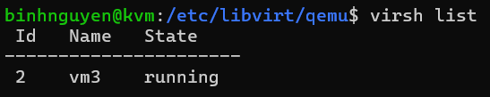

Sử dụng `virt-manager` để quản lí VM:

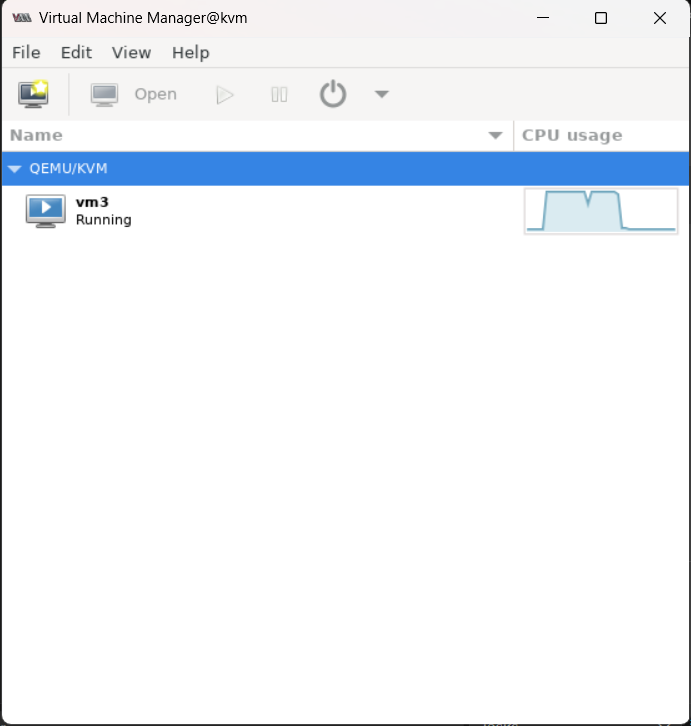
## 4. Chỉnh sửa cấu hình máy ảo bằng file XML
Trước khi tiến hành chỉnh sửa cấu hình file XML thì sẽ tắt VM trước.

Ta dùng lệnh `virsh edit <tên_vm>` hoặc có thể sử dụng vi, vim để edit file .xml của VM.

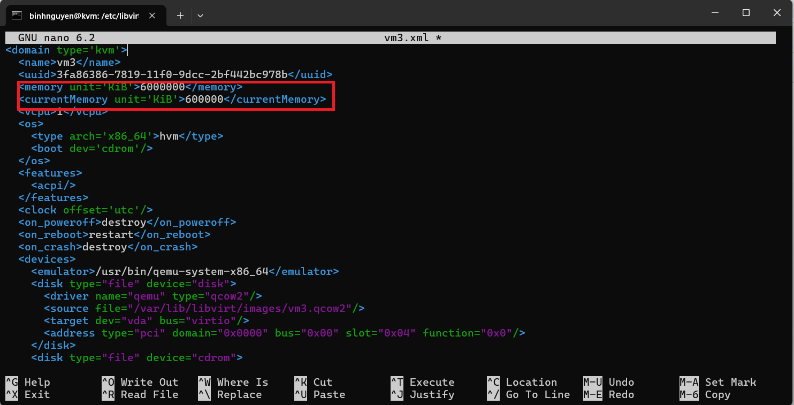

Ở đây, ta sẽ thay đổi dung lượng RAM của vm3 thành 600000 Kib. Sau đó define lại vm3.

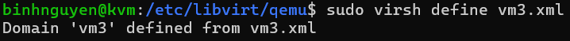

Sau đó, start vm3 trở lại và kiểm tra lại dung lượng RAM:

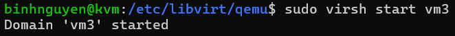

Kiểm tra trên virt-manager:

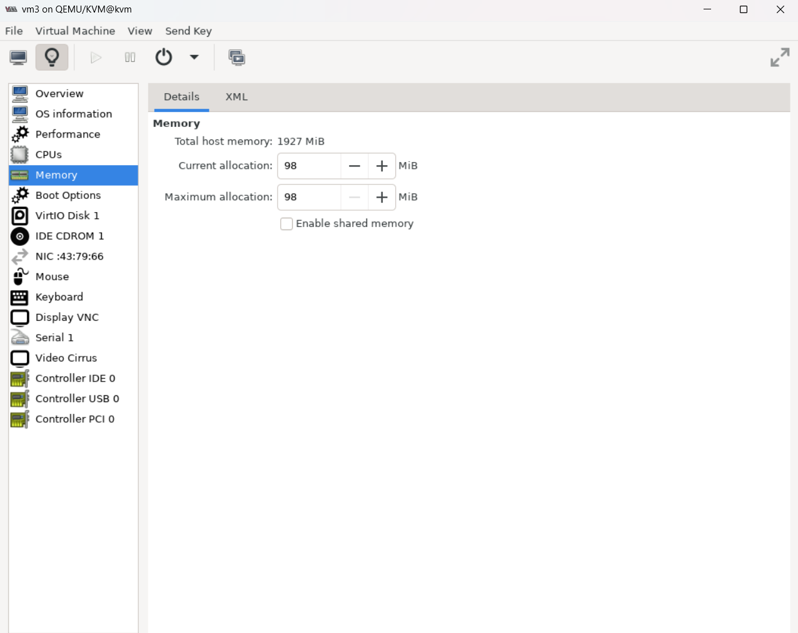