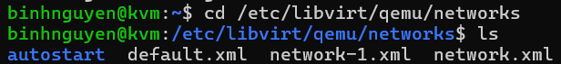
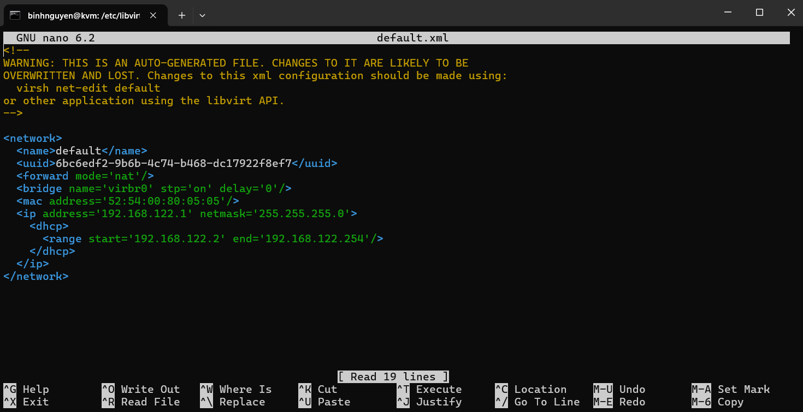
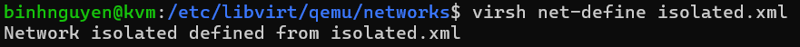
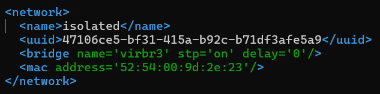
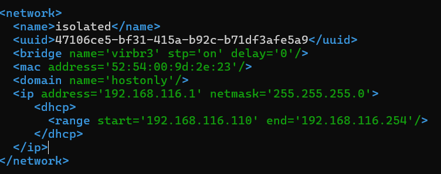
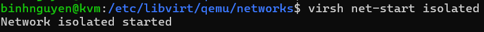
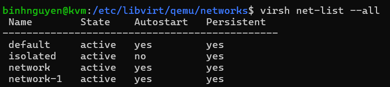
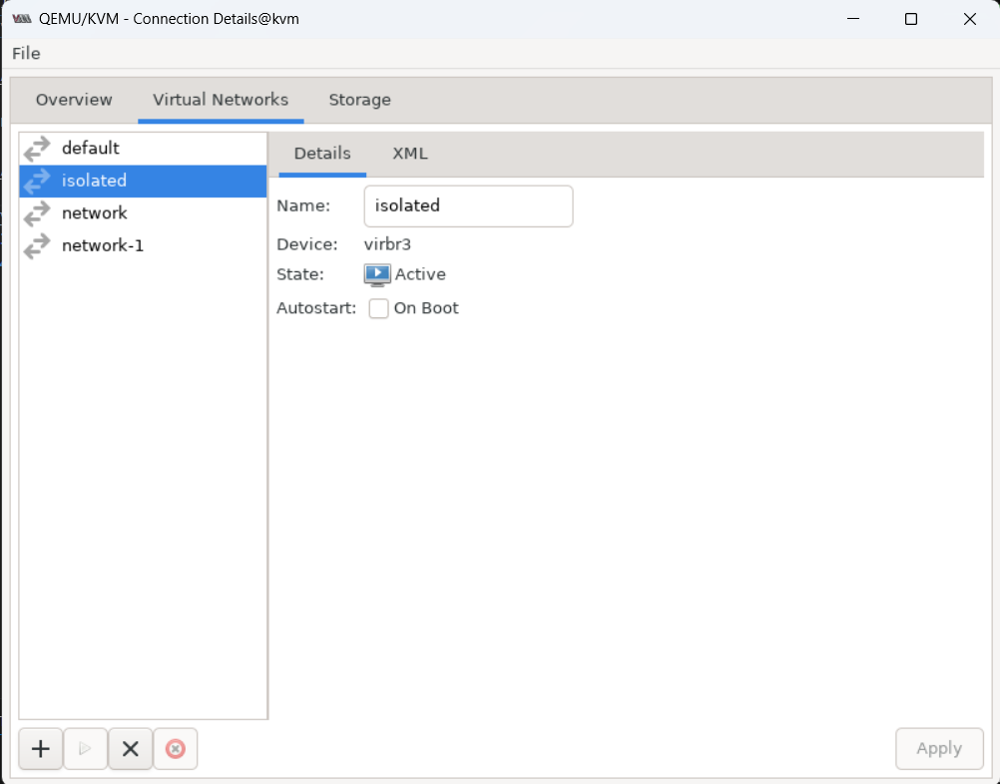

# File XML Network và tạo virtual-network bằng file XML
## 1. File XML Network
Thư mục chứa file XML network. Các file ở đây là mạng ảo trong KVM:
```
/etc/libvirt/qemu/networks
```


Ta sẽ xem file `default.xml`:



- `name`: tên mạng
- `forward mode`: kiểu mạng
- `bridge`: card sử dụng
- `mac`: địa chỉ MAC
- `domain`: tên domain của mạng
- `ip`: thông số IP của mạng
- `dhcp`: thông tin dhcp của mạng
- `range`: dải cấp dhcp cho các VM
## 2. Tạo virtual network bằng file XML
### 2.1 Chuẩn bị file XML
Ở đây, ta sẽ tạo 1 mạng ảo Host-only. Ta tạo file xml isolated.xml trong thư mục `/etc/libvirt/qemu/networks/`.
```
<network>
<name>isolated</name>
</network>
```
### 2.2 Tiến hành tạo mạng bằng file XML
Tiến hành define network từ file xml bằng câu lệnh `virsh net-define isolated.xml`.



Sau khi đã define, bạn có thể sử dụng câu lệnh `virsh net-list --all` để xem network available:


Mạng isolated đã xuất hiện, tuy nhiên nó vẫn chưa được active.

Sau khi define, libvirt sẽ tự động add thêm một số thành phần vào file xml bạn vừa tạo và lưu nó tại `/etc/libvirt/qemu/networks/`.



Tiến hành sửa file `isolated.xml` bằng lệnh:
```
sudo nano isolated.xml
```


Sau khi cấu hình xong, ta tiến hành start virtual network vừa tạo bằng câu lệnh `virsh net-start isolated`.



Kiểm tra lại:



Như vậy, isolated đã được start và có thể sử dụng. Dùng virt-manager để xem:


### 2.3 Chỉnh sửa cấu hình mạng
Trong trường hợp người dùng muốn thay đổi cấu hình:
- tiến hành chỉnh sửa trong file xml
- dùng lệnh `virsh net-destroy` và `virsh net-start` để reset lại virtual network.
### 2.4 Ví dụ về file XML các kiểu mạng
#### 2.4.1 NAT
```
<network>
  <name>nat</name>
  <bridge name="virbr1"/>
  <forward mode="nat"/>
  <ip address="192.168.123.1" netmask="255.255.255.0">
    <dhcp>
      <range start="192.168.123.128" end="192.168.123.254"/>
    </dhcp>
  </ip>
</network>
```
- `<forward mode="nat"/>`: dòng này định nghĩa kiểu mạng là NAT.
#### 2.4.2 Bridge
```
<network>
  <name>hostonly</name>
  <bridge name="virbr2"/>
  <ip address="192.168.125.1" netmask="255.255.255.0">
    <dhcp>
      <range start="192.168.125.128" end="192.168.125.254"/>
    </dhcp>
  </ip>
</network>
```
- Với kiểu Host-only sẽ không có thẻ chuyển tiếp <forward>.
#### 2.4.3 Host-only
```
<network>
  <name>local</name>
  <bridge name="virbr3"/>
  <forward mode="route" dev="eth1"/>
  <ip address="192.168.127.1" netmask="255.255.255.0">
    <dhcp>
      <range start="192.168.127.128" end="192.168.127.254"/>
    </dhcp>
  </ip>
</network>
```
`<forward mode="route" dev="eth1"/>` :
- `mode="route"`: kiểu mạng bridge
- `dev="eth1"`: chọn card bridge mà nó gắn vào