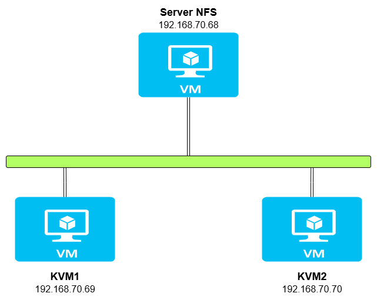
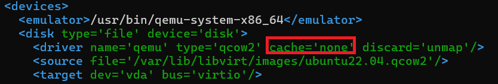
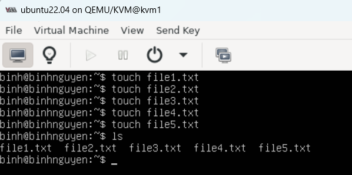
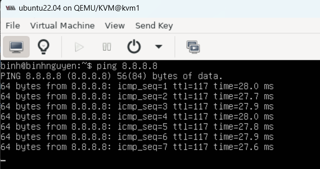
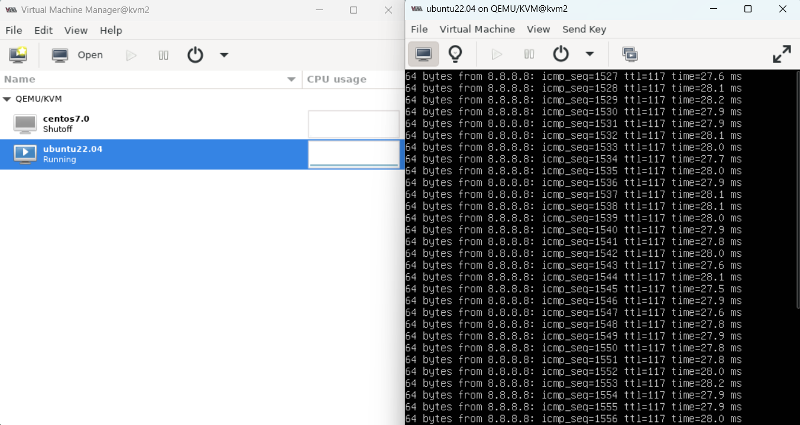
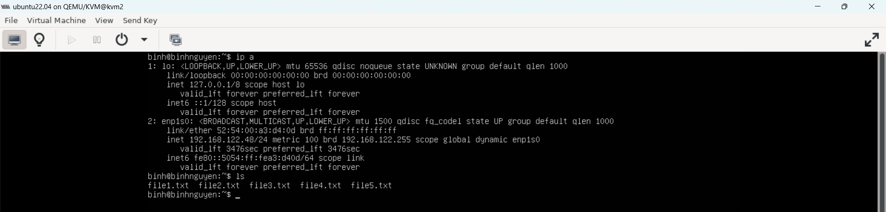

# Live migrate trên KVM
## 1. Tổng quan
Trong quá trình vận hành để phục vụ cho việc bảo trì và nâng cấp hệ thống chúng ta cần chuyển các VM từ host này sang host khác. Với các VM đang chạy các ứng dụng quan trọng chúng ta không thể tắt nó đi trong quá trình chuyển. Trên KVM việc live migrate sẽ đảm bảo được các yêu cầu này.
## 2. Chuẩn bị
Chuẩn bị 3 máy cài đặt hệ điều hành Ubuntu 22.04 trong đó một máy dùng để cài đặt NFS dùng làm máy lưu file disk VM và hai máy dùng để cài KVM.

**Cấu hình:**
- NFS Server:
   - RAM: 6GB
   - vCPU: 4
   - 20GB Disk
- KVM: 
   - RAM: 4GB
   - vCPU: 2
   - 20GB Disk

Ba máy này cần có card mạng và có thể kết nối được với nhau.

Đây là môi trường lap nên tôi tắt firewalld và selinux trên cả 3 máy. Để tắt sử dụng 3 câu lệnh sau trên cả ba máy:
```
systemctl stop firewalld 

setenforce 0
```
**Mô hình:**



**Cơ chế cơ bản của live-migrate:** Về cơ bản cơ chế di chuyển vm khi vm vẫn đang hoạt động. Quá trình trao đổi diễn ra nhanh các phiên làm việc kết nối hầu như không cảm nhận được sự gián đoạn nào. Quá trình Live Migrate được diễn ra như sau:

- Bước đầu tiên của quá trình Live Migrate: 1 ảnh chụp ban đầu của VM cần chuyển trên host KVM1 được chuyển sang VM trên host KVM2.

- Trong trường hợp người dùng đang truy cập VM tại host KVM1 thì những sự thay đổi và hoạt động trên host KVM2 vẫn diễn ra bình thường, tuy nhiên những thay đổi này sẽ không được ghi nhận.

- Những thay đổi của VM trên host KVM1 được đồng bộ liên tục đến host KVM2.

- Khi đã đồng bộ xong thì VM trên host KVM1 sẽ offline và các phiên truy cập trên host KVM1 được chuyển sang host KVM2.

## 3. Cài đặt
### 3.1 Cấu hình phân dải tên miền
Để có thể live migrate giữa 2 KVM host thì 2 máy này cần biết tên miền của nhau. Bạn có thể cấu hình dịch vụ DNS phân dải tên miền cho các 2 máy này.

**Trên KVM1:**
- Sửa tên máy trong file `/etc/hostname`. Máy này tôi để tên là `kvm1`.
- Chỉ ra tên miền và địa chỉ của máy KVM host còn lại trong file `/etc/hosts`. Thêm dòng sau vào cuối file. Chú ý đổi đúng địa chỉ IP máy KVM host còn lại của bạn:
```
192.168.70.70 kvm2.local kvm2
```
- Reboot lại máy.

**Trên KVM2:**
- Sửa tên máy trong file `/etc/hostname`. Máy này tôi để tên là `kvm2`.
- Chỉ ra tên miền và địa chỉ của máy KVM host còn lại trong file `/etc/hosts`. Thêm dòng sau vào cuối file. Chú ý đổi đúng địa chỉ IP máy KVM host còn lại của bạn:
```
192.168.70.69 kvm1.local kvm1
```
- Reboot lại máy.
### 3.2 Cài đặt NFS
**Trên NFS Server:**
- Cài đặt các gói NFS:
```
sudo apt install -y nfs-kernel-server nfs-common
```
- Tạo thư mục chia sẻ: 
```
sudo mkdir -p /root/storage
```
- Chia sẻ thư mục với các máy KVM:
   - Để chia sẻ thư mục này với các máy KVM, bạn cần chỉnh sửa file `/etc/exports`. Mở file này bằng trình soạn thảo văn bản (ví dụ nano):
   
   ```
   sudo nano /etc/exports
   ```

   - Thêm dòng sau vào cuối file để chỉ định địa chỉ IP của các máy KVM cần truy cập vào thư mục chia sẻ:
   
   ```
   /root/storage 192.168.70.69/24(rw,sync,no_root_squash,no_subtree_check)
   /root/storage 192.168.70.70/24(rw,sync,no_root_squash,no_subtree_check)
   ```
- Cập nhật lại file vừa chỉnh sửa:
```
exportfs -a
```
- Khởi động lại dịch vu NFS:
```
sudo systemctl start nfs-kernel-server
sudo systemctl enable nfs-kernel-server
```

**Trên máy KVM Host:** Trên 2 máy KVM host đều thực hiện các câu lệnh sau:
- Cài đặt NFS:
```
sudo apt install -y nfs-kernel-server nfs-common
```
- Sử dụng thư mục chứa file disk. Ở đây, ta tạo thư mục mới để lab:
```
mkdir storage
```
- Mount thư mục chứa máy ảo với thư mục đã share. Lưu ý: địa chỉ IP đúng với IP của NFS server:
```
mount 192.168.70.68:/root/storage/  storage
```
hoặc khi sử dụng thư mục mặc định chứa file disk của VM:
```
mount 192.168.70.68:/root/storage/ /var/lib/libvirt/images/
```
**Lưu ý:** mỗi khi reboot lại máy ta cần mount lại các thư mục này. Nếu không muốn bạn mount nó bằng cách sửa file /etc/fstab
### 3.3 Cài đặt KVM
Thực hiện cài đặt KVM trên cả 2 máy KVM host.

Khi cài đặt VM ta cần lưu file disk của VM vào thư mục đã mount với thư mục được share của NFS server.

Khi cài máy ảo xong ta cần thêm thông tin sau vào trong file xml của VM bằng cách dùng lệnh:
```
virsh edit <tenvm>
```
Thêm vào cache=’none’ để tránh trường hợp migrate bị mất dữ liệu:



Sau đó reboot lại VM.

Các bước này nên thực hiện ngay sau cài VM kể cả bạn chưa có ý định live migrate ngay lúc này bởi vì khi cần migrate có thể thực hiện được luôn mà không cần phải reboot VM khi đã cài các ứng dụng lên.
### 3.4 Kết nối qemu giữa hai KVM Host
Để có thể live migrate giữa hai host thì hai host này cần phải kết nối được với nhau. Để làm được việc này ta thực hiện các bước sau ở trên cả hai máy host KVM.
```
sudo sed -i 's/#listen_tls = 0/listen_tls = 0/g' /etc/libvirt/libvirtd.conf
sudo sed -i 's/#listen_tcp = 1/listen_tcp = 1/g' /etc/libvirt/libvirtd.conf
sudo sed -i 's/#tcp_port = "16509"/tcp_port = "16509"/g' /etc/libvirt/libvirtd.conf
sudo sed -i 's/#listen_addr = "192.168.70.68"/listen_addr = "0.0.0.0"/g' /etc/libvirt/libvirtd.conf
sudo sed -i 's/#auth_tcp = "sasl"/auth_tcp = "none"/g' /etc/libvirt/libvirtd.conf
#sudo sed -i 's/#LIBVIRTD_ARGS="--listen"/LIBVIRTD_ARGS="--listen"/g' /etc/default/libvirtd
```
Restart lại libvirtd trên cả hai máy:
```
systemctl restart libvirtd
```
### 3.5 Migrate
Ta kiểm tra VM trên KVM1, và tạo một số file như hình:




Trước khi migrate, ta sẽ chạy lệnh ping trên vm của KVM1:



Migrate từ KVM1(192.168.70.69) sang KVM2(192.168.70.70) Thực hiện câu lệnh trên KVM1:

```
virsh migrate --live ubuntu22.04 qemu+tcp://192.168.70.70/system
```

Sau khi quá trình hoàn tất, vm trên host KVM1 sẽ ở trạng thái Shutoff và vm chuyển sang host KVM2 ở trạng thái Running.


Ta mở vm ở trên KVM2 ta thấy lệnh ping 8.8.8.8 vẫn đang chạy:



Sau khi chuyển qua KVM163, vm162 vẫn giữ nguyên IP và dữ liệu cũ:



