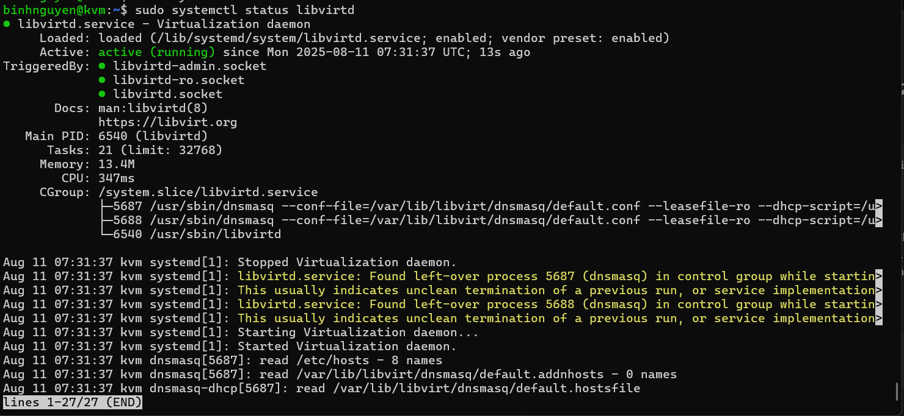
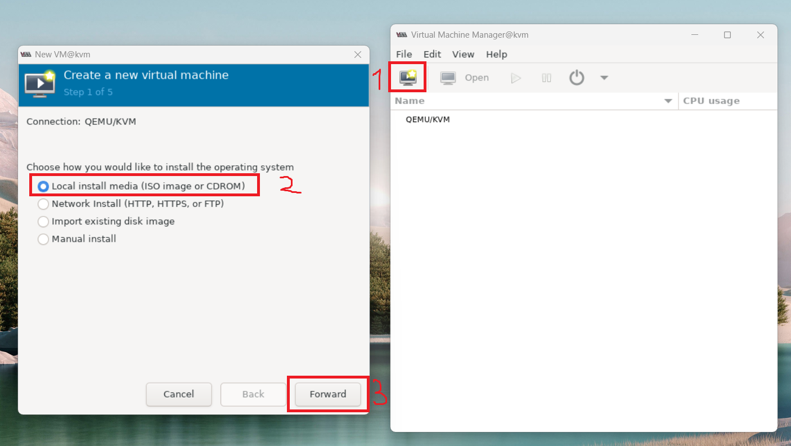
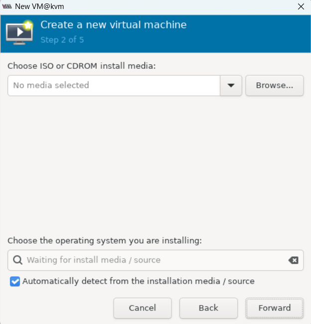
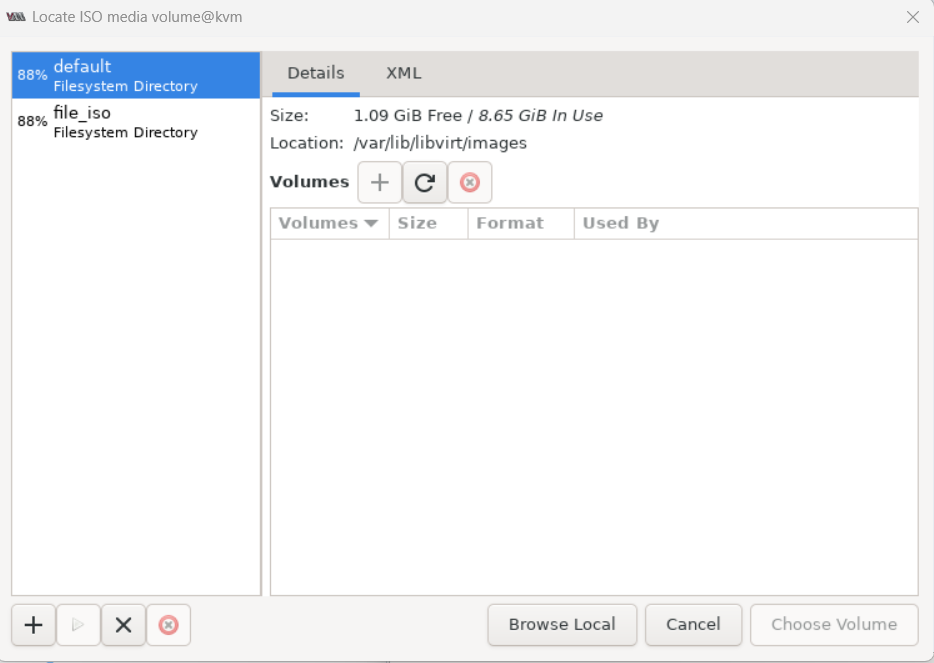
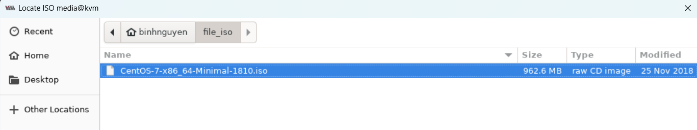
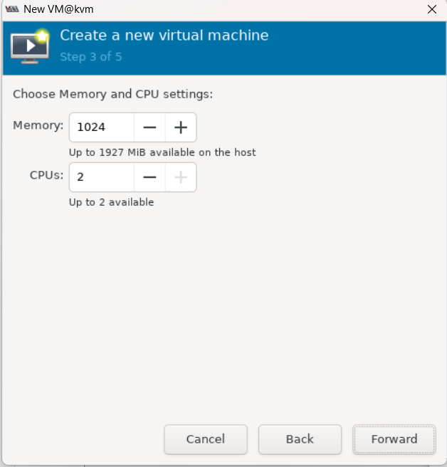
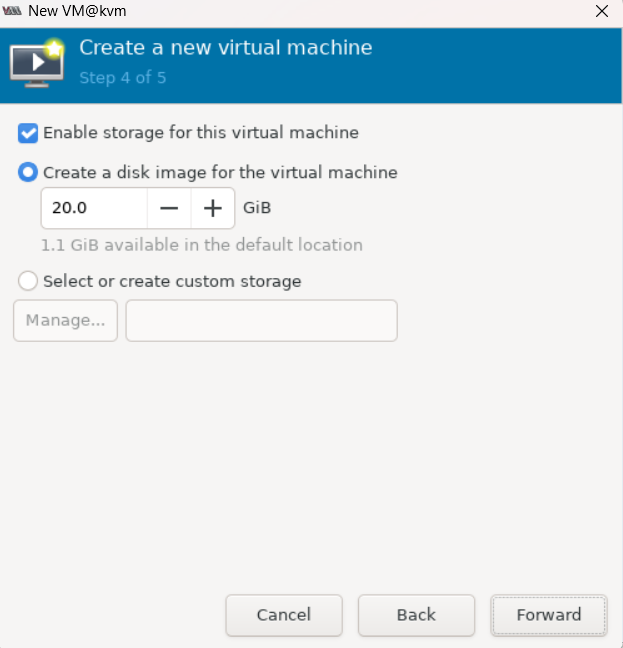
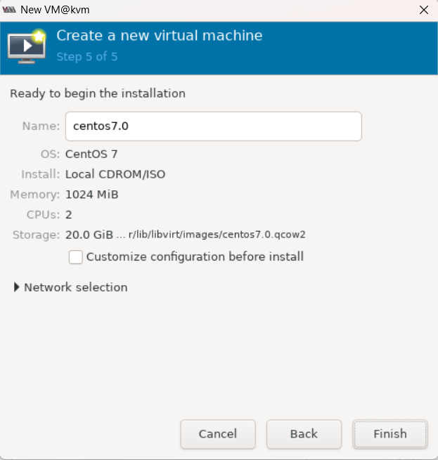
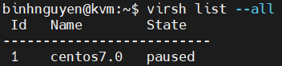

# Cài đặt KVM trên Ubuntu 22.04
## 1. Kiểm tra ảo hóa
Trước khi bắt đầu cài đặt KVM, hãy kiểm tra xem CPU của bạn có hỗ trợ ảo hóa phần cứng hay không thông qua lệnh sau:
```
egrep -c "svm|vmx" /proc/cpuinfo
```
Ví dụ kết quả:


- 0: CPU không hỗ trợ ảo hóa, không thể cài đặt KVM.
- Số khác 0: CPU hỗ trợ ảo hóa, có thể bắt đầu cài đặt.

## 2. Cài đặt các gói KVM cần thiết trên Ubuntu 22.04
Cài đặt các gói KVM cần thiết bằng lệnh sau:
```
sudo apt install -y qemu-kvm libvirt-daemon-system libvirt-daemon virtinst bridge-utils libosinfo-bin
``` 
- `qemu-kvm`: Phần phụ trợ cho KVM
- `libvirt-bin`: Cung cấp libvirt mà bạn cần quản lý qemu bằng libvirt
- `bridge-utils`: Chứa tiện ích cần thiết để tạo và quản lý máy ảo.
- `virt-manager`: cung cấp giao diện để quản lý máy ảo Sau khi cài đặt xong ta khởi động lại dịch vụ và enable bằng lệnh.

Kích hoạt và kiểm tra lại trạng thái dịch vụ:
```
sudo systemctl restart libvirtd
sudo systemctl enable libvirtd
```


## 3. Sử dụng virt-manager để cài đặt VM 
Cài đặt virt-manager (quản lý bằng GUI):
```
sudo apt install -y virt-manager
```
Tạo thư mục chứa file ISO và tải file ISO CentOS 7:
```
mkdir file_iso
cd file_iso
wget http://centos-hn.viettelidc.com.vn/7/isos/x86_64/CentOS-7-x86_64-Minimal-1810.iso
```
Khởi chạy chương trình bằng lệnh:
```
virt-manager
```
Trong cửa sổ đầu tiên, hãy nhấp vào biểu tượng máy tính ở góc trên bên trái, trong cửa sổ mở ra , chọn tùy chọn cài đặt VM bằng Local install media(ISO). Sau đó click tiếp vào `Forward`.



Ở đây chọn `Browse`:



Tiếp tục chọn `Browse Local`:



Điều hướng đến đường dẫn nơi bạn đã lưu trữ ISO mà bạn muốn cài đặt và chọn iso muốn cài đặt. Sau khi đã chọn được bản cài, tiếp tục chọn Forward để đi tới cài đặt dung lượng ổ đĩa:



Nhập dung lượng RAM và số lượng CPU muốn phân bổ cho VM và tiến hành bước tiếp theo:







Chọn Install CentOS 7 và để chương trình chạy.

Xem danh sách cũng như trạng thái các máy ảo KVM:

```
virsh list --all
```
