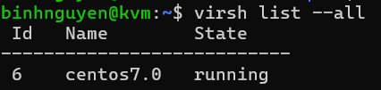
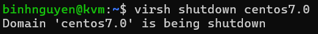
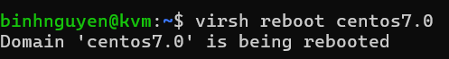
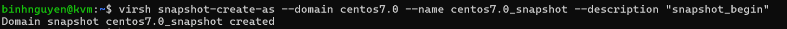
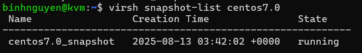
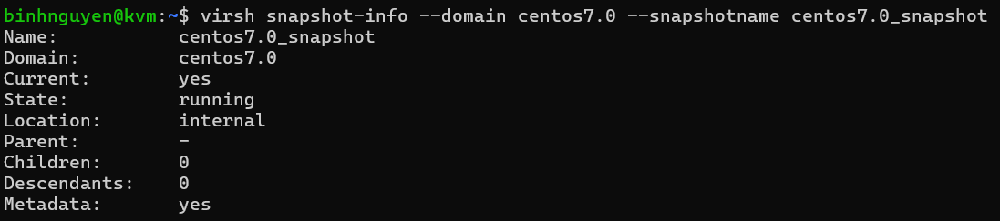
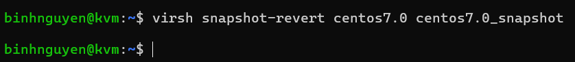
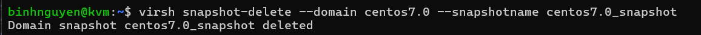
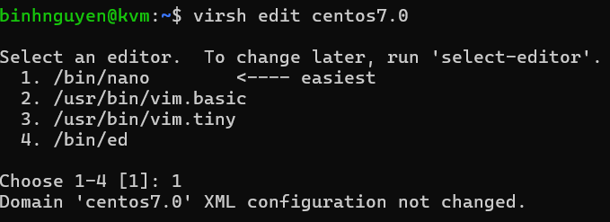

# Tạo và quản lý máy ảo bằng giao diện CLI VIRSH
## 1. Tạo máy ảo với Virsh
Để tạo máy ảo bằng dòng lệnh, ta sử dụng lệnh virt-install.

Hầu hết các option đều không bắt buộc. Yêu cầu tối thiểu là: `--name`, `--memory`, lưu trữ (`--disk` hoặc `--filesystem`)
### 1.1 Tạo VM bằng file iso
```
virt-install \
--connect qemu:///system \
--name iso \
--memory 1024 \
--vcpus 1 \
--disk /var/lib/libvirt/images/iso.img,size=2 \
--cdrom=/var/lib/libvirt/file-iso/CentOS-7-x86_64-Minimal-1810.iso \
--network network=default \
--graphics vnc,listen='0.0.0.0'
```

Trong đó
- `--name`: đặt tên cho máy ảo định tạo
- `--vcpus`: là tổng số CPU định tạo cho máy ảo
- `-`-memory`: chỉ ra dung lượng RAM cho máy ảo (tính bằng MB)
- `--cdrom`: sau đó chỉ ra đường dẫn đến file ISO. Nếu muốn boot bằng cách khác ta dùng option --locaion sau đó chỉ ra đường dẫn đến file (có thể là đường dẫn trên internet).
- `--disk`: chỉ ra vị trí lưu disk của máy ảo. size chỉ ra dung lượng disk của máy ảo(tính bằng GB). Có thể tạo thêm disk bằng cách thêm 1 dòng nữa.
- `--os-variant`: chỉ ra kiểu của HĐH của máy ảo đang tạo. Option này có thể chỉ ra hoặc không nhưng nên sử dụng nó vì nó sẽ cải thiện hiệu năng của máy ảo. Nếu bạn không biết HĐH hành của mình thuộc loại nào bạn có thể tìm kiếm thông tin bằng cách dùng lệnh osinfo-query os
- `--graphics`: chọn kiểu màn hình tương tác
- `--network`: chỉ ra cách kết nối mạng của máy ảo. Nếu tạo nhiều card mạng, ta chỉ cần khai báo thêm

Lưu ý: Các option và arguments phải viết liền với dấu "=" và không được có space.

Trên đây là một số option cơ bản để tạo máy ảo. Bạn có thể tìm hiểu thêm bằng cách sử dụng lệnh virt-install --help.
### 1.2 Tạo VM bằng image

Tải image về từ trang chủ của Ubuntu: https://cloud-images.ubuntu.com/
```
cd /var/lib/libvirt/images
wget https://cloud-images.ubuntu.com/minimal/releases/noble/release/ubuntu-24.04-minimal-cloudimg-amd64.img
```
Tải file check sum:
```
# Tải file checksum
wget https://cloud-images.ubuntu.com/minimal/releases/noble/release/SHA256SUMS

# Kiểm tra checksum (ok nếu hiện 'OK')
sha256sum -c --ignore-missing SHA256SUMS
```
- Sử dụng option `--import`.
- `disk` là đường dẫn đến file image.
```
virt-install \
  --name ubuntu-min \
  --memory 1024 --vcpus 1 \
  --disk path=/var/lib/libvirt/images/ubuntu-24.04-minimal-cloudimg-amd64.img,format=qcow2,bus=virtio \
  --import \
  --os-variant ubuntu24.04 \
  --network network=default,model=virtio \
  --graphics vnc,listen=0.0.0.0
```
### 1.3 Tạo máy ảo qua Internet (netboot)
- Sử dụng option `--location`: sau đó là đường dẫn url chứa file cài đặt netboot (netboot được cung cấp bởi hệ điểu hành)
```
virt-install \
  --name centos7-net \
  --memory 2048 --vcpus 1 \
  --disk path=/var/lib/libvirt/images/centos7.qcow2,size=10,format=qcow2 \
  --location 'http://vault.centos.org/7.9.2009/os/x86_64/' \
  --os-variant centos7.0 \
  --graphics vnc,listen=0.0.0.0 \
  --extra-args 'inst.text console=ttyS0,115200n8'
```
**Lưu ý:** Nếu khi boot gặp lỗi dracut như dưới đây
```
Warning: dracut-initqueue timeout - starting timeout scripts
...
Warning: could not boot.
Warning: /dev/root does not exist
```
Có nghĩa là bạn đang không thể truy xuất initramfs hoặc giải nén nó hay bạn đang không đủ dung lượng RAM cho nó. Tối thiểu RAM là 1280MB.
## 2. Thao tác quản lý với Virsh command
### 2.1 Hiển thị danh sách máy ảo
```
virsh list --all
```

### 2.2 Tắt VM
```
virsh shutdown <tên_máy_ảo>
```

### 2.3 Bật VM
```
virsh start <tên_máy_ảo>
```

### 2.4 Reboot VM
```
virsh reboot <tên_máy_ảo>
```

### 2.5 Xóa máy ảo
```
virsh undefine <tên_máy_ảo>
```
### 2.6 Tạo snapshot
```
virsh snapshot-create-as --domain tên_máy --name tên_bản_snapshot --description "mô tả bản snapshot"
```



**Lưu ý:** snapshot chỉ tạo được khi định dạng disk ảo của ta sử dụng là qcow2 chính vì vậy nếu bạn đang sử dụng định dạng raw mà muốn tạo snapshot thì cần phải chuyển sang định dạng qcow2.

Xem danh sách các bản snapshot trên 1 VM:
```
virsh snapshot-list <tên_máy_ảo>
```


Xem thông tin chi tiết của bản snapshot:
```
virsh snapshot-info --domain <tên_máy_ảo> --snapshotname <tên_bản_snapshot>
```


Revert để chạy lại một bản snapshot đã tạo:
```
virsh snapshot-revert <tên_máy_ảo> <tên-bản-snapshot>
```


Xóa 1 bản snapshot:
```
virsh snapshot-delete --domain <tên_máy_ảo> --snapshotname <tên_bản_snapshot>
```

### 2.7 Sửa thông tin CPU và Memory
```
virsh edit <tên_VM>
```

### 2.8 Một số lệnh khác
Xem thông tin chi tiết về file disk của VM:
```
qemu-img info <đường_dẫn_file-disk>
```

Xem thông tin cơ bản của 1 VM:
```
virsh dominfo <tên_VM>
```


Ngoài ra ta muốn biết thông tin chi tiết của VM ta có thể vào đọc file xml của VM đó.

Tài liệu tham khảo:

[1] (https://github.com/nhanhoadocs/thuctapsinh/blob/master/HaiDD/KVM/kvm/06-virsh_commandOnkvm.md)