# Tạo và quản lý máy ảo bằng Virt-manager
## 1. Kiểm tra máy có hỗ trợ ảo hóa không
```
egrep -c "svm|vmx" /proc/cpuinfo
2
```
Nếu kết quả trả về khác 0 thì máy có hỗ trợ ảo hóa, còn bằng 0 tức là không hỗ trợ.
# 2. Cài đặt các gói cần thiết
```
apt install -y qemu-kvm libvirt-daemon-system libvirt-daemon virtinst bridge-utils libosinfo-bin
```
# 3. Truy cập virt-manager để cấu hình VM
```
virt-manager
```
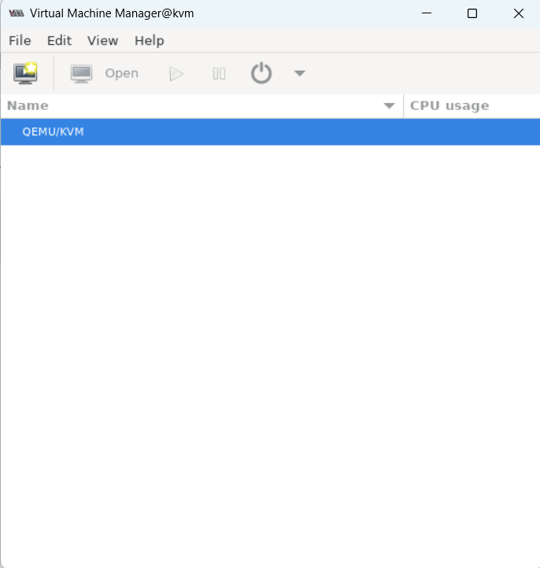
- Tạo một máy ảo: `File --> New Virtual Machine`.

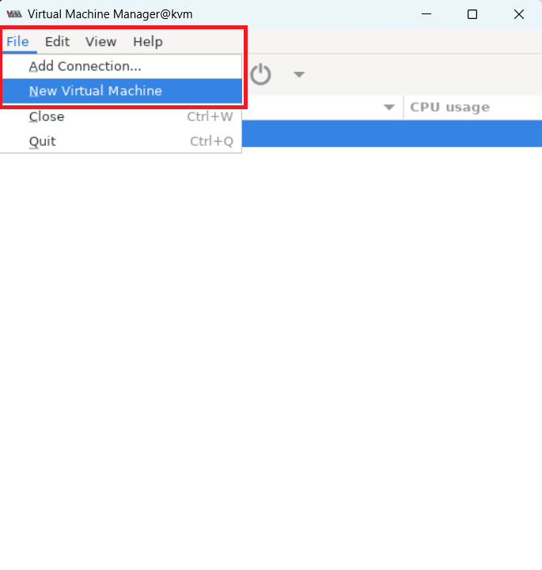

- Chọn `Local install media (ISO image or CDROM)`.

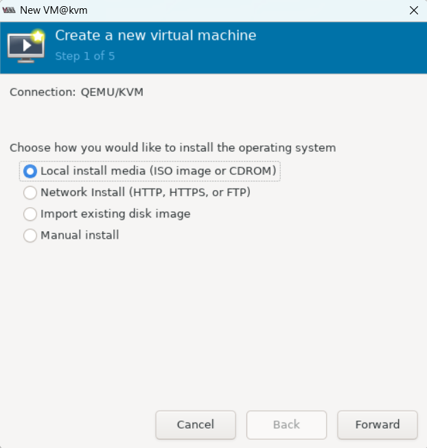

- Chọn đường dẫn file ISO ta đã tải ở trên.

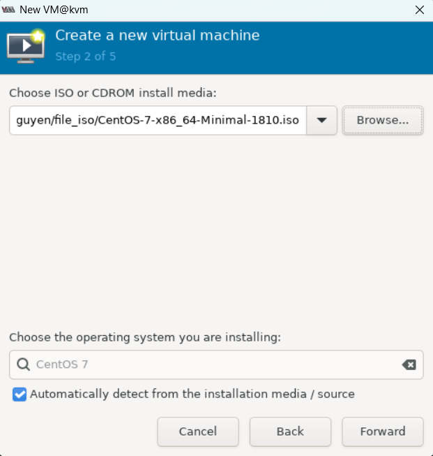

- Sau đó, ta cài đặt các thông số cho máy ảo.

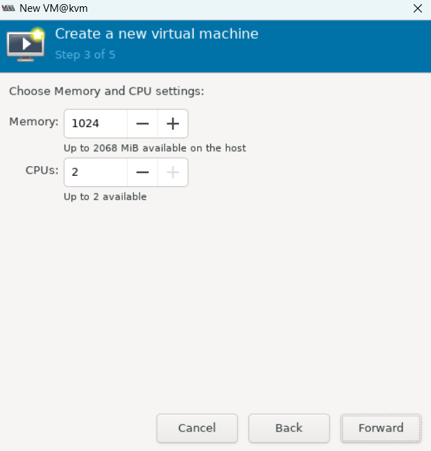

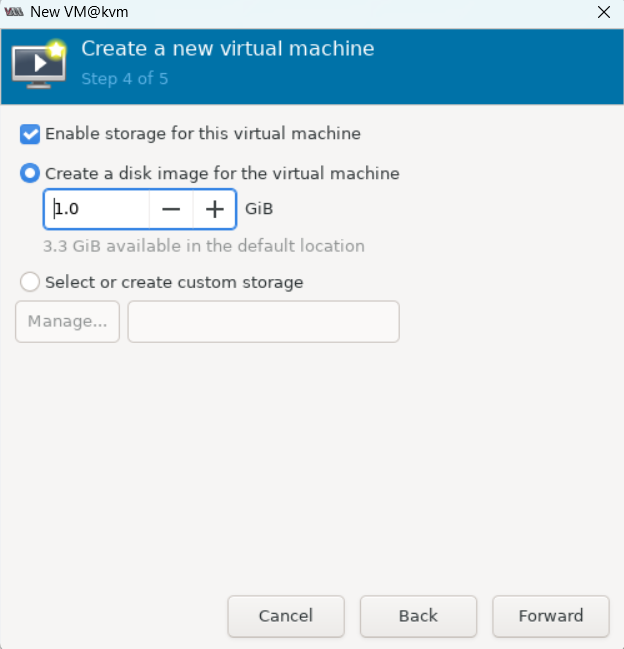

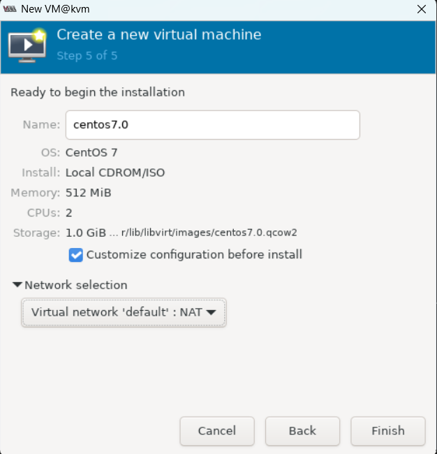

- Kiểm tra và thiết lập lại các thông số của máy ảo và click chọn `Begin Installation`.

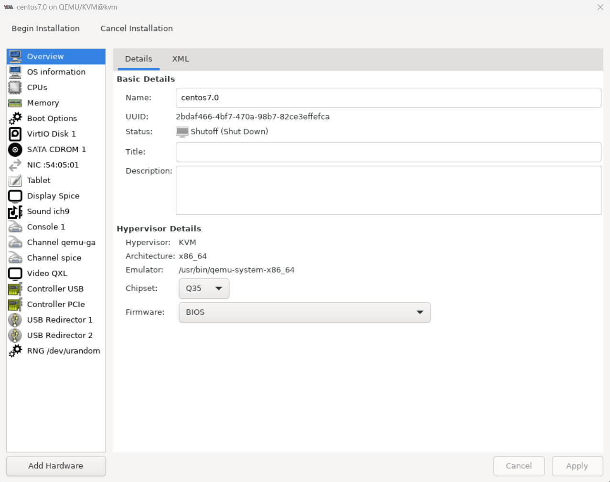

- Cài đặt CentOS như bình thường.

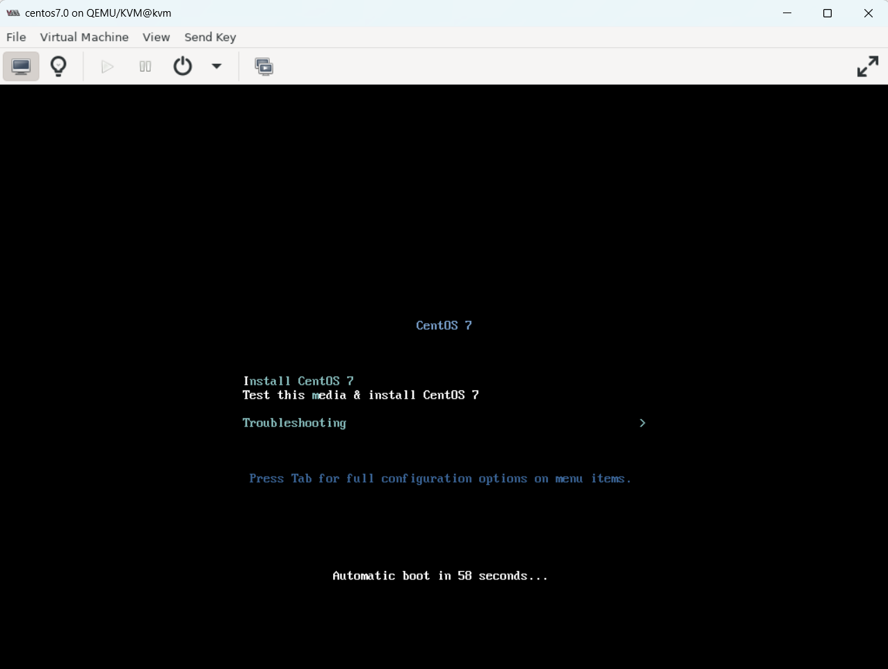

# 4. Một số thao tác với virt-manager
- Quản lí các máy ảo đã tạo tại giao diện `virt-manager`:

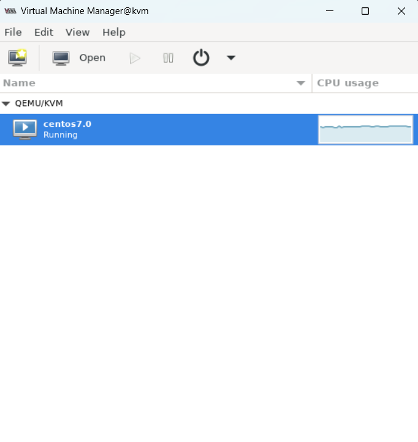

- Snapshot: Để tạo Snapshot cho VM, ta làm theo các bước sau

Chọn vào mục Manager VM Snapshot:

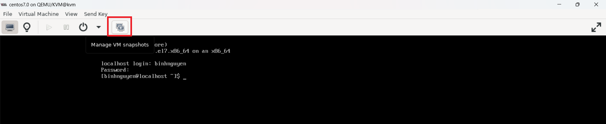

Click chọn thêm Snapshot

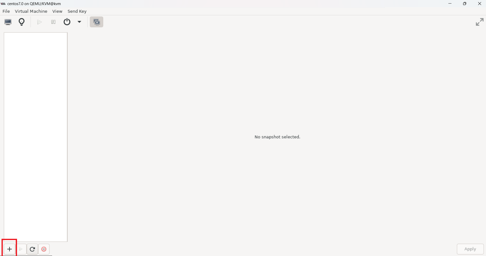

Điền tên cho Snapshot

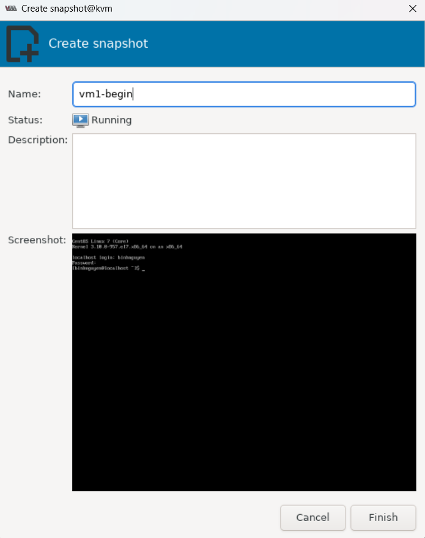

Sau đó, ta sẽ thấy Snapshot được tạo

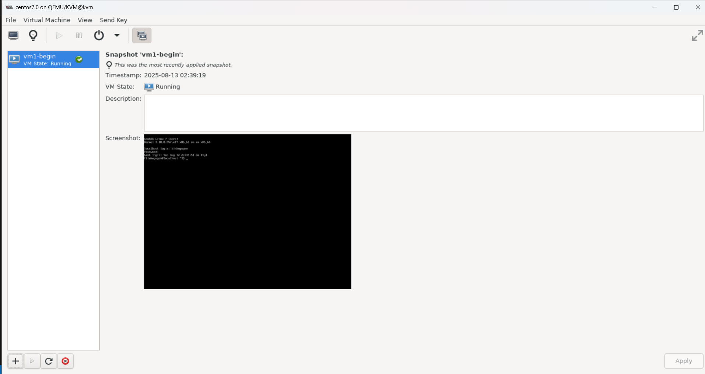

- Xem thông tin phần cứng:

Ta click biểu tượng như trong hình

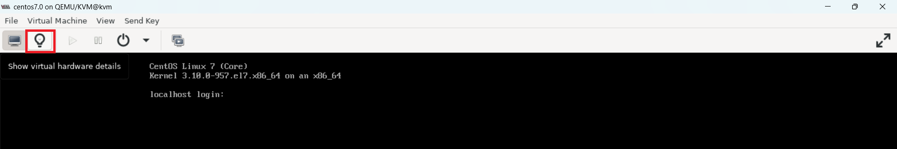

Ở đây, ta có thể xem các thông số phần cứng của máy ảo

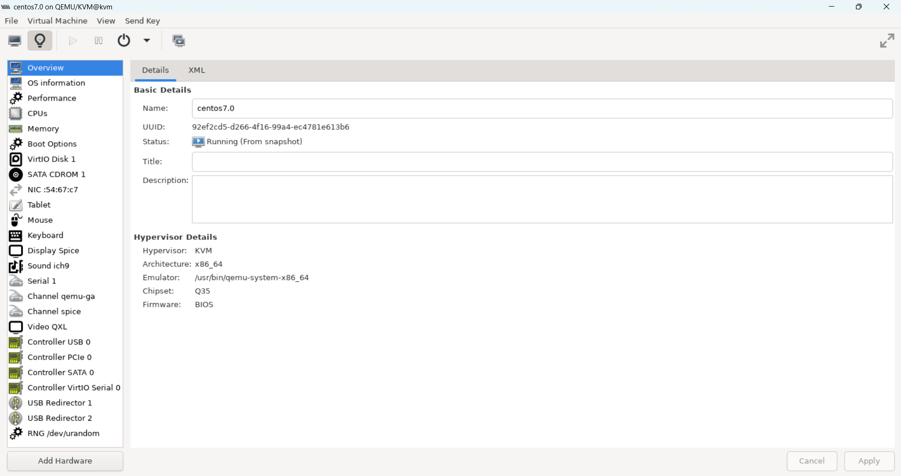


