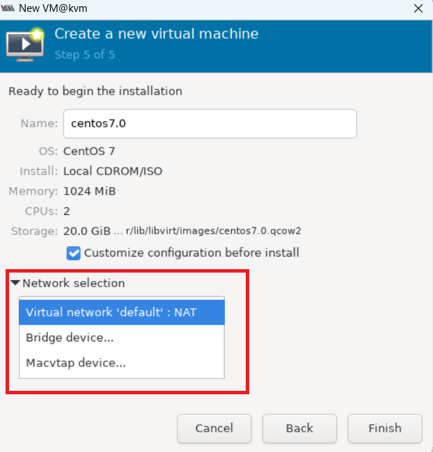

# Các option khi tạo một VM (CPU, Disk, NIC)
## 1. Options của CPU
- `Virt-manager`: Có thể tùy chỉnh dung lượng của RAM và số CPU ảo cho VM.

## 2. Options của Disk
Khi tạo một VM đến mục tùy chọn option cho Disk, ta có 2 lựa chọn sau:
- Tạo 1 Disk image để lưu máy ảo:

- Tạo hoặc chọn 1 Storage đã tạo trước để cài đặt máy ảo (thường sử dụng trên WebVirtCloud):
# 3. Options của NIC
Tùy vào mục đích tạo VM để chọn kiểu card mạng cho thích hợp. Có thể để kết nối ra ngoài mạng internet hoặc để dạng NAT:

