# Cài đặt AD DS bằng Server Manager trên Windows Server 2022

Đây là các bước để thực hiện cài đặt AD DS bằng Server Manager trên Windows Server 2022:

1. Trong `Server Manager`, chọn `Manage` rồi chọn `Add Roles and Features` để khởi động `Add Roles and Features Wizard`.

   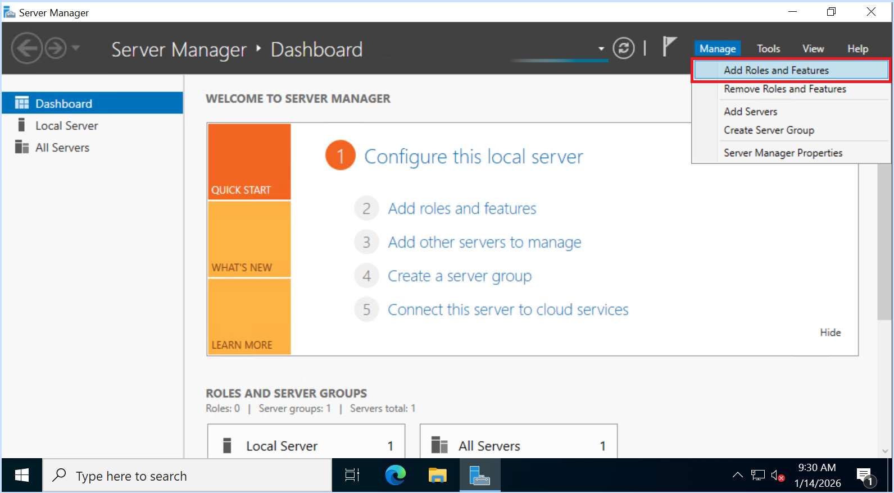

2. Trên trang `Before you begin`, chọn `Next`.

   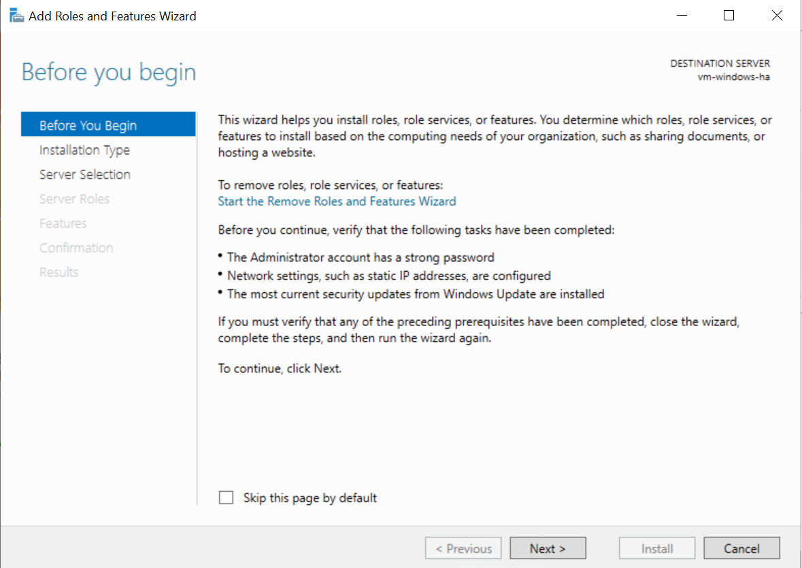

3. Trên trang `Select installation type`, chọn `Role-based or feature-based installation`, sau đó chọn `Next`.
    
   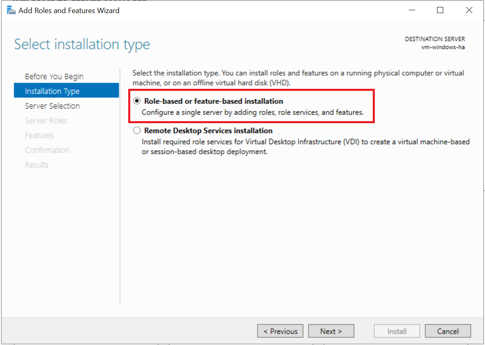

4. Trên trang `Select destination server`, chọn `Select a server from the server pool`, chọn tên máy chủ mà bạn muốn cài đặt AD DS, sau đó chọn `Next`.

   

5. Trên trang `Select server roles`, chọn `Active Directory Domain Services`, sau đó trong hộp thoại `Add Roles and Features Wizard`, chọn `Add Features`, rồi chọn `Next`.
    
   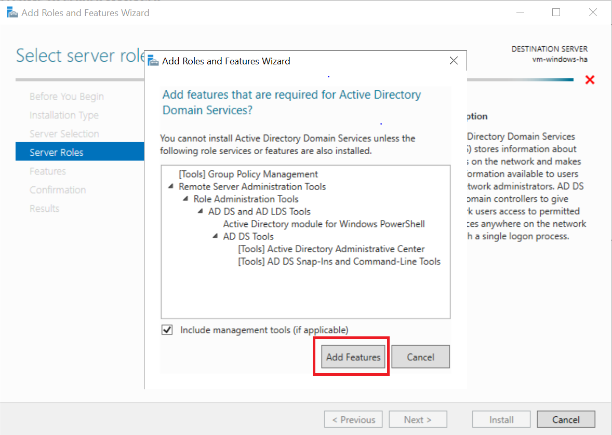

6. Trên trang `Select features`, chọn các tính năng bổ sung mà bạn muốn cài đặt, sau đó chọn `Next`.
    
   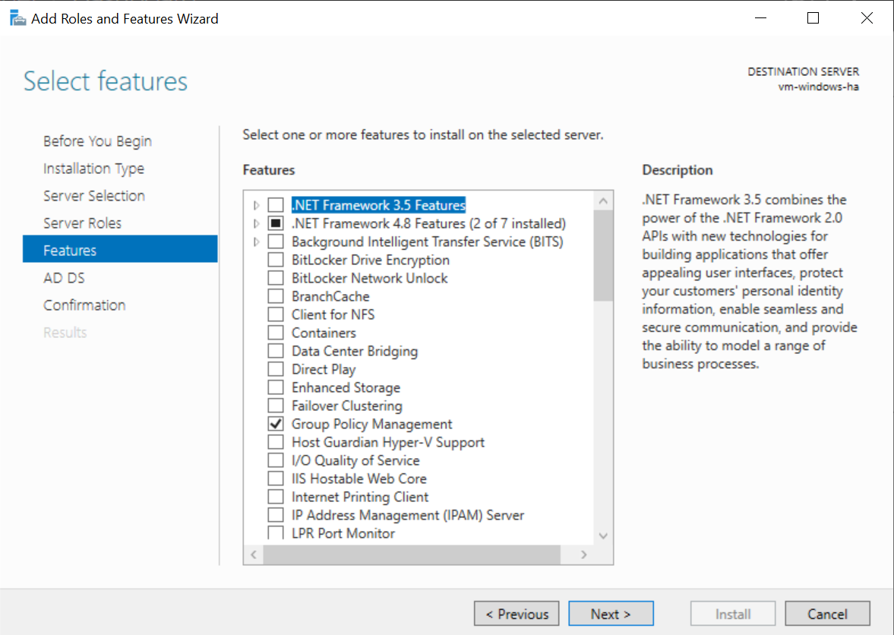

7. Trên trang `Active Directory Domain Services`, xem lại thông tin và sau đó chọn `Next`.

   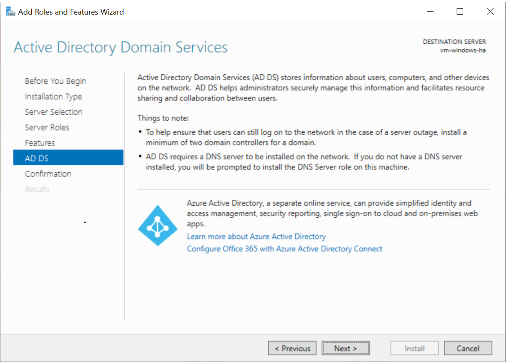

8. Trên trang `Confirm installation selections`, chọn `Install`.
   
   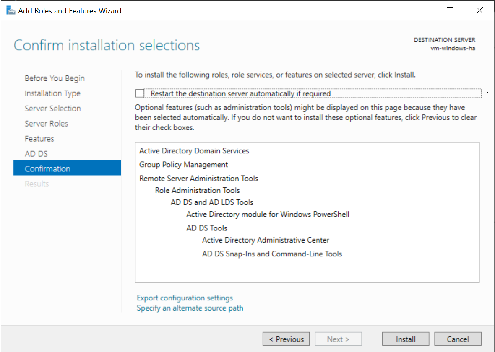

9. Tại trang `Results`, hãy xác nhận rằng quá trình cài đặt đã thành công, sau đó chọn `Promote this server to a domain controller` để khởi động `Active Directory Domain Services Configuration Wizard`.
   
   

   Nếu bạn đóng trình hướng dẫn `Add Roles Wizard` tại thời điểm này mà không khởi chạy `Active Directory Domain Services Configuration Wizard`, bạn có thể khởi động lại trình này bằng cách chọn `Tasks` trong `Server Manager`.
   
   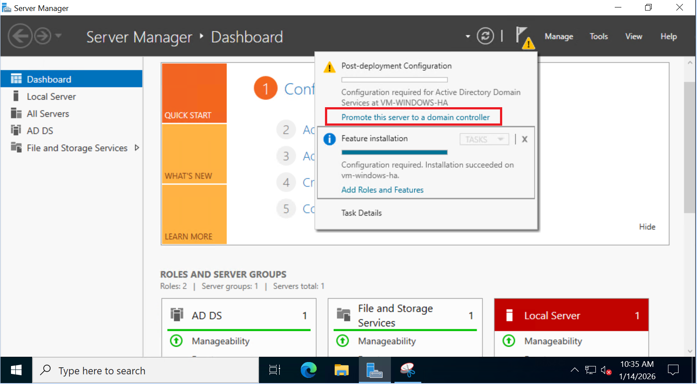

10. Trên trang `Deployment Configuration`, hãy chọn một trong các tùy chọn sau:
    
    

    - `Add a domain controller to an existing domain`:
    Thêm Domain Controller vào domain đã có.
    
     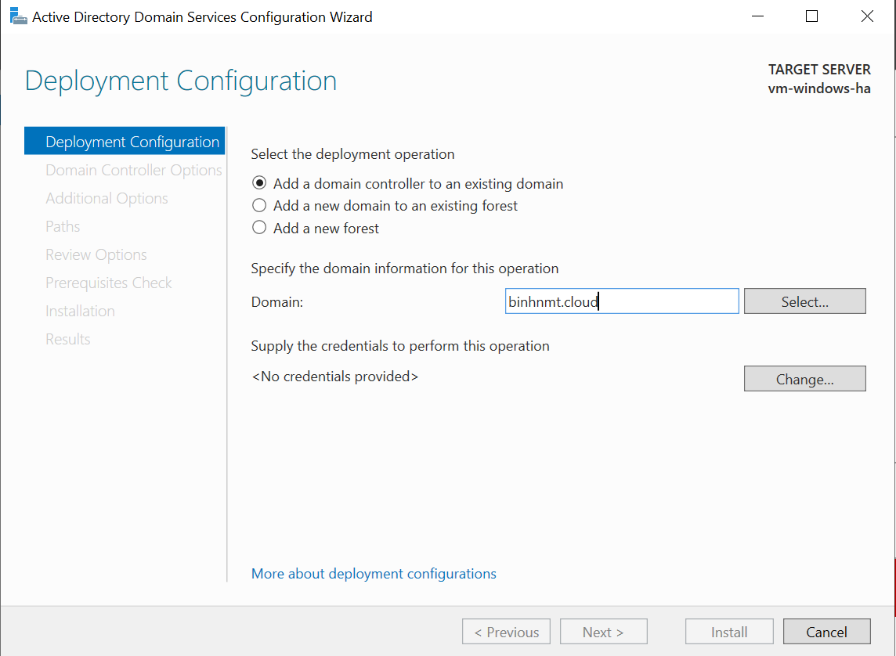

    - `Add a new domain to an existing forest`: 

         - `Child Domain`: Tạo domain con trong cùng forest (ví dụ: emea.corp.contoso.com).

         - `Tree Domain`: Tạo domain mới khác DNS nhưng chung forest (ví dụ: fabrikam.com).

     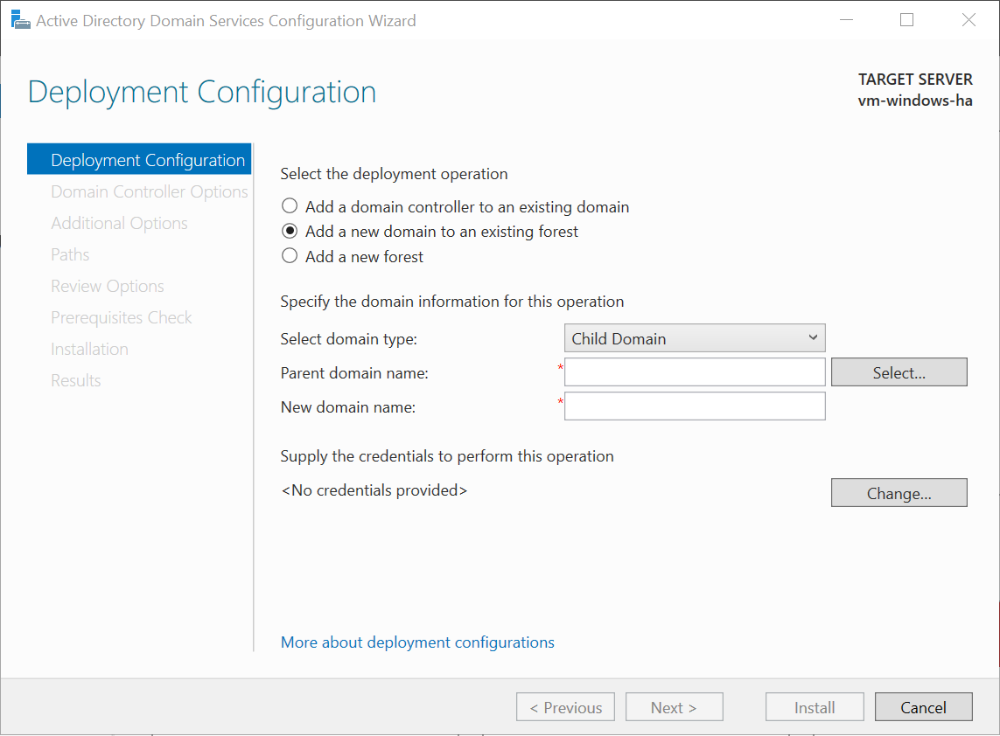

    - `Add a new forest`: Tạo forest và domain hoàn toàn mới.

     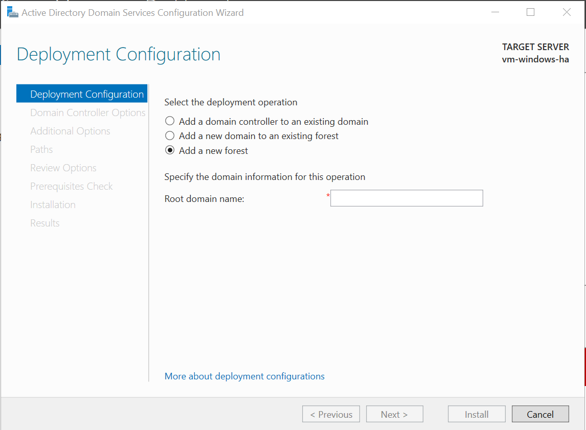

    Với việc cài đặt trên node 1, ta sẽ chọn `Add a new forest` và điền tên domain vào phần `root domain name`.

11. Trên trang `Domain Controller Options`, hãy chọn một trong các tùy chọn sau:

    - Nếu đang tạo một forest mới hoặc một domain mới: Chọn `Domain and Forest Functional Levels`, chọn `Domain Name System (DNS) server`, đặt mật khẩu `DSRM`, sau đó chọn Next.
    
      - `Domain Functional Level`: Phiên bản Windows Server thấp nhất được phép làm Domain Controller.
      - `Forest Functional Level`: Phiên bản Windows Server tối thiểu của mọi Domain Controller trong forest.
      - `Domain Name System (DNS) server`: Tick chọn để máy này kiêm luôn DNS (bắt buộc cho Domain Controller).
      - `DSRM Password`: Mật khẩu dùng để đăng nhập khi khởi động vào Directory Services Restore Mode (chế độ khôi phục AD).
    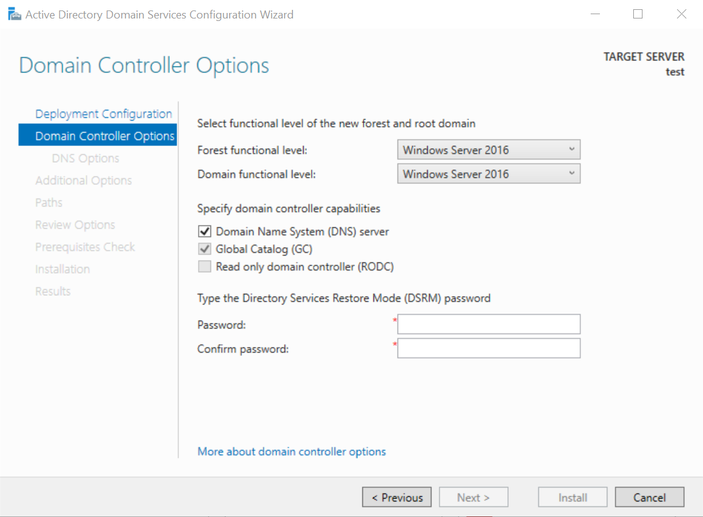

    - Nếu đang thêm một Domain Controller vào một domain đã tồn tại: Chọn `Domain Name System (DNS) server`, `Global Catalog (GC)` hoặc `Read Only Domain Controller (RODC)` nếu cần, chọn tên site, nhập mật khẩu `DSRM`, sau đó chọn Next.
     
     - `DNS Server`: Cho phép DC này chạy dịch vụ DNS.
     - `Global Catalog (GC)`: Dùng để tăng tốc xác thực và tìm kiếm user (nên bật).
     - `Read Only Domain Controller (RODC)`: DC chỉ đọc, dùng cho chi nhánh, bảo mật thấp (thường không chọn).

    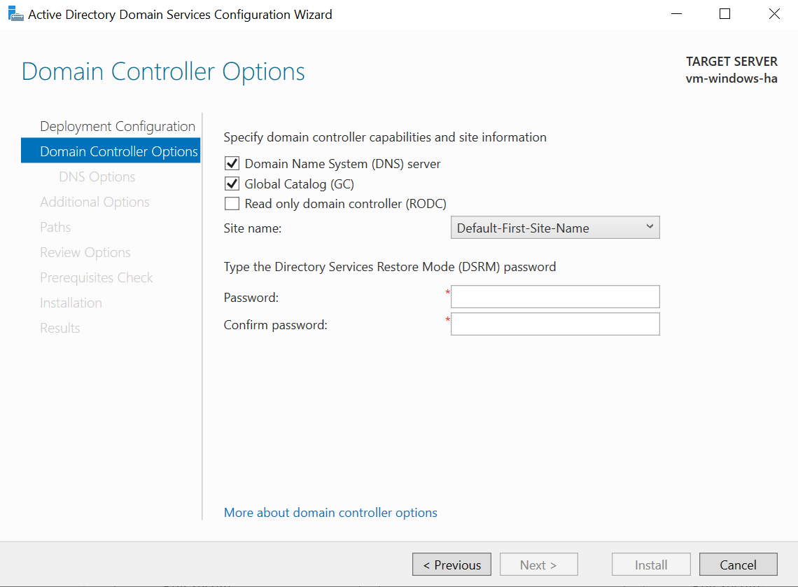

12. Trên trang DNS Options (chỉ xuất hiện nếu bạn cài đặt DNS server), hãy chọn Update DNS delegation nếu cần.

    Nếu chọn tùy chọn này, bạn phải cung cấp thông tin đăng nhập của tài khoản có quyền tạo DNS delegation record trong DNS zone cha (parent DNS zone).

    Nếu DNS server đang host zone cha không thể kết nối được, thì tùy chọn Update DNS Delegation sẽ không khả dụng.
    
    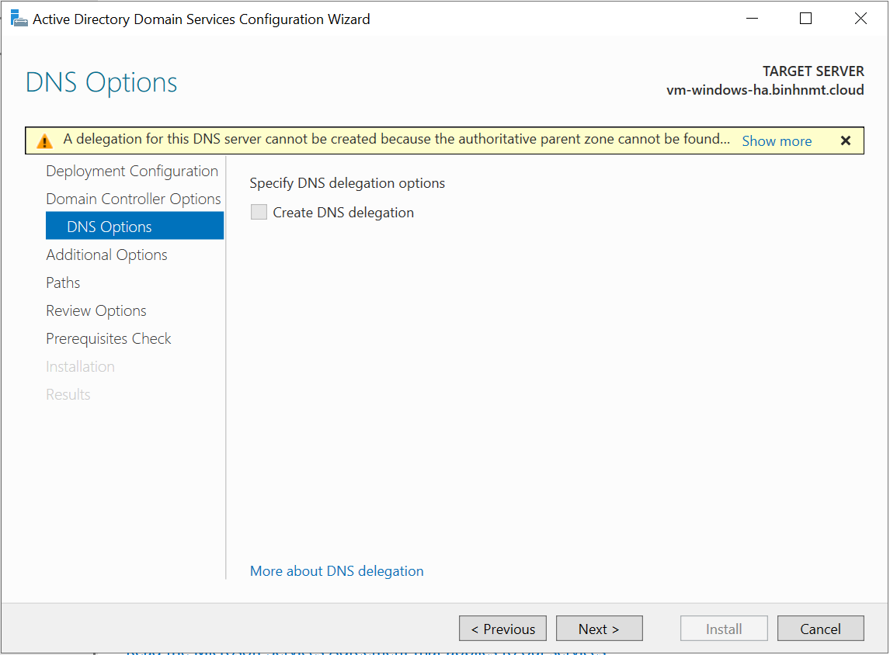

13. Nếu đang tạo một domain mới, nhập tên `NetBIOS` mới hoặc kiểm tra/xác nhận tên `NetBIOS` mặc định của domain, sau đó chọn Next.

    Nếu đang thêm một Domain Controller vào một domain đã tồn tại, chọn Domain Controller mà muốn dùng để sao chép (replicate) dữ liệu cài đặt AD DS (hoặc cho phép trình hướng dẫn tự động chọn bất kỳ Domain Controller nào).
    
    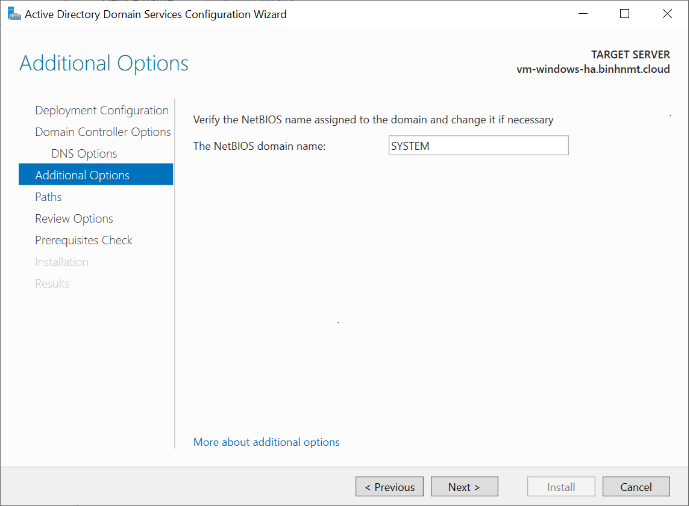

14. Trên trang `Paths`, hãy nhập vị trí lưu trữ cho cơ sở dữ liệu Active Directory, các file log và thư mục SYSVOL (hoặc chấp nhận các vị trí mặc định), sau đó chọn Next.
    
    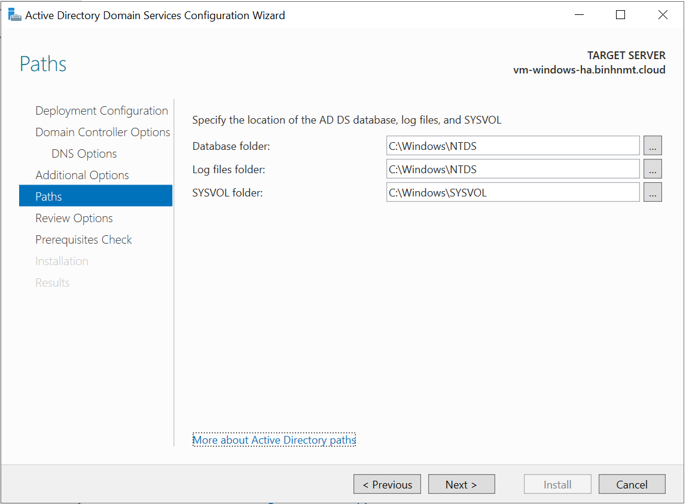

15. Trên trang `Review Options`, kiểm tra và xác nhận các lựa chọn.

    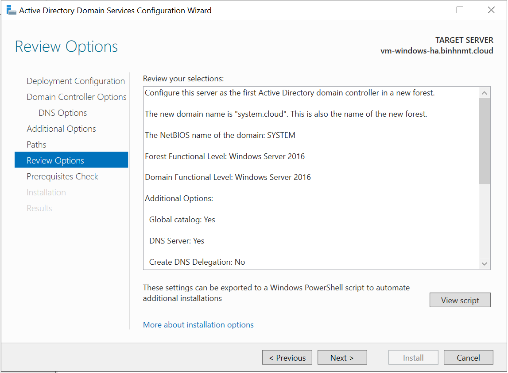

16. Trên trang `Prerequisites Check`, xác nhận quá trình kiểm tra các điều kiện cần thiết đã hoàn tất, sau đó chọn Install.

    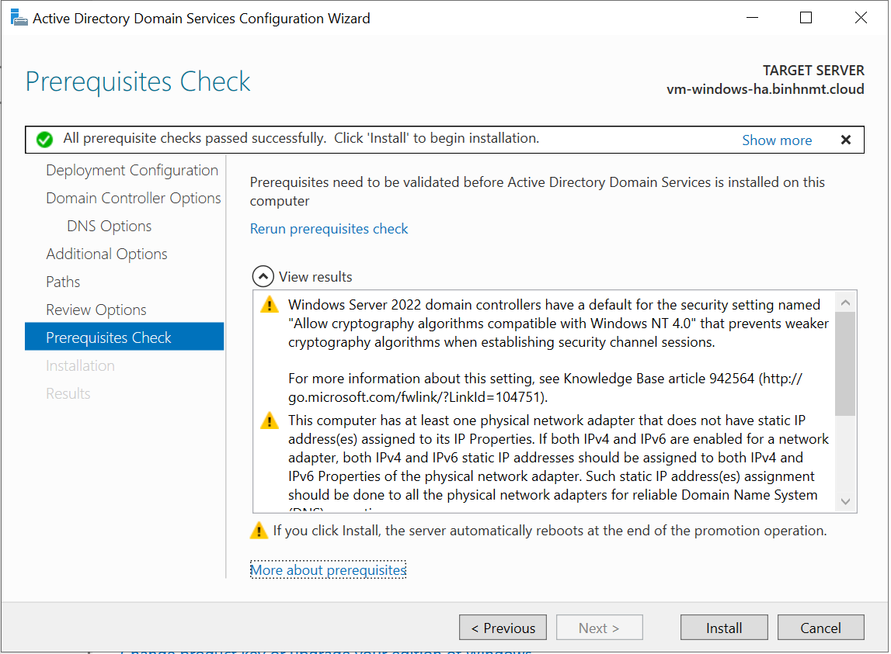

17. Trên trang `Results`, kiểm tra và xác nhận máy chủ đã được cấu hình thành công thành Domain Controller. Máy chủ sẽ tự động khởi động lại để hoàn tất quá trình cài đặt AD DS.
     
     Vào giao diện `Server Manager`, chọn `Tools`, chọn `Active Directory Users and Computers` để xác nhận đã xuất hiện domain:

     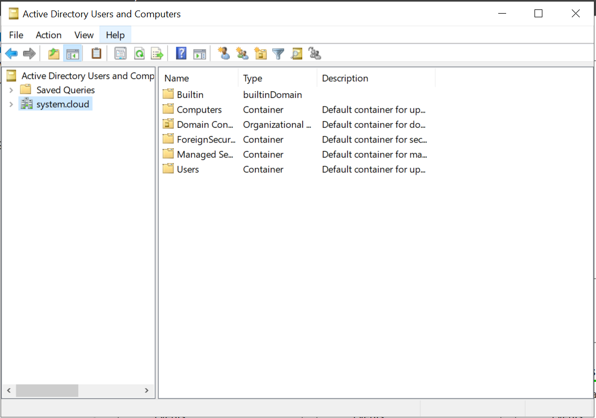

Tài liệu tham khảo:

[1] (https://learn.microsoft.com/en-us/windows-server/identity/ad-ds/deploy/install-active-directory-domain-services--level-100-)

