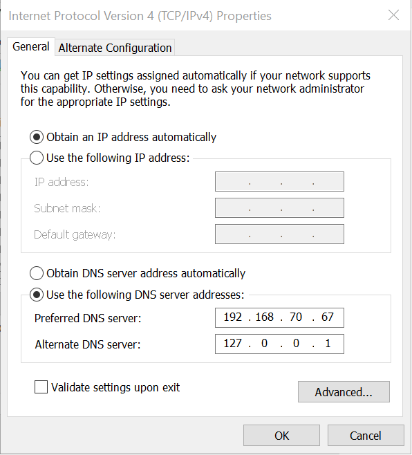
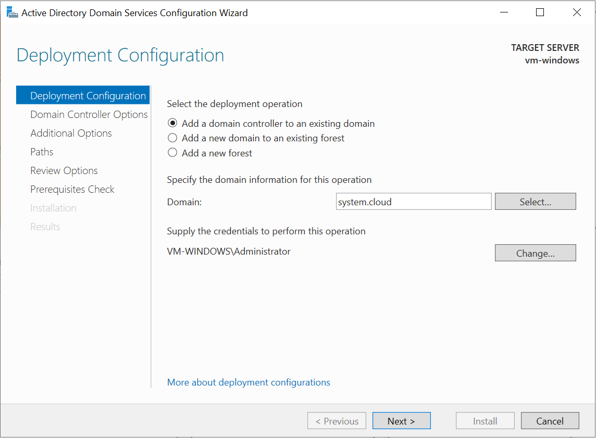
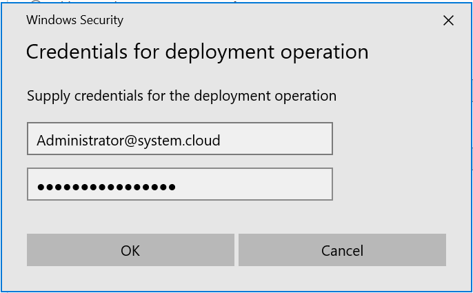
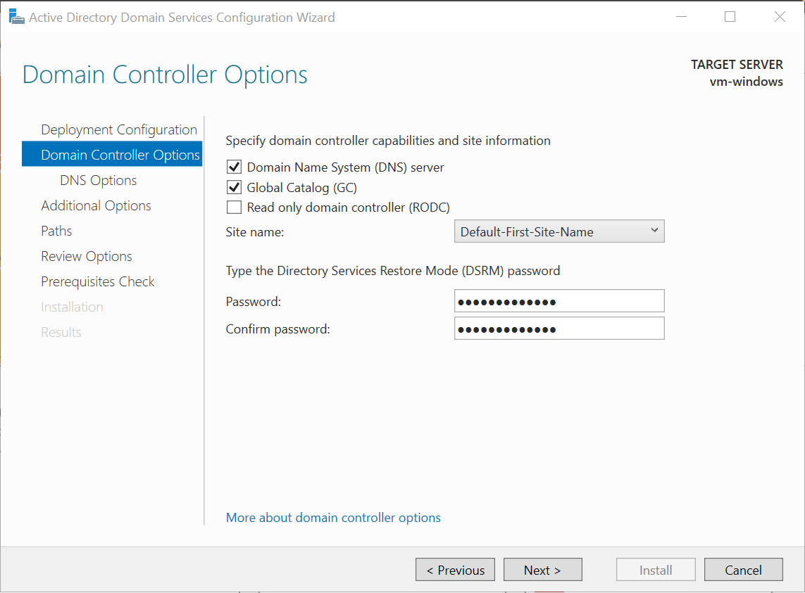
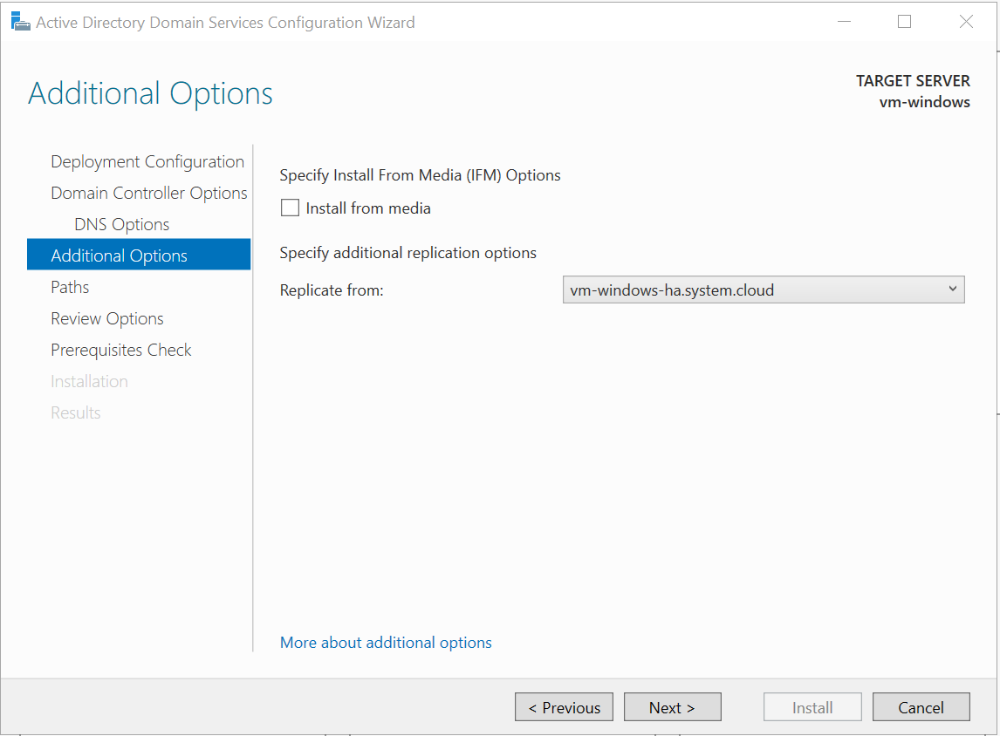
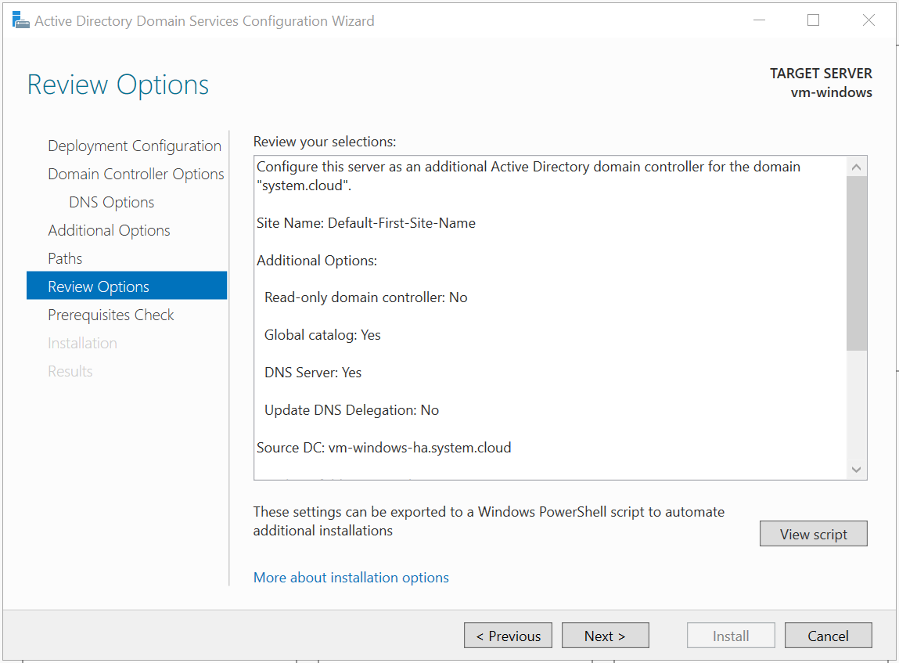

# Triển khai AD DS HA bằng Server Manager trên Windows Server 2022

Tiến hành cài đặt Active Directory Domain Services trên Windows Server 2022, sau khi thực hiện đến bước quá trình cài đặt thành công thì tiếp tục triển khai AD DS HA bằng bước sau:

Chọn `Promote this server to a domain controller` trong page `Results` như ảnh trên hoặc chọn trong `Tasks` trong `Server Manager`:

Để thực hiện triển khai AD DS HA, đầu tiên phải cấu hình network ở cả 2 node như sau:
- `Preferred DNS server`: trỏ về địa chỉ IP của node kia.
- `Alternate DNS server`: trỏ về địa chỉ loopback của node hiện tại.

Các bước triển khai AD DS HA sẽ được thực hiện như sau:

1. Trên trang `Deployment Configuration`, chọn option `Add a domain controller to an existing domain`.

   Điền tên domain và nhập thông tin administrator của domain đó để xác thực:

   
   
   Nhập thông tin administrator của domain dưới dạng như sau:

   

2. Trên trang `Domain Controller Options`, do đang thực hiện thêm một Domain Controller vào một domain đã tồn tại: Chọn `Domain Name System (DNS) server`, `Global Catalog (GC)` hoặc `Read Only Domain Controller (RODC)` nếu cần, chọn tên site, nhập mật khẩu `DSRM`, sau đó chọn Next.

   

3. Trên trang `DNS Options` (chỉ xuất hiện nếu cài đặt DNS server), hãy chọn Update DNS delegation nếu cần.

    Nếu chọn tùy chọn này, bạn phải cung cấp thông tin đăng nhập của tài khoản có quyền tạo DNS delegation record trong DNS zone cha (parent DNS zone).

    Nếu DNS server đang host zone cha không thể kết nối được, thì tùy chọn Update DNS Delegation sẽ không khả dụng.

    

4. Do đang thêm một Domain Controller vào một domain đã tồn tại, chọn Domain Controller mà muốn dùng để sao chép (replicate) dữ liệu cài đặt AD DS (hoặc cho phép trình hướng dẫn tự động chọn bất kỳ Domain Controller nào).

    

5. Trên trang `Paths`, hãy nhập vị trí lưu trữ cho cơ sở dữ liệu Active Directory, các file log và thư mục SYSVOL (hoặc chấp nhận các vị trí mặc định), sau đó chọn Next.

    

6. Trên trang `Review Options`, kiểm tra và xác nhận các lựa chọn.

    

7. Trên trang `Prerequisites Check`, xác nhận quá trình kiểm tra các điều kiện cần thiết đã hoàn tất, sau đó chọn Install.

    

8. Trên trang `Results`, kiểm tra và xác nhận máy chủ đã được cấu hình thành công thành Domain Controller. Máy chủ sẽ tự động khởi động lại để hoàn tất quá trình cài đặt AD DS.
     
     Vào giao diện `Server Manager`, chọn `Tools`, chọn `Active Directory Users and Computers` để xác nhận đã xuất hiện domain:

     

Đã hoàn tất thực hiện triển khai AD DS HA ở trên 2 node cùng quản lý một domain trên Windows Server 2022.

Tài liệu tham khảo:

[1] (https://learn.microsoft.com/en-us/windows-server/identity/ad-ds/deploy/install-a-replica-windows-server-2012-domain-controller-in-an-existing-domain--level-200-)