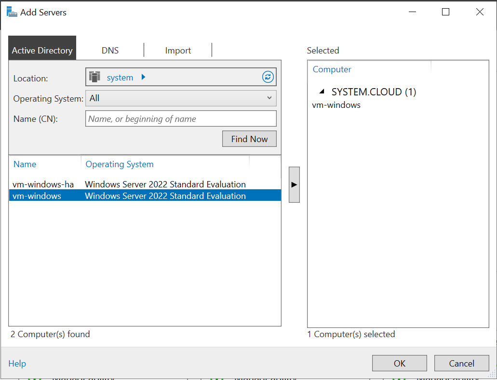
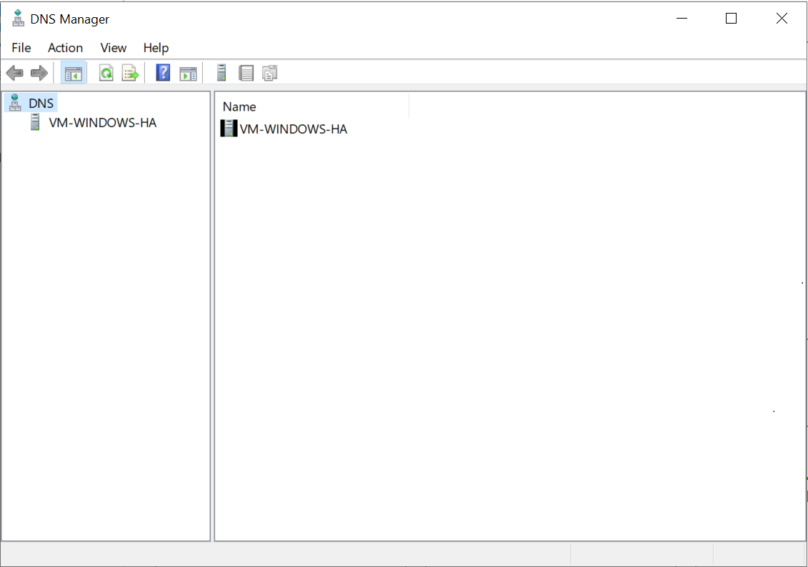
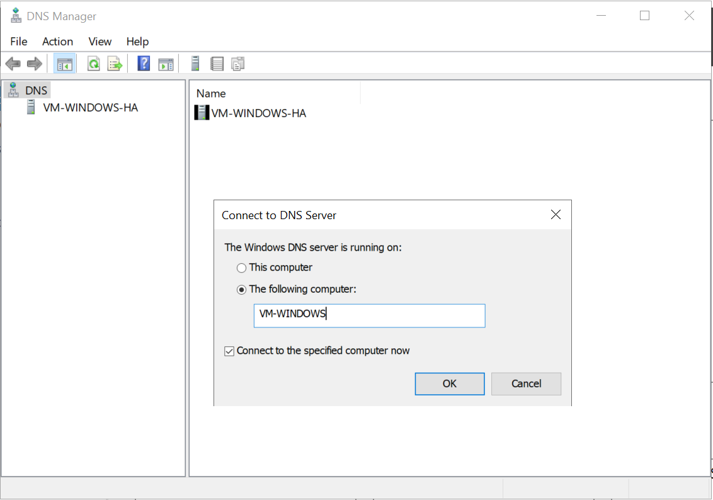
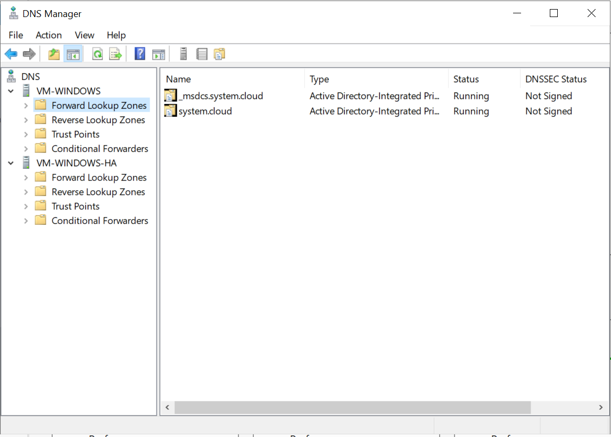
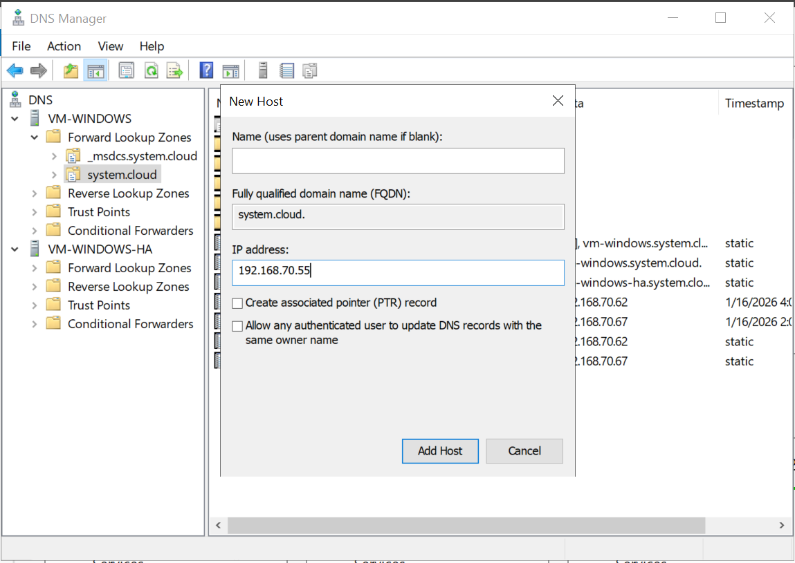
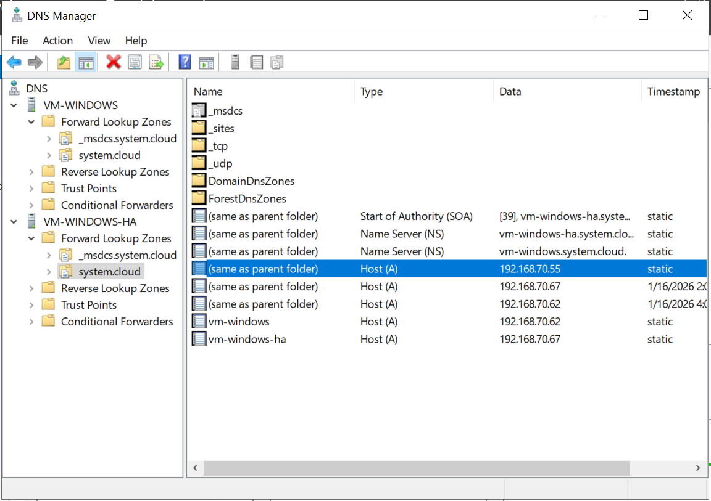
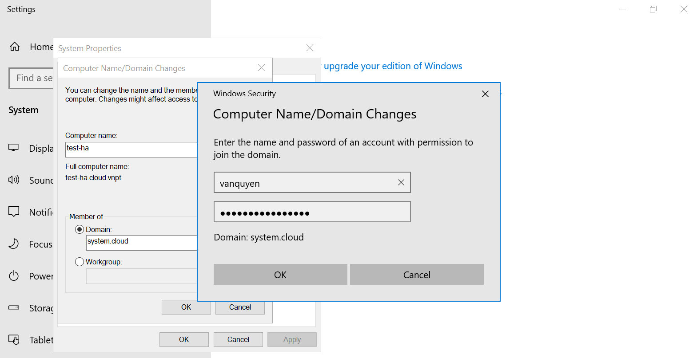
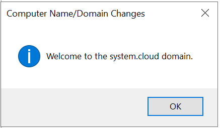
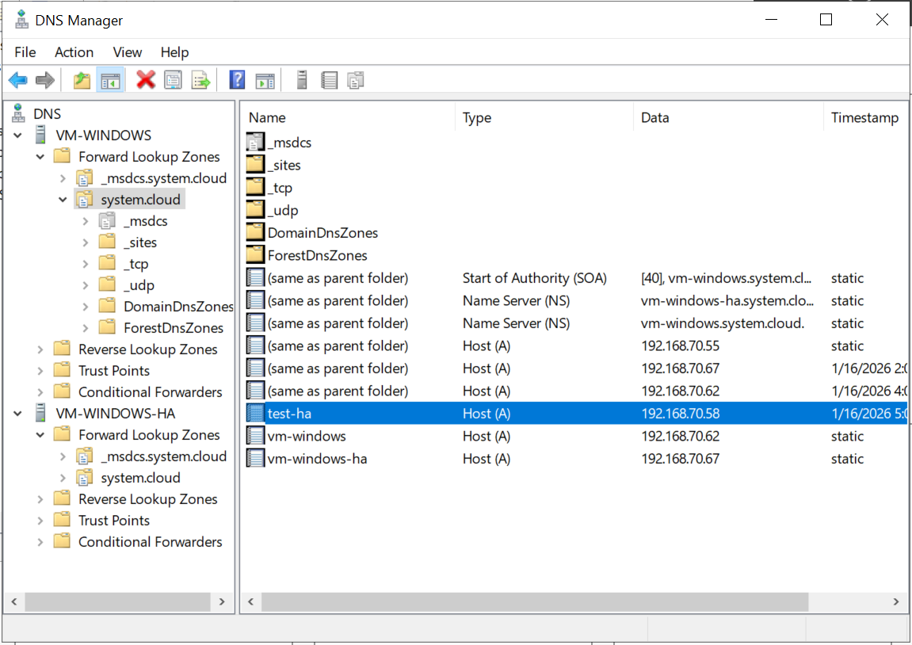
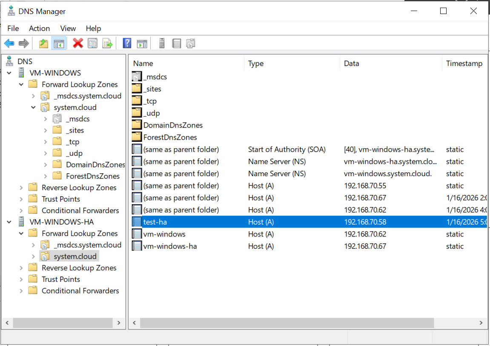

# Triển khai DNS Server HA bằng Server Manager trên Windows Server 2022

1. Để thực hiện DNS Server HA, bước đầu tiên cần add server back up vào server chính, trên giao diện `Server Manager` vào `Manage` chọn `Add Servers`.

2. Giao diện `Add Server` sẽ xuất hiện, với những `Domain Controller` đã join domain thì khi nhấn `Find Now` sẽ xuất hiện bên dưới. Chọn server muốn add và nhấn `OK` để hoàn tất.

   

3. Chọn `Tools` ở trên giao diện `Server Manager` nhấn `DNS` để xuất hiện giao diện quản lý DNS Server.

   

4. Chọn `DNS`, chọn `Connect to DNS Server`, chọn `The following compute` và nhập tên server muốn connect, nhấn `OK`:

   

5. Đã hoàn tất add DNS server vào để quản lý các bản ghi của 1 domain, thực hiện tạo 1 bản ghi để test khả năng replicate giữa 2 DNS Server.
   
   

   Chọn `Forward Lookup Zones` nhấn vào domain quản lý, chọn `New Host (A or AAAA)` để tạo 1 bản ghi mới.

    

    Kiểm tra ở DNS Server còn lại xem đã replicate được bản ghi vừa tạo chưa:

    

    Đã replicate được bản ghi ở DNS Server còn lại. 

6. Tạo một user trên dịch vụ AD DS và thực hiện đăng nhập user đó vào domain để xem 2 bản ghi của user đó có xuất hiện ở 2 node AD DS đã tích hợp DNS không.
   
   

   Thấy thông báo sau tức là user đã đăng nhập thành công vào domain.

   

   Kiểm tra bản ghi trên 2 node:

   

   

   Sau khi user đăng nhập domain thành công, bản ghi user đó đã xuất hiện ở cả 2 node.