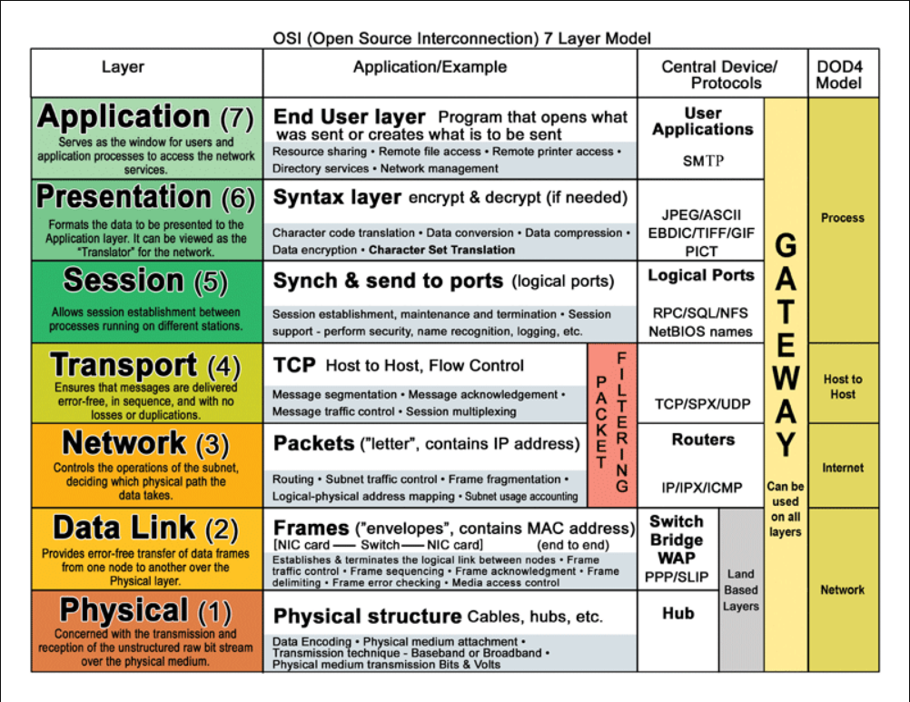
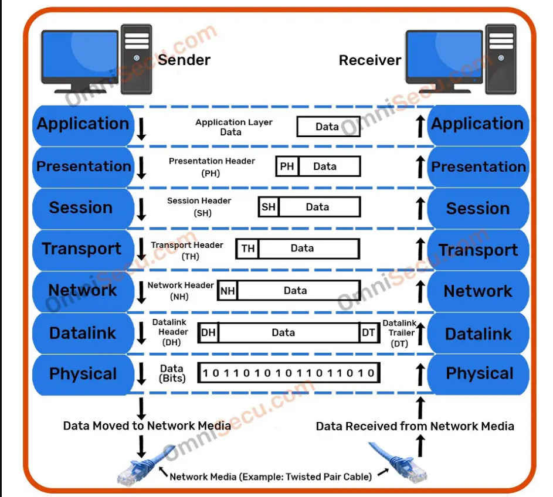

# Mô hình OSI
## 1. Mô hình OSI là gì?
Mô hình OSI (open system interconnection) là một mô hình kết nối các hệ thống mở, là một khuôn khổ cho các giao tiếp mạng (network communications).

Mô hình OSI là mô hình cơ bản để phát triển các giao tiếp mạng đúng cách.
## 2. Các layer trong mô hình OSI
### 2.1 Tổng quan
Mô hình OSI có 7 lớp chức năng tương ứng như sau: lớp vật lý, lớp liên kết dữ liệu, lớp mạng, lớp vận chuyển, lớp phiên, lớp trình bày và lớp ứng dụng. 
### 2.2 Chức năng của từng layer 

#### 2.2.1 Lớp vật lý - Physical layer
Lớp vật lý có chức năng truyền dãy bit 0,1 qua 1 đường truyền vật lý. Ví dụ như cắp xoắn đôi UTP, FTP, cáp đồng trục, cáp quang,...

Lớp vật lý xây dựng đường truyền vật lý giữa các host, xác định một số đặc điểm vật lý của phương tiện được sử dụng để truyền dữ liệu giữa các thiết bị. Ví dụ như khoảng cách truyền, cáp truyền, mức điện áp,...
#### 2.2.2 Lớp liên kết dữ liệu - Data Link Layer
Lớp liên kết dữ liệu sẽ thực hiện chức năng điều khiển truy nhập vào đường truyền vật lý của lớp vật lý và thực hiện giao tiếp với lớp trên là lớp mạng. 

Lớp liên kết dữ liệu sẽ định dạng các thông điệp vào khung dữ liệu (frame), thêm vào đó một header chứa địa chỉ phần cứng của nơi nhận và địa chỉ nguồn của nó. 

Lớp liên kết dữ liệu được chia thành hai lớp con là LLC (Logical Link Control) và MAC (Media Access Control). Trong đó:
   - LLC sẽ thực hiện các chức năng như kiểm soát lỗi, điều khiển luồng, quản lý giao tiếp giữa các thiết bị mạng.
   - MAC sẽ được dùng để làm địa chỉ trong quá trình truyền gửi dữ liệu.
#### 2.2.3 Lớp mạng - Network Layer
Lớp mạng sẽ cung cấp kết nối giữa các thiết bị không nằm trong cùng một mạng cục bộ sử dụng giao thức IP.

Lớp mạng sẽ đưa ra các lựa chọn đường đi giữa điểm gửi (source) và điểm nhận (destination) - định tuyến và đưa ra sự lựa chọn tối ưu nhất.
#### 2.2.4 Lớp vận chuyển - Transport Layer
Đảm bảo dữ liệu sẽ được được truyền đi không có lỗi, đúng thứ tự và không bị mất mát hay trùng lặp.
#### 2.2.5 Lớp phiên - Session Layer
Điều khiển phiên liên lạc giữa các thiết bị, thiết lập, duy trì và kết thúc kết nối.
#### 2.2.6 Lớp trình bày - Presentation Layer
Lớp giao vận sẽ đảm nhiệm nhiệm vụ thông ngôn, đảm bảo dữ liệu gửi từ đầu này có thể đọc được ở đầu kia.

Định dạng dữ liệu, cung cấp các cơ chế mã hóa đối với truyền dữ liệu và giải mã đối đối với việc nhận dữ liệu.
#### 2.2.7 Lớp ứng dụng - Application Layer
Giao tiếp trực tiếp đối với người dùng, cung cấp các phương tiện cho người dùng truy nhập các thông tin và dữ liệu trên mạng. 
## 3. Workflow của mô hình OSI

- **Bên gửi:**

  - **Lớp ứng dụng:** Người dùng đưa thông tin vào máy tính (hình ảnh, văn bản,...). Thông tin sẽ đóng thành một gói data và chuyển xuống các lớp dưới.
  - **Lớp trình bày:** Chuyển dữ liệu thành một dạng chung để mã hóa dữ liệu.
  - **Lớp phiên:** Xác nhận, bổ sung thông tin cần thiết cho các phiên kết nối.
  - **Lớp vận chuyển:** Dữ liệu được phân mảnh thành nhiều degment và bổ sung thông tin về phương thức vận chuyển dữ liệu để đảm bảo tính bảo mật.
  - **Lớp mạng:** Segment tiếp tục được cắt ra thành nhiều package và bổ sung thông tin định tuyến, xác định đường đi cho gói dữ liệu.
  - **Lớp liên kết dữ liệu:** Package được cắt nhỏ ra thành các frame và bổ sung thông tin kiểm tra gói tin.
  - **Lớp vật lý:** Frame được chuyển thành chuỗi nhị phân để truyền thông tin đến máy nhận.
- **Bên nhận:** 
  - **Lớp vật lý:** Máy nhận kiểm tra quá trình đồng bộ và đưa các chuỗi bit nhị phân vào vùng đệm rồi gửi thông báo cho lớp liên kết dữ liệu là đã nhận dữ liệu
  - **Lớp liên kết dữ liệu:** Kiểm tra các lỗi trong frame máy gửi tạo ra bằng cách kiểm tra FCS có trong gói tin được gắn phía máy nhận, nếu có lỗi thì frame đó bị hủy. Sau đó kiểm tra địa chỉ MAC xem có trùng địa chỉ máy nhận không, nếu đúng thì gỡ bỏ header của lớp này để chuyển lên lớp mạng.
  - **Lớp mạng:**  Kiểm tra xem địa chỉ trong gói tin này có phải là địa chỉ của máy nhận hay không. Nếu đúng địa chỉ máy nhận sẽ gỡ bỏ header của lớp này và tiếp tục chuyển đến lớp trên để tiếp tục qui trình.
  - **Lớp vận chuyển:** Tiến hành kiểm tra và đóng gói lại các segment nhận được. Sau khi đã xác nhận nhận đủ dữ liệu, loại bỏ header của lớp này và chuyển tiếp lên lớp trên để xử lý.
  - **Lớp phiên:** Đảm bảo các dữ liệu trong gói tin nhận được toàn vẹn. Tiến hành gỡ bỏ header của lớp phiên và tiếp tục gửi lên lớp trên.
  - **Lớp trình bày:** Xử lý gói tin bằng cách chuyển đối các định dạng dữ liệu cho phù hợp. Sau khi hoàn thành sẽ tiến hành gửi lên lớp ứng dụng. 
  - **Lớp ứng dụng:** Tiến hành xử lý và gỡ bỏ header cuối cùng. Khi đó ở máy nhận sẽ nhận được dữ liệu của gói tin được truyền đi.
