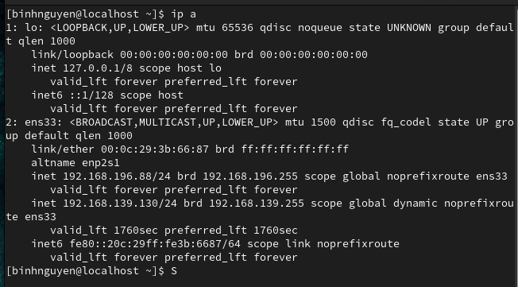
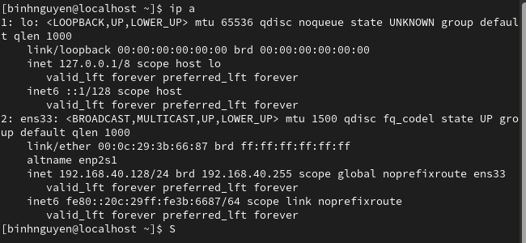
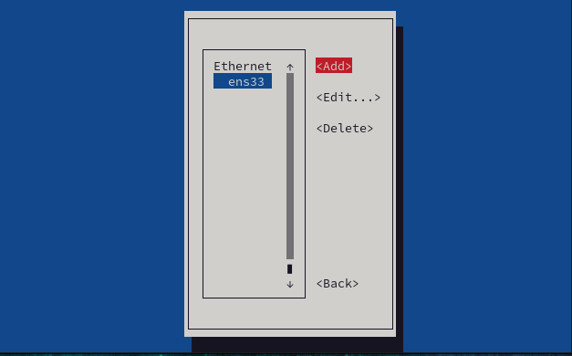
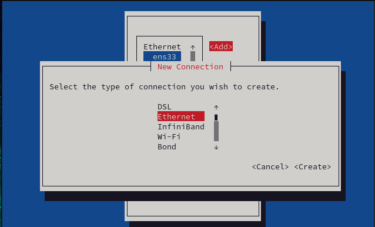
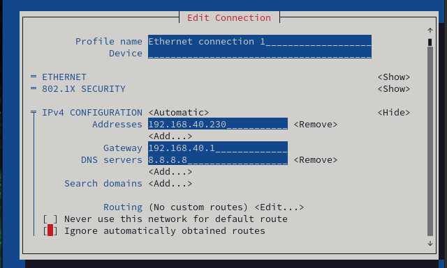
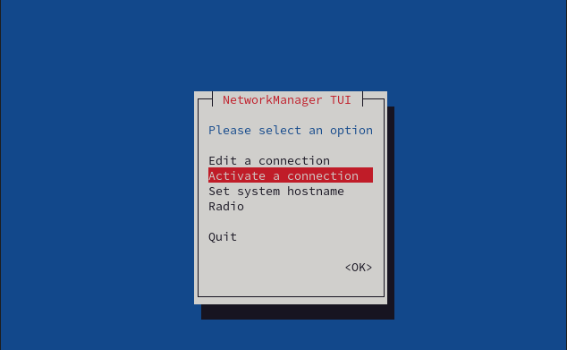
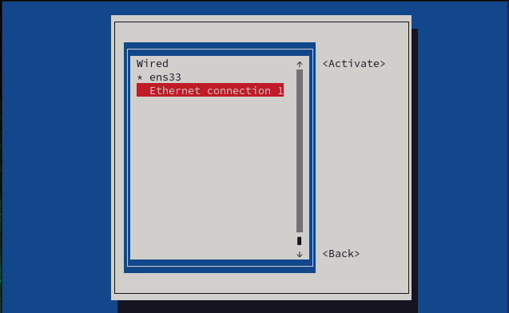
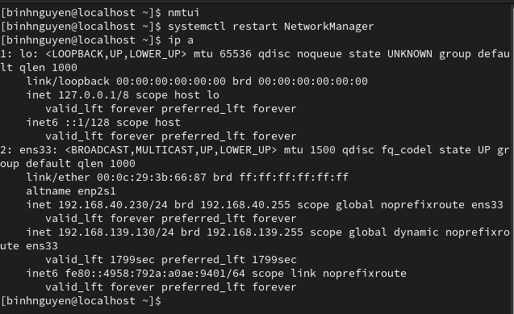

# 1. Cài đặt IP tĩnh bằng cách sửa file cấu hình
- Kiểm tra IP hiện tại của máy ảo:

- Vào thư mục chứa card mạng và truy cập vào file cấu hình:

- Thực hiện chỉnh sửa địa chỉ IP của máy ảo trong file cấu hình:

- Gõ :wq để lưu và thoát khỏi file cấu hình
- Sau khi thoát khỏi file, gõ lệnh systemctl restart NetworkManager để khởi động lại mạng.
- Kiểm tra lại địa chỉ IP của máy ảo:

  
  Hoàn tất việc cài đặt IP tĩnh cho máy ảo CentOS.
# 2. Cài đặt IP tĩnh bằng dòng lệnh 
- Thực hiện cấu hình IP tĩnh bằng các dòng lệnh theo thứ tự sau:
  - Cấu hình địa chỉ mạng.
  - Cấu hình địa chỉ gateway.
  - Cấu hình dns.
  - Chọn cấu hình IPv4 bằng phương pháp thủ công.
  - Bật kết nối cho địa chỉ IPv4 vừa được đặt.

- Restart lại mạng để cập nhật địa chỉ IP bằng câu lệnh systemctl restart NetworkManager.
- Kiểm tra lại địa chỉ IP của máy ảo:
  
  Hoàn tất việc cài đặt IP tĩnh cho máy ảo CentOS.
# 3. Cài đặt IP tĩnh bằng giao diện
- Chạy câu lệnh nmtui để mở giao diện NetworkManager.
- Chọn edit connection và nhấn ok:

- Chọn add để cấu hình IP tĩnh mới:

- Chọn type Ethernet và nhấn create:

- Sửa địa chỉ IP và nhấn ok:

- Quay lại giao diện NetworkManager chọn activate a connection:

- Chọn mạng mình vừa tạo và nhấn activate:

- Chạy lệnh systemctl restart NetworkManager để khởi động lại mạng:

- Kiểm tra lại địa chỉ IP của máy ảo:

   
  Hoàn tất cài đặt IP tĩnh cho máy ảo CentOS.