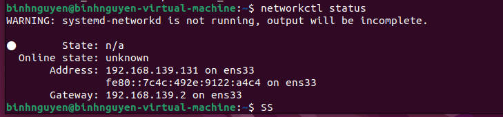
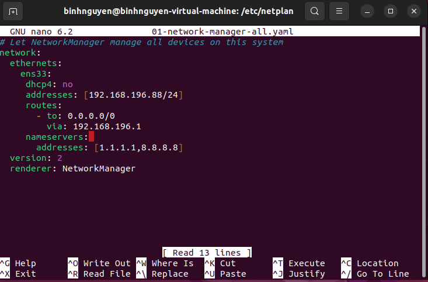
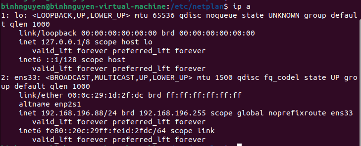

# 1. Cài đặt IP tĩnh bằng cách sửa file cấu hình
- Kiểm tra địa chỉ IP hiện tại của máy ảo:

- Kiểm tra Gateway và DNS của máy ảo:

- Truy cập vào thư mục netplan của máy ảo để chỉnh sửa file cấu hình:

- Truy cập vào file cấu hình bằng lệnh sudo nano 01*
- Chỉnh sửa file cấu hình như ảnh dưới:

- Cấu hình lại mạng bằng lệnh sudo netplan apply.

- Kiểm tra lại địa chỉ IP của máy ảo:

  Hoàn tất cài đặt IP tĩnh cho máy ảo Ubuntu.